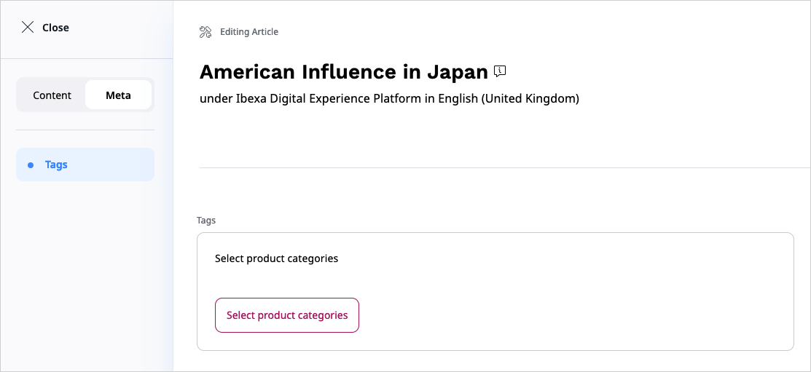

# Add tab switcher

Tabs switcher allows separating the default Fieldtypes in the Content Type from the Fieldtypes that enhance the content with new functionalities.
The best example of such Fieldtype are SEO or Taxonomy, as these are not typical Fieldtypes but a Fieldtypes that handle functionality for the whole Content object.

The following example shows how to add a Meta tab with automatically assigned Taxonomy Fieldtype.

## Add Meta tab

Before you start adding the Meta tab, make sure the Content Type you want to edit has [Taxonomy Entry Assignment Fieldtype]([[= user_doc =]]/taxonomy/#assign-tag-to-content-from-taxonomy-tree).

Next, provide the semantic configuration:

```yaml
ibexa:
    system:
        admin_group:
            admin_ui_forms:
                content_edit:
                    fieldtypes:
                        ibexa_taxonomy_entry_assignment:
                            meta: true

```

`ibexa_taxonomy_entry_assignment` - identifier for the Fieldtype

`meta` - when set to `true`, puts the declared Fieldtype in the Meta tab



## Add custom tab

First, create an EventListener in the `src/EventListener/TextAnchorMenuTabListener.php`:

``` php hl_lines="20 22"
[[= include_file('code_samples/back_office/content_type/src/EventListener/TextAnchorMenuTabListener.php') =]]
```

A new custom tab is defined in the line 20, the line 22 defines items for the second level.

For new tabs it is also required to render its section in the Content editing form. To do it, register the UI Component:

```yaml
    app.my_component:
        parent: Ibexa\AdminUi\Component\TwigComponent
        arguments:
            $template: 'my_template.html.twig'
        tags:
            - { name: ibexa.admin_ui.component, group: 'content-edit-sections' }
```

Finally, create the `templates/my_template.html.twig` template file:

``` html+twig
[[= include_file('code_samples/back_office/content_type/templates/my_template.html.twig') =]]
```
