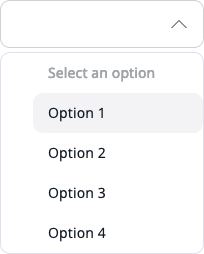

# Create custom drop-downs

In [[= product_name =]], you can create a reusable custom drop-down component and implement it anywhere in the Back Office.
Follow the steps below to learn how to integrate this component to fit it to your project needs.

## Prepare custom drop-down structure

First prepare the component structure. See the example:

```twig


```

### Generate `<select>` input

Next, configure which elements are available for the `<select>` input. See the properties:

- `source` - what is currently set in the "Generate `<select>` input" header:

```twig

<select class="ibexa-input">
    <option value="DE">DE</option>
    <option value="US">US</option>
    <option value="NO">NO</option>
    <option value="PL">PL</option>
</select>

```

 The `<select>` input shoud have class `ibexa-input`.

- `choices` - table with elements showed in the drop-down

```twig

```

Can have many levels, for example:

```twig
```

- `preferred_choices` - the table with elements that appear at the begining of the list and are separated from the rest:

```twig

```

- `value` - the currently selected element, this is an object with the key `value`:

```twig

```

- `multiple` - boolean, available values: true/false, If you want to allow users to pick multiple items from a list, add the `multiple` attribute to the same element.

!!! caution

    Do not remove `select` input. Removing it would break the functionality of any submission form.



<!-- ## Generate `<select>` input

Next step is generating a standard select input with the `ibexa-dropdown__select` CSS class added to the `<select>` element.
This element should contain at least one additional attribute: `hidden`. 
If you want to allow users to pick multiple items from a list, add the `multiple` attribute to the same element.

Example:

```html
    <select class="ibexa-input"> hidden multiple></select>
``` -->


<!-- ## Add attributes

Next, look into the `data-value` attribute in the code above (line 11 and 12) to duplicated options with the CSS class: `ibexa-dropdown__item`.
It stores a value of an option from a select input.

You can provide placeholder text for your custom dropdown. To do so:

- put a `data-value` attribute with no value `data-value=""`
- add a `disabled` attribute to the item in the duplicated list of options 

It will make it un-clickable.

Example:  
 
```html
<li data-value="" class="ibexa-dropdown__item" disabled>Select an option</li>
<li data-value="1" class="ibexa-dropdown__item">Option 1</li> -->
```

- `translation_domain` - used for translating choices and placeholder, transfers the translations domain

- `custom_form` - in case of a custom form, a true value must be set, default by true

- `class` - additional classes for the element with `ibexa-dropdown` class

- `placeholder` - displayed placeholder when no option is selected

- `custom_init` - by default set to `false`. If set to `true`, you will have to manually initialize a drop-down in the JSCo code to JS code. out-of-the-box does not require any actions.

## Initialize

All drop-downs are searched and initialized in `admin.dropdown.js`. However, if you want to extend it or make some modifications, run the following JavaScript code:

```javascript
(function (global, document) {
const container = document.querySelector('.ibexa-dropdown');

const dropdown = new global.eZ.core.CustomDropdown({
    container: container,
    selectorSource: selectorSource,
    itemsContainer: container.querySelector('.ibexa-dropdown__items'),
    hasDefaultSelection: true
});

dropdown.init();
})(window, window.document);
```

## Configuration options

Full list of options:

|Name|Description|Required|
|----|-----------|--------|
|`container`|Contains a reference to a DOM node where custom drop-down is initialized.|required|
|`selectorSource`|Contains a reference |required|
|`itemsContainer`|Contains a reference to a duplicated items container.|required|
|`hasDefaultSelection`|Contains a boolean value. If set to `true` the first option will be selected as a placeholder or selected value.|optional|
|`selectedItemTemplate`|Contains a literal template string with placeholders for `value` and `label` data.|optional|

In the code samples provided above you will find 4 of 5 configuration options.
Default template HTML code structure for missing `selectedItemTemplate` looks like this:

```html
    <li class="ibexa-dropdown__selected-item" data-value="{{value}}">{{label}}<span class="${CLASS_REMOVE_SELECTION}"></span></li>
```
