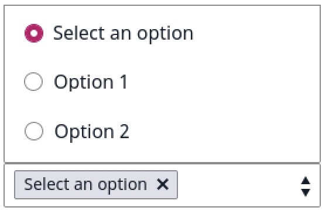

# Creating custom drop-downs

In [[= product_name =]], you can implement custom drop-downs anywhere in the Back Office.
Follow the steps below to learn how to integrate this component to fit it to your project needs.

## Prepare custom dropdown structure

First prepare the HTML code structure in the following way:

```html hl_lines="2 11 12"
<div class="ez-custom-dropdown">
    <select class="ez-custom-dropdown__select" hidden multiple>
        <option value="1">Option 1</option>
        <option value="2">Option 2</option>
        <option value="3">Option 3</option>
        <option value="4">Option 4</option>
    </select>
    <div class="ez-custom-dropdown__wrapper">
        <ul class="ez-custom-dropdown__selection-info"></ul>
        <ul class="ez-custom-dropdown__items ez-custom-dropdown__items--hidden">
            <li data-value="" class="ez-custom-dropdown__item" disabled>Select an option</li>
            <li data-value="1" class="ez-custom-dropdown__item">Option 1</li>
            <li data-value="2" class="ez-custom-dropdown__item">Option 2</li>
            <li data-value="3" class="ez-custom-dropdown__item">Option 3</li>
            <li data-value="4" class="ez-custom-dropdown__item">Option 4</li>
        </ul>
    </div>
</div>
```

In line two, the code above contains a hidden native `select` input. It stores the selection values.
Input is hidden because a custom drop-down duplicates its functionality.

!!! caution

    Do not remove `select` input. Removing it would break the functionality of any submission form.



## Generate `<select>` input

Next step is generating a standard select input with the `ez-custom-dropdown__select` CSS class added to the `<select>` element.
This element should contain at least one additional attribute: `hidden`. 
If you want to allow users to pick multiple items from a list, add the `multiple` attribute to the same element.

Example:

```html
    <select class="ez-custom-dropdown__select" hidden multiple></select>
```


## Add attributes

Next, look into the `data-value` attribute in the code above (line 11 and 12) to duplicated options with the CSS class: `ez-custom-dropdown__item`.
It stores a value of an option from a select input.

You can provide placeholder text for your custom dropdown. To do so:

- put a `data-value` attribute with no value `data-value=""`
- add a `disabled` attribute to the item in the duplicated list of options 

It will make it un-clickable.

Example:  
 
```html
<li data-value="" class="ez-custom-dropdown__item" disabled>Select an option</li>
<li data-value="1" class="ez-custom-dropdown__item">Option 1</li>
```

## Initialize

To initialize a custom drop-down, run the following JavaScript code:

```javascript
(function (global, document) {
const container = document.querySelector('.ez-custom-dropdown');

const dropdown = new global.eZ.core.CustomDropdown({
    container: container,
    sourceInput: container.querySelector('.ez-custom-dropdown__select'),
    itemsContainer: container.querySelector('.ez-custom-dropdown__items'),
    hasDefaultSelection: true
});

dropdown.init();
})(window, window.document);
```

## Configuration options

Full list of options:

|Name|Description|Required|
|----|-----------|--------|
|`container`|contains a reference to a DOM node where custom dropdown is initialized|required|
|`sourceInput`|contains a reference to a DOM node where the value of selected option is stored. Presumably, it should be a reference to a select input node|required|
|`itemsContainer`|contains a reference to a duplicated items container|required|
|`hasDefaultSelection`|contains a boolean value. If set to `true` the first option will be selected as a placeholder or selected value|optional|
|`selectedItemTemplate`|contains a literal template string with placeholders for `value` and `label` data|optional|

In the code samples provided above you will find 4 of 5 configuration options.
Default template HTML code structure for missing `selectedItemTemplate` looks like this:

```html
    <li class="ez-custom-dropdown__selected-item" data-value="{{value}}">{{label}}<span class="${CLASS_REMOVE_SELECTION}"></span></li>
```
