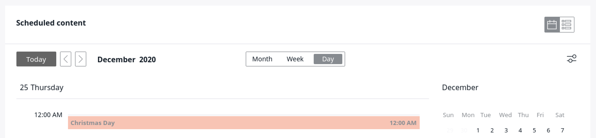
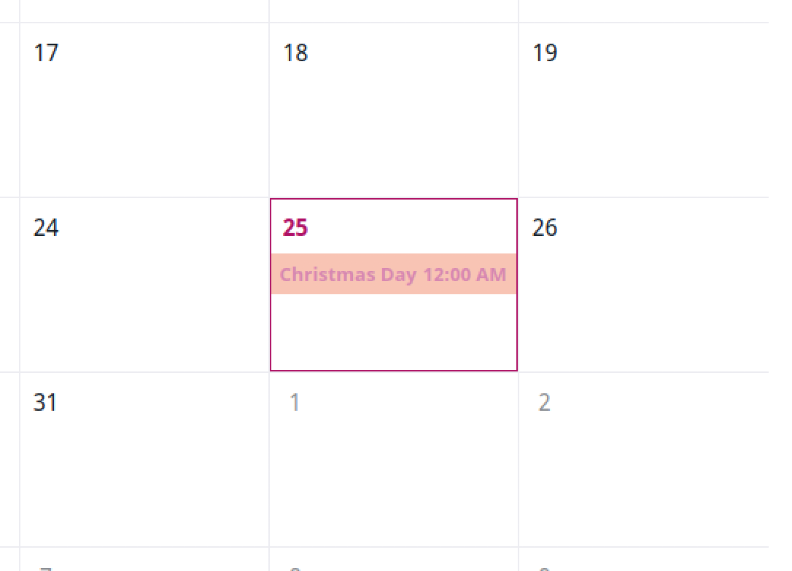

# Customizing Calendar widget

By default, the Calendar widget enables you to display all scheduled events and perform basic actions on them.
You can also configure it to display your custom event types or display them from [custom sources](#configuring-event-sources).

Optionally, you can [change the colors and icons](#customizing-colors-and-icons) and make the widget look differently depending on the [SiteAccess configuration](../guide/siteaccess.md#configuring-siteaccesses).

## Configuring custom events

This example shows you how to create custom events which add bank holidays to the calendar.

First, create a new event in `src/Calendar/Holidays/Event.php`:

``` php
<?php

namespace App\Calendar\Holidays;

use DateTimeInterface;
use EzSystems\EzPlatformCalendar\Calendar\Event as CalendarEvent;

class Event extends CalendarEvent
{
    public function __construct(string $id, DateTimeInterface $dateTime, EventType $type)
    {
        parent::__construct($type, $id, $dateTime);
    }
}
```

Here, you define a new class for your event based on `EzSystems\EzPlatformCalendar\Calendar\Event`.

Next, create `src/Calendar/Holidays/EventType.php`:

```php hl_lines="23 24 25 26"
<?php

namespace App\Calendar\Holidays;

use EzSystems\EzPlatformCalendar\Calendar\Event;
use EzSystems\EzPlatformCalendar\Calendar\EventAction\EventActionCollection;
use EzSystems\EzPlatformCalendar\Calendar\EventType\EventTypeInterface;
use Symfony\Contracts\Translation\TranslatorInterface;

class EventType implements EventTypeInterface
{
    private const EVENT_TYPE_IDENTIFIER = 'holiday';

    private $translator;
    private $actions;

    public function __construct(iterable $actions, TranslatorInterface $translator)
    {
        $this->actions = new EventActionCollection($actions);
        $this->translator = $translator;
    }

    public function getTypeIdentifier(): string
    {
        return self::EVENT_TYPE_IDENTIFIER;
    }

    public function getTypeLabel(): string
    {
        return $this->translator->trans(
            /** @Desc("Bank holidays") */
            'bank_holiday.label',
            [],
            'app_calendar_events'
        );
    }

    public function getEventName(Event $event): string
    {
        return $event->getId();
    }

    public function getActions(): EventActionCollection
    {
        return $this->actions;
    }
}
```

The identifier defined in lines 23-26 can be used later in [configuration](#customizing-colors-and-icons).

Complete the procedure by registering the new event type in `config/services.yaml`:

``` yaml
services:
    // ...
    App\Calendar\Holidays\EventType:
        arguments:
            $actions: []
        tags:
            - { name: ezplatform.calendar.event_type }
```

## Configuring event sources

To add specific events to your calendar, you need to create an event source.

An event source must implement `EzSystems\EzPlatformCalendar\Calendar\EventSource\EventSourceInterface`.

One such built-in implementation is `InMemoryEventSource`.
To add an in-memory collection as an event source, create `src/Calendar/Holidays/EventSourceFactory.php`:

```php
<?php

namespace App\Calendar\Holidays;

use DateTime;
use DateTimeInterface;
use EzSystems\EzPlatformCalendar\Calendar\EventCollection;
use EzSystems\EzPlatformCalendar\Calendar\EventSource\EventSourceInterface;
use EzSystems\EzPlatformCalendar\Calendar\EventSource\InMemoryEventSource;

class EventSourceFactory
{
    private $eventType;

    public function __construct(EventType $eventType)
    {
        $this->eventType = $eventType;
    }

    public function createEventSource(): EventSourceInterface
    {
        $eventCollectionArray = [];
        $eventCollectionArray[] = $this->createEvent('New Year', new DateTime("2020-01-01"));
        $eventCollectionArray[] = $this->createEvent('Christmas Day', new DateTime("2020-12-25"));

        $collection = new EventCollection($eventCollectionArray);

        return new InMemoryEventSource($collection);
    }

    private function createEvent(string $id, DateTimeInterface $dateTime): Event
    {
        return new Event($id, $dateTime, $this->eventType);
    }
}
```

!!! note

    When creating the list of events for `$collection_example = new EventCollection()`, you must put all the `createEvent()` entities chronologically.
    
    For example:
    
    ``` php
    $collection_example = new EventCollection([
        $this->createEvent("Event 1", new DateTime("2020-01-01")),
        $this->createEvent("Event 2", new DateTime("2020-01-02")),
        // ...
    ```    

The event source must be registered in `config/services.yaml`:

``` yaml
App\Calendar\Holidays\EventSourceFactory:
    arguments:
        $eventType: '@App\Calendar\Holidays\EventType'

App\Calendar\Holidays\EventSource:
    class: EzSystems\EzPlatformCalendar\Calendar\EventSource\InMemoryEventSource
    factory: ['@App\Calendar\Holidays\EventSourceFactory','createEventSource']
    tags:
        - { name: ezplatform.calendar.event_source }
```

Now you will be able to see the bank holidays in the **Calendar** tab.



### Importing events from external sources

You can also import events from external sources, e.g. a JSON file:

``` json
[
  {
    "date": "2020-01-01",
    "name": "New Year Day"
  },
  {
    "date": "2020-12-25",
    "name": "Christmas Day"
  },
]
```

To do this, import this file in `src/Calendar/Holidays/EventSourceFactory.php`:

``` php
<?php

namespace App\Calendar\Holidays;

use DateTime;
use DateTimeInterface;
use EzSystems\EzPlatformCalendar\Calendar\EventCollection;
use EzSystems\EzPlatformCalendar\Calendar\EventSource\EventSourceInterface;
use EzSystems\EzPlatformCalendar\Calendar\EventSource\InMemoryEventSource;

class EventSourceFactory
{
    private $eventType;

    public function __construct(EventType $eventType)
    {
        $this->eventType = $eventType;
    }

    public function createEventSource(): EventSourceInterface
    {
        $items = json_decode(file_get_contents(__DIR__ . DIRECTORY_SEPARATOR . 'data.json'), true);
        $eventCollectionArray = [];
        foreach ($items as $item) {
            $eventCollectionArray[] = $this->createEvent($item['name'], new DateTime($item['date']));
        }
        $collection = new EventCollection($eventCollectionArray);

        return new InMemoryEventSource($collection);
    }

    private function createEvent(string $id, DateTimeInterface $dateTime): Event
    {
        return new Event($id, $dateTime, $this->eventType);
    }
}
```

## Customizing colors and icons

You can change the foreground and background color of a custom event or change the icon of an event or action.
The setting is SiteAccess-aware.

To customize the appearance settings, add the following configuration to `config/packages/ezplatform.yaml`:

``` yaml hl_lines="6"
ezplatform:
    system:
        <siteaccess>:
            calendar:
                event_types:
                    holiday:
                        icon: /assets/images/event_icon.svg
                        color: '#FF0000'
                        actions:
                            action_name:
                                icon: /assets/images/action_icon.svg
```

Note that line 6 contains the name of the event type defined in `EventType.php`.

After modifying the assets, for the new configuration to take effect, run: `yarn encore <dev|prod>`.


