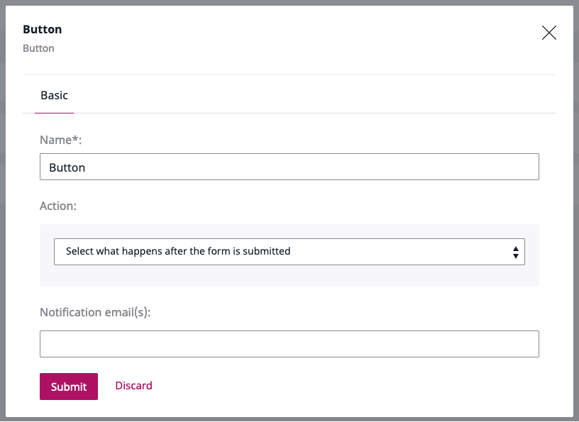

# Extending Form Builder [[% include 'snippets/experience_badge.md' %]] [[% include 'snippets/commerce_badge.md' %]]

## Existing Form fields

### Captcha field

The Captcha Form field is based on [Gregwar/CaptchaBundle](https://github.com/Gregwar/CaptchaBundle).


You can customize the field by adding configuration to `config/packages/gregwar_captcha.yaml` under `gregwar_captcha`:

``` yaml
gregwar_captcha:
    as_url: true
    width: 150
    invalid_message: Code does not match, please retry.
    reload: true
```

The configuration resizes the CAPTCHA image (line 3), changes the error message (line 4), enables the user to reload the code (line 5).


For information about available options, see [the bundle's documentation.](https://github.com/Gregwar/CaptchaBundle#options)

!!! note

    If your installation uses Varnish to manage content cache, you must modify the configuration to avoid issues with the Captcha field. For more information, see [Ensure proper captcha behavior](../guide/http_cache.md#ensure-proper-captcha-behavior).

## Extending Form fields

You can extend the Form Builder by adding new Form fields or modifying existing ones.
Form fields are defined in YAML configuration.

For example, to create a Country Form field in the "Custom form fields" category,
provide the block configuration in `config/packages/ez_platform_form_builder.yaml`:

``` yaml
ez_platform_form_builder:
    fields:
        country:
            name: Country
            category: Custom form fields
            thumbnail: `/bundles/ezplatformadminui/img/ez-icons.svg#input-line`
            attributes:
                label:
                    name: Display label
                    type: string
                    validators:
                        not_blank:
                            message: You must provide label of the field
                help:
                    name: Help text
                    type: string
            validators:
                required: ~
```

Available attribute types are:

|Type|Description|
|----|----|
|`string`|String|
|`text`|Text block|
|`integer`|Integer number|
|`url`|URL|
|`multiple`|Multiple choice|
|`select`|Dropdown|
|`checkbox`|Checkbox|
|`location`|Content Location|
|`radio`|Radio button|
|`action`|Button|
|`choices`|List of available options|

Each type of Form field can have validators of the following types:

- `required`
- `min_length`
- `max_length`
- `min_choices`
- `max_choices`
- `min_value`
- `max_value`
- `regex`
- `upload_size`
- `extensions`

New types of fields require a mapper which implements the `EzSystems\EzPlatformFormBuilder\FieldType\Field\FieldMapperInterface` interface.
Implement the `FieldMapperInterface` interface in `src/FormBuilder/Field/Mapper/CountryFieldMapper.php`:

``` php
namespace App\FormBuilder\Field\Mapper;

use EzSystems\EzPlatformFormBuilder\FieldType\Field\Mapper\GenericFieldMapper;
use EzSystems\EzPlatformFormBuilder\FieldType\Model\Field;

class CountryFieldMapper extends GenericFieldMapper

{
    /**
     * {@inheritdoc}
     */
    protected function mapFormOptions(Field $field, array $constraints): array
    {
        $options = parent::mapFormOptions($field, $constraints);
        $options['label'] = $field->getAttributeValue('label');
        $options['help'] = $field->getAttributeValue('help');
        return $options;
    }
}
```

The mapper must be registered as a service in `config/services.yaml`:

``` yaml
services:
    # ...
    App\FormBuilder\Field\Mapper\CountryFieldMapper:
        arguments:
            $fieldIdentifier: country
            $formType: Symfony\Component\Form\Extension\Core\Type\CountryType
        tags:
            - { name: ezplatform.form_builder.field_mapper }
```

Now you can go to Back Office and build a new form.
You should be able to see the new section in the list of available fields:


And a new Country Form field:


## Changing field and field attribute definitions dynamically

Field or field attribute definition can be modified by subscribing to one of the following events:

```
ezplatform.form_builder.field.<FIELD_ID>
ezplatform.form_builder.field.<FIELD_ID>.<ATTRIBUTE_ID>
```

The following example adds the `readonly` attribute to `single_line` field definition.

``` php
namespace App\EventSubscriber;

use EzSystems\EzPlatformFormBuilder\Event\FieldDefinitionEvent;
use EzSystems\EzPlatformFormBuilder\Event\FieldDefinitionEvents;
use EzSystems\EzPlatformFormBuilder\Definition\FieldAttributeDefinitionBuilder;
use Symfony\Component\EventDispatcher\EventSubscriberInterface;

class FieldDefinitionSubscriber implements EventSubscriberInterface
{
    public function onSingleLineFieldDefinition(FieldDefinitionEvent $event): void
    {
        $isReadOnlyAttribute = new FieldAttributeDefinitionBuilder();
        $isReadOnlyAttribute->setIdentifier('readonly');
        $isReadOnlyAttribute->setName('Field is read only');
        $isReadOnlyAttribute->setType('string');

        $definitionBuilder = $event->getDefinitionBuilder();
        $definitionBuilder->addAttribute($isReadOnlyAttribute->buildDefinition());
    }

    /**
     * {@inheritdoc}
     */
    public static function getSubscribedEvents(): array
    {
        return [
            FormEvents::getFieldDefinitionEventName('single_line') => 'onSingleLineFieldDefinition'
        ];
    }
}
```

``` yaml
services:
    App\EventSubscriber\FieldDefinitionSubscriber:
        public: true
        tags:
            - kernel.event_subscriber
```

## Accessing Form field definitions

Field definitions are accessible through:

- `\EzSystems\EzPlatformFormBuilder\Definition\FieldDefinitionFactory` in the back end
- global variable `eZ.formBuilder.config.fieldsConfig` in the front end

## Customizing email notifications

Email is one of the Submit button options you can add to a form using the Form Builder.
It allows you to list email addresses to which notifications about newly filled forms should be sent.



### Override email template

To customize the Form Builder submission notification, you need to override the `form_builder/form_submit_notification_email.html.twig` template.
It contains two blocks: subject and body.
Each of them is rendered independently and consists of three sets of parameters.

|Parameter|Type|Description|
|---------|----|-----------|
|`content`|`eZ\Publish\API\Repository\Values\Content\Content`|Name of the form, its Content Type|
|`form`|`EzSystems\EzPlatformFormBuilder\FieldType\Model\Form`|Definition of the form|
|`data`|`EzSystems\EzPlatformFormBuilder\FieldType\Model\FormSubmission`|Sent data|  

By adjusting them to your needs, you will change your email template.

### Configure sender details

To send emails, you also need to configure `sender_address` in `config/packages/swiftmailer.yaml`.
It acts as a sender and return address for all bounced messages.
For details, see [Symfony Mailer Configuration Reference.](https://symfony.com/doc/5.0/reference/configuration/swiftmailer.html#sender-address)
