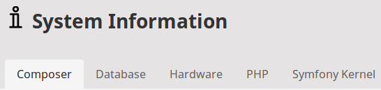

# Extending tabs

Many elements of the Back Office interface, such as System Information or Location View, are built using tabs.



You can extend existing tab groups with new tabs, or create your own tab groups.

## Adding a new tab group

New tab groups are created using the [`TabsComponent`](https://github.com/ezsystems/ezplatform-admin-ui/blob/master/src/lib/Component/TabsComponent.php).

Register your tab group as a service in `config/services.yaml`:

``` yaml
app.my_tabs.custom_group:
    parent: EzSystems\EzPlatformAdminUi\Component\TabsComponent
    autowire: true
    autoconfigure: false
    arguments:
        $groupIdentifier: 'custom_group'
    tags:
        - { name: ezplatform.admin_ui.component, group: 'dashboard-blocks' }
```

The tab group must be tagged with `ezplatform.admin_ui.component`.
The `group` tag indicates where the group will be rendered.
For the list of possible rendering places, see [Injecting custom components](custom_components.md).

`$groupIdentifier` is the name that you point to when assigning a tab to this group.
You can also provide the `$template` argument to use a custom template for rendering the group.

### Adding a tab group with custom logic

To create a custom tab group with additional logic, you need to create it at the level of compiling the Symfony container,
using a [CompilerPass.](https://symfony.com/doc/4.3/service_container/compiler_passes.html)

For example, in `src/DependencyInjection/Compiler/CustomTabGroupPass.php`:

``` php
namespace App\DependencyInjection\Compiler;

use EzSystems\EzPlatformAdminUi\Tab\TabGroup;
use EzSystems\EzPlatformAdminUi\Tab\TabRegistry;
use Symfony\Component\DependencyInjection\Compiler\CompilerPassInterface;
use Symfony\Component\DependencyInjection\ContainerBuilder;
use Symfony\Component\DependencyInjection\Definition;

class CustomTabGroupPass implements CompilerPassInterface
{
    public function process(ContainerBuilder $container)
    {
        if (!$container->hasDefinition(TabRegistry::class)) {
            return;
        }

        $tabRegistry = $container->getDefinition(TabRegistry::class);
        $tabGroupDefinition = new Definition(
            TabGroup::class,  // or any class that extends TabGroup
            ['custom-tab-group']
        );
        $tabRegistry->addMethodCall('addTabGroup', [$tabGroupDefinition]);
    }
}
```

You also need to add the compiler pass to `src/Kernel.php`:

``` php
protected function configureContainer(ContainerBuilder $container, LoaderInterface $loader): void
{
    //
    $container->addCompilerPass(new CustomTabGroupPass());
}
```

## Adding a new tab

Before you add a tab to a group you must create the tab's PHP class and define it as a Symfony service with the `ezplatform.tab` tag in `config/services.yaml`:

``` yaml
App\Custom\Tab:
    parent: EzSystems\EzPlatformAdminUi\Tab\AbstractTab
    autowire: true
    autoconfigure: false
    tags:
        - { name: ezplatform.tab, group: dashboard-everyone }
```

This configuration also assigns the new tab to `dashboard-everyone`.
You can also use here the name of your own [custom tab group](#adding-a-new-tab-group).

The tab class can look like this (in `src/Custom/Tab.php`):

``` php
namespace App\Custom;

use EzSystems\EzPlatformAdminUi\Tab\AbstractTab;

class Tab extends AbstractTab
{
    public function getIdentifier(): string
    {
        return 'custom-tab';
    }

    public function getName(): string
    {
        return /** @Desc("Custom Tab") */
            $this->translator->trans('custom.tab.name', [], 'some_translation_domain');
    }

    public function renderView(array $parameters): string
    {
        // Do rendering here

        return $this->twig->render('my_tabs/custom.html.twig', [
            'foo' => 'Bar!',
        ]);
    }
}
```

Beyond the `AbstractTab` used in the example above you can use two specialized tab types:

- `AbstractControllerBasedTab` enables you to embed the results of a controller action in the tab.
- `AbstractRouteBasedTab` embeds the results of the selected routing, passing applicable parameters.

## Modifying tab display

You can order the tabs by making the tab implement `OrderedTabInterface`.
The order will then depend on the numerical value returned by the `getOrder` method.

``` php
class Tab extends AbstractTab implements OrderedTabInterface
{
    public function getOrder(): int
    {
        return 100;
    }
}
```

The tabs will be displayed according to this value in ascending order.

!!! tip

    It is good practice to reserve some distance between these values, for example to stagger them by step of 10.
    It may come useful if you later need to place something between the existing tabs.

You can also influence tab display (e.g. order tabs, remove or modify them, etc.) by using Event Listeners:

``` php
class TabEvents
{
    /**
     * Happens just before rendering a tab group.
     */
    const TAB_GROUP_PRE_RENDER = 'ezplatform.tab.group.pre_render';

    /**
     * Happens just before rendering a tab.
     */
    const TAB_PRE_RENDER = 'ezplatform.tab.pre_render';
}
```

As an example, see how `OrderedTabInterface` is implemented:

```php
<?php

namespace EzSystems\EzPlatformAdminUi\Tab\Event\Subscriber;

use EzSystems\EzPlatformAdminUi\Tab\Event\TabEvents;
use EzSystems\EzPlatformAdminUi\Tab\Event\TabGroupEvent;
use EzSystems\EzPlatformAdminUi\Tab\OrderedTabInterface;
use EzSystems\EzPlatformAdminUi\Tab\TabInterface;
use Symfony\Component\EventDispatcher\EventSubscriberInterface;

/**
 * Reorders tabs according to their Order value (Tabs implementing OrderedTabInterface).
 * Tabs without order specified are pushed to the end of the group.
 *
 * @see OrderedTabInterface
 */
class OrderedTabSubscriber implements EventSubscriberInterface
{
    /**
     * @return array
     */
    public static function getSubscribedEvents(): array
    {
        return [
            TabEvents::TAB_GROUP_PRE_RENDER => ['onTabGroupPreRender'],
        ];
    }

    /**
     * @param TabGroupEvent $tabGroupEvent
     */
    public function onTabGroupPreRender(TabGroupEvent $tabGroupEvent)
    {
        $tabGroup = $tabGroupEvent->getData();
        $tabs = $tabGroup->getTabs();

        $tabs = $this->reorderTabs($tabs);

        $tabGroup->setTabs($tabs);
        $tabGroupEvent->setData($tabGroup);
    }

    /**
     * @param TabInterface[] $tabs
     *
     * @return array
     */
    private function reorderTabs($tabs): array
    {
        $orderedTabs = [];
        foreach ($tabs as $tab) {
            if ($tab instanceof OrderedTabInterface) {
                $orderedTabs[$tab->getIdentifier()] = $tab;
                unset($tabs[$tab->getIdentifier()]);
            }
        }

        uasort($orderedTabs, [$this, 'sortTabs']);

        return array_merge($orderedTabs, $tabs);
    }

    /**
     * @param OrderedTabInterface $tab1
     * @param OrderedTabInterface $tab2
     *
     * @return int
     */
    private function sortTabs(OrderedTabInterface $tab1, OrderedTabInterface $tab2): int
    {
        return $tab1->getOrder() <=> $tab2->getOrder();
    }
}
```
