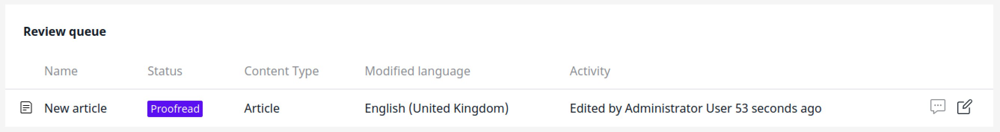

# Extending Workflow

## Adding custom actions

[Built-in actions in the Editorial Workflow](../guide/workflow.md#publishing-content-with-workflow)
enable you to automatically publish a Content item or to send a notification to reviewers.

You can also create custom actions that will be called when content reaches a specific stage
or goes through a transition in a workflow. In `config/packages/ezplatform.yaml`:

``` yaml
ezplatform:
    system:
        # Workflow configuration is SiteAccess-aware
        default:
            workflows:
                custom_workflow:
                    # ...
                    transitions:
                        # ...
                        to_proofread:
                            from: draft
                            to: proofread
                            label: To proofreading
                            actions:
                                proofread_transition_action:
                                    data:
                                        message: "The article has gone to proofreading"
```

??? tip "Complete `custom_workflow` configuration"    
    ``` yaml
    ezplatform:
        system:
            # Workflow configuration is SiteAccess-aware
            default:
                workflows:
                    # Identifier of the workflow
                    custom_workflow:
                        name: Custom Workflow
                        matchers:
                            # Which Content Types can use this workflow, optional
                            content_type: article
                            # Which status of the Content item can use this workflow, optional. Available statuses are draft and published.
                            content_status: draft
                        # All stages the content goes through
                        stages:
                            draft:
                                label: Draft
                                color: '#f15a10'
                            proofread:
                                label: Proofread
                                color: '#5a10f1'
                            done:
                                label: Done
                                color: '#301203'
                                # Content items in this stage don't appear on My dashboard and in Review Queue.
                                last_stage: true
                        initial_stage: draft
                        # Available transitions between stages
                        transitions:
                            to_proofread:
                                from: draft
                                to: proofread
                                label: To proofreading
                                color: '#8888ba'
                                icon: '/bundles/ezplatformadminui/img/ez-icons.svg#comment'
                                reviewers:
                                    required: true
                            back_to_draft:
                                reverse: to_proofread
                                label: Back to draft
                                color: '#cb8888'
                                icon: '/bundles/ezplatformadminui/img/ez-icons.svg#comment'
                            done:
                                from: proofread
                                to: done
                                label: Done
                                color: '#88ad88'
                                icon: '/bundles/ezplatformadminui/img/ez-icons.svg#comment'
    ```

The configuration indicates the name of the custom action (`proofread_transition_action`) that will call the action.
`data` contains additional data that can be passed to the action. In this case, a message to display.

To define what the action does, create an Event Listener `src/EventListener/ProofreadTransitionListener.php`:

``` php hl_lines="27 36"
<?php

declare(strict_types=1);

namespace App\EventListener;

use EzSystems\EzPlatformWorkflow\Event\Action\AbstractTransitionWorkflowActionListener;
use Symfony\Component\Workflow\Event\TransitionEvent;
use EzSystems\EzPlatformAdminUi\Notification\TranslatableNotificationHandlerInterface as NotificationInterface;

class ProofreadTransitionListener extends AbstractTransitionWorkflowActionListener
{
    private $notificationHandler;

    public function __construct(NotificationInterface $notificationHandler)
    {
        $this->notificationHandler = $notificationHandler;
    }

    public function getIdentifier(): string
    {
        return 'proofread_transition_action';
    }

    public function onWorkflowEvent(TransitionEvent $event): void
    {
        $metadata = $this->getActionMetadata($event->getWorkflow(), $event->getTransition());
        $message = $metadata['data']['message'];

        $this->notificationHandler->info(
            $message,
            [],
            'domain'
        );

        $this->setResult($event, true);
    }
}
```

This Listener displays a notification bar at the bottom of the page when a Content item goes through the `to_proofread` transition.

The content of the notification is the message configured in `actions.proofread_transition_action.data`.
To get it, access the metadata for this transition through `getActionMetadata()` (line 27).

The listener must be registered as a service (in `config/services.yaml`):

``` yaml
App\EventListener\ProofreadTransitionListener:
    tags:
        - { name: ezplatform.workflow.action_listener }
```

Line 36 in the listener above sets a custom result value for the transition.
You can use this value in other stages and transitions for this Content item, for example:

``` yaml
done:
    from: proofread
    to: done
    label: Done
    actions:
        done_transition_action:
            condition:
                - result.proofread_transition_action == true
```

The action indicated here will be performed only if the result from the `proofread_transition_action` is set to `true`.
Then, the following `src/EventListener/DoneTransitionListener` is called:

``` php hl_lines="27"
<?php

declare(strict_types=1);

namespace App\EventListener;

use EzSystems\EzPlatformWorkflow\Event\Action\AbstractTransitionWorkflowActionListener;
use Symfony\Component\Workflow\Event\TransitionEvent;
use EzSystems\EzPlatformAdminUi\Notification\TranslatableNotificationHandlerInterface as NotificationInterface;

class DoneTransitionListener extends AbstractTransitionWorkflowActionListener
{
    private $notificationHandler;

    public function __construct(NotificationInterface $notificationHandler)
    {
        $this->notificationHandler = $notificationHandler;
    }

    public function getIdentifier(): string
    {
        return 'done_transition_action';
    }

    public function onWorkflowEvent(TransitionEvent $event): void
    {
        $context = $event->getContext();
        $message = $context['message'];

        $this->notificationHandler->info(
            $message,
            [],
            'domain'
        );
    }
}
```

This listener also displays a notification, but in this case its content is taken from the message
that the user types when choosing the `Done` transition.

The message is contained in the context of the action.

`$event->getContext()` gives you access to the context.
The context contains:

- `$workflowId` - the ID of the current workflow
- `$message` - content of the user's message when sending the Content item through the transitions
- `$reviewerId`: ID of the User who was selected as a reviewer
- `$result`: an array of transition actions performed so far

You can also modify the context using the `setContext()` method.
For example, you can override the message typed by the user:

```
$new_context = $context;
$new_context['message'] = "This article went through proofreading";
$event->setContext($new_context);
```
Now you can send your articles to the proofreading stage.



## Workflow event timeline

[Workflow event timeline](../guide/workflow.md) is used out of the box to display workflow transitions.

You can also use it to render custom entries in the timeline, for example system alerts on workflows.

### Adding custom entry type

To add a custom entry type, create a custom class extending `EzSystems\EzPlatformWorkflow\WorkflowTimeline\Value\AbstractEntry`.
Use an `EzSystems\EzPlatformWorkflow\Event\TimelineEvents::COLLECT_ENTRIES` event to add your entries to the timeline.

### Providing custom templates

To provide custom templates for new event timeline entries, use the following configuration in `config/packages/ezplatform.yaml`:

``` yaml
ezplatform:
    system:
        default:
            workflows_config:
                # Workflow Timeline
                timeline_entry_templates:
                    - { template: '@EzPlatformWorkflow/ezplatform_workflow/timeline/entries.html.twig', priority: 10 }
```

The template has to provide a block named `ez_workflow_timeline_entry_{ENTRY_IDENTIFIER}`.
