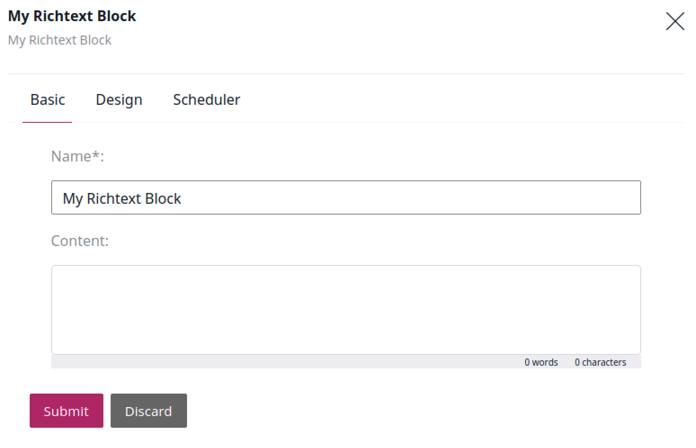

# Creating custom RichText blocks [[% include 'snippets/experience_badge.md' %]] [[% include 'snippets/commerce_badge.md' %]]

To create a RichText [custom Page block](extending_page.md), you need to define its layout, provide templates, add a subscriber and register it as a service.

Start with providing the block configuration in `config/packages/ezplatform_page_fieldtype.yaml`:

``` yaml hl_lines="3 15"
ezplatform_page_fieldtype:
    blocks:
        my_block:
            name: My Richtext Block
            thumbnail: assets/images/blocks/richtext_block_icon.svg
            configuration_template: blocks/my_block/config.html.twig
            views:
                default:
                    template: blocks/my_block/default.html.twig
                    name: My block view
                    priority: -255                    
            attributes:
                content:
                    name: Content
                    type: richtext

```

This configuration defines a new block, its view and configuration templates, and attribute type `richtext` (line 15).
Remember to provide an icon for the block in the `assets/images/blocks/` folder.

Next, create a subscriber that converts a string of data into XML.
Create a `src/Event/Subscriber/RichTextBlockSubscriber.php` file containing:

``` php hl_lines="32 41 42 43 44 45 46 47 48 49 50 51"
<?php

declare(strict_types=1);

namespace App\Event\Subscriber;

use EzSystems\EzPlatformRichText\eZ\RichText\DOMDocumentFactory;
use EzSystems\EzPlatformPageFieldType\FieldType\Page\Block\Renderer\BlockRenderEvents;
use EzSystems\EzPlatformPageFieldType\FieldType\Page\Block\Renderer\Event\PreRenderEvent;
use EzSystems\EzPlatformPageFieldType\FieldType\Page\Block\Renderer\Twig\TwigRenderRequest;
use Symfony\Component\EventDispatcher\EventSubscriberInterface;

class RichTextBlockSubscriber implements EventSubscriberInterface
{
    /** @var \EzSystems\EzPlatformRichText\eZ\RichText\DOMDocumentFactory */
    private $domDocumentFactory;

    /**
     * @param \EzSystems\EzPlatformRichText\eZ\RichText\DOMDocumentFactory $domDocumentFactory
     */
    public function __construct(DOMDocumentFactory $domDocumentFactory)
    {
        $this->domDocumentFactory = $domDocumentFactory;
    }

    /**
     * {@inheritdoc}
     */
    public static function getSubscribedEvents(): array
    {
        return [
            BlockRenderEvents::getBlockPreRenderEventName('my_block') => 'onBlockPreRender',
        ];
    }

    /**
     * @param \EzSystems\EzPlatformPageFieldType\FieldType\Page\Block\Renderer\Event\PreRenderEvent $event
     */
    public function onBlockPreRender(PreRenderEvent $event): void
    {
        $renderRequest = $event->getRenderRequest();
        if (!$renderRequest instanceof TwigRenderRequest) {
            return;
        }
        $parameters = $renderRequest->getParameters();
        $parameters['document'] = null;
        $xml = $event->getBlockValue()->getAttribute('content')->getValue();
        if (!empty($xml)) {
            $parameters['document'] = $this->domDocumentFactory->loadXMLString($xml);
        }
        $renderRequest->setParameters($parameters);
    }
 }

```

Note that in the line 32, `my_block` is the name of the block defined in the `ezplatform_page_fieldtype.yaml` file (line 3).
This line also implements the `PreRender` method.
Lines 41-51 handle the conversion of content into XML string.

At this point you need to create [templates](../guide/templates.md#templating-basics) for displaying and configuring your block.

Start with creating the view template in `templates/blocks/my_block/richtext.html.twig`:

``` html+twig hl_lines="2"
<div class="block-richtext {{ block_class }}">
            {{ document | ez_richtext_to_html5 }}
</div>

```
Here, line 2 is responsible for rendering the content from XML to HTML5.

Proceed with creating a separate `templates/blocks/my_block/config.html.twig` template:

``` html+twig



    {{ parent() }}
    <meta name="LanguageCode" content="{{ language_code }}" />


```

Complete the procedure with registering the subscriber as a service in `config/services.yaml`:

``` yaml
services:
    App\Event\Subscriber\RichTextBlockSubscriber:
        tags:
            - { name: kernel.event_subscriber }
```


Now, you can add your custom RichText block in the Site tab.



For details on customizing additional options of the block or creating custom blocks with other attribute types, see [Creating custom Page blocks](extending_page.md).
