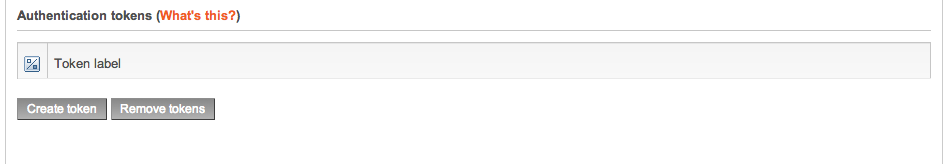

# About Composer

## Using Composer

Keeping your system up-to-date is important to make sure it is running optimally and securely. The update mechanism in eZ software is using the *de facto* standard PHP packaging system called [Composer](https://getcomposer.org/). 

This makes it easy to adapt package installs and updates to your workflow, allowing you to test new/updated packages in a development environment, place the changes in your version control system (git, Subversion, Mercurial, etc.), pull in those changes to a staging environment and, when approved, put them in production.

!!! note "[Composer](https://getcomposer.org/) is an opensource PHP packaging system to manage dependencies."

    This makes it easy to adapt package installs and updates to your workflow, allowing you to test new/updated packages in a development environment, put the changes in your version control system (git, Subversion, Mercurial, etc.), pull in those changes on a staging environment and, when approved, put it in production.

### Installing Composer

Composer is a command-line tool, so the main way to install it is via command line from inside the root directory of the (eZ) software:

**Composer download in current folder:**

``` bash
php -r "readfile('https://getcomposer.org/installer');" | php
```

By doing it this way you will need to execute further Composer commands using `php composer.phar`. If you'd rather prefer to install Composer globally on your machine instead of inside each and every project that uses it, then follow [these instructions in online Composer documentation](https://getcomposer.org/doc/00-intro.md#globally).

### Prerequisite to using composer with eZ Enterprise software

**This section describes features available only in eZ Enterprise.**

### Setting up Authentication tokens for access to commercial updates

Out of the box Composer uses a packaging repository called [packagist.org](https://packagist.org/) to find all open-source packages and their updates. Additional commercial packages are available for eZ Enterprise subscribers at [updates.ez.no/bul/](https://updates.ez.no/bul/) *(which is password-protected, you will need to set up authentication tokens as described below to get access)*.

To get access to these updates log in to your service portal on [support.ez.no](https://support.ez.no) and look for the following on the *"Maintenance and Support agreement details"* screen:



1.  Click "Create token" (This requires the "Portal administrator" access level.)
2.  Fill in a label describing the use of the token. This will allow you to revoke access later.
    -   Example, if you need to provide access to updates to a third party, a good example would be "53-upgrade-project-by-partner-x"

3.  Copy the password, **you will not get access to it again**!

After this, when running Composer to get updates as described below, you will be asked for a Username and Password. Use:

-   as Username – your Installation key found above on the *"Maintenance and Support agreement details"* page in the service portal
-   as Password – the token password you retrieved in step 3.

Support agreement expiry

If your Support agreement expires, your authentication token(s) will no longer work. They will become active again if the agreement is renewed, but this process may take up to 24 hours. (If the agreement is renewed before the expiry date, there will be no disruption of service.)

### Optional: Save authentication information in auth.json to avoid repeatedly typing it

Composer will ask to do this for you on updates, however if it is disabled, you can create an `auth.json` file manually in one of the following ways:

* Option A: Store your credentials in the project directory:

``` bash
composer config http-basic.updates.ez.no <installation-key> <token-password>
```

* Option B: If you'd rather want to install it globally in [COMPOSER\_HOME](https://getcomposer.org/doc/03-cli.md#composer-home) directory for machine-wide use:

``` bash
composer config --global http-basic.updates.ez.no <installation-key> <token-password>
```

### Update workflow Using Composer

This section describes the best practice for using Composer, essentially it suggests treating updates like other code/configuration/\* changes on your project, tackling them on a development machine before staging them for rollout on staging/production.  

### 1. Running composer update and version changes in development

Updating eZ software via Composer is nothing different then [updating other projects via Composer](https://getcomposer.org/doc/03-cli.md#update), but for illustration here is how you update your project locally:

**composer update**

``` bash
php -d memory_limit=-1 composer.phar update --no-dev --prefer-dist
```

!!! tip

    This will load in all updated packages, from eZ as well as third-party libraries, both used by eZ and other you may have added. When updating like this it is recommended to take note of what was updated so you have an idea of what you should test before putting the updates into production.

At this stage you might need to manually clear Symfony's `prod` environment class cache (cached interfaces and lazy services) in case the classes/interfaces in it have changed. This can be done in the following way:

**Optional prod class cache clearing**

``` bash
rm -f app/cache/prod/*.php
```

When the update has completed and local install is verified to work, make sure to version changes done to the `composer.lock` file (if you use a version control system like *git*). This file contains **all details of which versions are currently used** and makes sure the same version is used among all developers, staging and eventually production when current changes are approved for production (assuming you have a workflow for this).

!!! tip

    In large development teams make sure people don't blindly update and install third party components. This might easily lead to version conflicts on `composer.lock` and can be tiring to fix up if happening frequently. A workflow involving composer install and unit test execution on proposed changes can help avoid most of this, like the Pull Request workflow available via Github/Bitbucket.

### 2. Installing versioned updates on other development machines and/or staging -> production

Installing eZ software packages via Composer is nothing different then [installing vanilla packages via Composer](https://getcomposer.org/doc/03-cli.md#install), and for illustration here is how you install versioned updates:

**composer install (package installation)**

``` bash
php -d memory_limit=-1 composer.phar install --no-dev --prefer-dist
```

!!! tip

    Here the importance of `composer.lock` comes in, as this command will tell Composer to install packages in exactly the same version as defined in this file. If you don't keep track of `composer.lock`, it will instead just install always the latest version of a package and won't allow you to stage updates before moving towards production.

### General notes on use of Composer

### Installing additional packages via Composer

Requiring eZ software packages via Composer is also done in same way as [requiring vanilla packages via Composer](https://getcomposer.org/doc/03-cli.md#require), and for illustration here is how you install the community-developed [EzPriceBundle](https://github.com/ezcommunity/EzPriceBundle):

**composer install (package installation)**

``` bash
php -d memory_limit=-1 composer.phar require --prefer-dist ezcommunity/ez-price-bundle:~1.0.0@beta
```

### Dumping autoload for better performance

For PHP 5.6 and up you'll get a notable performance improvement by making composer dump optimized autoload array, this can be done on composer install and update, but also using:

`php -d memory_limit=-1 composer.phar dump-autoload --optimize`

### Common errors

#### Cloning failed using an ssh key

When dealing with [updates.ez.no](http://updates.ez.no) packages, you might get this if you somehow tell composer to download dev packages, or tell it to download from source. Currently our [updates.ez.no](http://updates.ez.no) service only support distribution packages in alpha stability or higher, so make sure to check what stability and avoid use of `--prefer-source` *(this is the reason examples above are using `--prefer-dist`).*

#### Conflict with roave/security-advisories

When you use composer update or require, a package may conflict with `roave/security-advisories`:
``` bash
Your requirements could not be resolved to an installable set of packages.
  Problem 1
    - ezsystems/ezpublish-legacy v5.4.10 conflicts with roave/security-advisories[dev-master].
    (...)
```

This means there is a known security bug in the specific version of the package, ezsystems/ezpublish-legacy v5.4.10 in this case. In most cases this means that a fix is available in a newer version, such as v5.4.10.1. If you increase your requirement to that version, the conflict is resolved.

In the rare case that there is no fixed version, you can revert your requirement to an older version which does not have the bug. If you have to use the version with the bug (not recommended) you can `composer remove roave/security-advisories`. In that case, please require it again when the bug is fixed and the package is updated: `composer require roave/security-advisories:dev-master`

### Best practice for Bundles

Best practice for Bundles is described in Symfony documentation under [Best Practices for Reusable Bundles](http://symfony.com/doc/current/cookbook/bundles/best_practices.html), with eZ bundles there is some notable exceptions:

#### Documentation

-   You may write your documentation using markdown (.md) if you prefer, however .rst is recommended if you plan to use [writethedocs.org](http://writethedocs.org), as heavily used by many open source projects.

#### Git repository naming

-   You may omit vendor name in repository naming, assuming vendor name is reflected in organization / user account it is attached to.
-   You may also choose to follow composer package naming on repository name which is more relevant when trying to find a given package later.

#### Composer Metadata

-   For defining `"type"`, the following are at the moment known valid values:
    -   `ezplatform-bundle` | Symfony bundles that uses eZ Platform features
    -   `ezstudio-bundle` | Symfony bundles that uses eZ Platform Enterprise Edition features*
        *
        -   Deprecated: Please use ezplatform-bundle and add dependencies on the ee packages you depend on instead.
    -   `symfony-bundle` | Standard symfony bundles as described in Symfony doc.
-   For eZ Publish (legacy) and eZ Publish Platform there where also:
    -   `ezpublish-legacy-extension` | For standalone 4.x (legacy) extensions, to be used with [ezpublish-legacy-installer](https://github.com/ezsystems/ezpublish-legacy-installer)
    -   `ezpublish-bundle | For eZ Publish Platform 5.x bundles, may optionally be a "legacy bundle".`

## Composer for Frontend Developers

If you are a web designer or working on the CSS on your website, this page contains is all you need to know about Composer.

!!! note "[Composer](https://getcomposer.org/) is an opensource PHP packaging system to manage dependencies."

    This makes it easy to adapt package installs and updates to your workflow, allowing you to test new/updated packages in a development environment, put the changes in your version control system (git, Subversion, Mercurial, etc.), pull in those changes on a staging environment and, when approved, put it in production.

### Troubleshooting

You may experience some latency in dependency resolution: everything is going normally.

If you are interested by the process, do your Composer commands with the `--verbose` option activated.

#### Option `verbose -v`

Increase the verbosity of messages: 1 for normal output, 2 for more verbose output and 3 for debug.

#### Usage:

``` bash
php -d memory_limit=-1 composer.phar <command> --verbose (-v|vv|vvv)
```

### Useful commands

#### install

The `install` command reads the composer.lock file from the current directory, processes it, and downloads and installs all the libraries and dependencies outlined in that file. If the file does not exist it will look for composer.json and do the same.

##### Usage

``` bash
php -d memory_limit=-1 composer.phar install --dry-run --prefer-dist
```

In this example the `dry-run` option is mentioned to prevent you from doing anything critical. (This option outputs the operations but will not execute anything and implicitly enables the verbose mode).

##### Documentation with complete usage:

``` bash
php -d memory_limit=-1 composer.phar install [--prefer-source] [--prefer-dist] [--dry-run] [--dev] [--no-dev] [--no-plugins] [--no-custom-installers] [--no-scripts] [--no-progress] [-v|vv|vvv|--verbose] [-o|--optimize-autoloader] [packages1] ... [packagesN]
```

#### Update

 The `update` command reads the composer.json file from the current directory, processes it, and updates, removes or installs all the dependencies.

##### Interesting options:

To limit the update operation to a few packages, you can list the package(s) you want to update as such:

``` bash
php -d memory_limit=-1 composer.phar update vendor/package1 foo/mypackage
```

 You may also use an asterisk (\*) pattern to limit the update operation to package(s) from a specific vendor:

``` bash
php -d memory_limit=-1 composer.phar update vendor/package1 foo/*
```

## Composer for System Administrators

!!! note "[Composer](https://getcomposer.org/) is an opensource PHP packaging system to manage dependencies."

    This makes it easy to adapt package installs and updates to your workflow, allowing you to test new/updated packages in a development environment, put the changes in your version control system (git, Subversion, Mercurial, etc.), pull in those changes on a staging environment and, when approved, put it in production.

!!! note "composer.phar or composer?"

    The following examples use a `composer install` global command, as alternative use `php composer.phar <command>`.
Read the answer in the FAQ:[What Composer command-line do you have to use ?](https://doc.ez.no/pages/viewpage.action?pageId=23529122)

!!! note

    See [the Composer documentation](https://getcomposer.org/doc/00-intro.md) for further information

### Technical prerequisites

Composer requires PHP 5.3.2+ to run.

### Useful Composer commands for System Administrators

!!! note

    as usual with CLI, you can type:

    `$> php composer.phar help [--xml] [--format="..."] [--raw] [command_name]`

    to get help for the command.

On this page you will find some useful commands and an extract of the Composer Documentation. The interesting options part is an extract of available options

#### show

The `show` command displays detailed information about a package, or lists all available packages.

##### Usage

``` bash
 php composer.phar show [-i|--installed] [-p|--platform] [-a|--available] [-s|--self] [-N|--name-only] [-P|--path] [package] [version]
```

#### require

The `require` command adds required packages to your composer.json and installs them. If you do not want to install the new dependencies immediately, you can call it with `--no-update`

##### Usage

``` bash
php composer.phar require [--dev] [--prefer-source] [--prefer-dist] [--no-progress] [--no-update] [--update-no-dev] [--update-with-dependencies] [packages1] ... [packagesN]
```

##### Interesting options

|option | description |
|-------|-------------|
|   --prefer-source | Forces installation from package sources when possible, including VCS information |
|   --prefer-dist   | Forces installation from package dist even for dev versions |
|   --no-progress   | Do not output download progress |
|   --no-update     | Disables the automatic update of the dependencies |
|   --update-with-dependencies | Allows inherited dependencies to be updated with explicit dependencies |

#### search

The `search` command searches for packages by its name.

##### Example

``` bash
$> php composer.phar search symfony composer
```

can return to you a list like this:

``` bash
symfony/assetic-bundle Integrates Assetic into Symfony2
symfony/monolog-bundle Symfony MonologBundle
ezsystems/ngsymfonytools-bundle Bundle of the legacy netgen/ngsymfonytools extension
symfony-cmf/routing Extends the Symfony2 routing component for dynamic routes and chaining several routers
doctrine/doctrine-bundle Symfony DoctrineBundle
nelmio/cors-bundle Adds CORS (Cross-Origin Resource Sharing) headers support in your Symfony2 application
tedivm/stash-bundle Incorporates the Stash caching library into Symfony.
egulias/listeners-debug-command-bundle Symfony 2 console command to debug listeners
hautelook/templated-uri-router Symfony2 RFC-6570 compatible router and URL Generator
hautelook/templated-uri-bundle Symfony2 Bundle that provides a RFC-6570 compatible router and URL Generator.
symfony/swiftmailer-bundle Symfony SwiftmailerBundle
white-october/pagerfanta-bundle Bundle to use Pagerfanta with Symfony2
symfony/icu Contains an excerpt of the ICU data and classes to load it.
symfony/symfony The Symfony PHP framework
sensio/distribution-bundle The base bundle for the Symfony Distributions
symfony/symfony The Symfony PHP framework
symfony/console Symfony Console Component
symfony/filesystem Symfony Filesystem Component
symfony/finder Symfony Finder Component
symfony/process Symfony Process Component
symfony/yaml Symfony Yaml Component
symfony/translation Symfony Translation Component
symfony/debug Symfony Debug Component
symfony/routing Symfony Routing Component
symfony/icu Contains an excerpt of the ICU data to be used with symfony/intl.
symfony/config Symfony Config Component
symfony/validator Symfony Validator Component
symfony/stopwatch Symfony Stopwatch Component
symfony-cmf/symfony-cmf Symfony Content Management Framework
```

#### validate

The `validate` command validates a given composer.json.

#####  Usage

``` bash
 $> php composer.phar validate [--no-check-all] [file]
```

##### Interesting options

|option | description |
|-------|-------------|
| --no-check-all | Do not make complete validation |
| --profile | Display timing and memory usage info |
| --working-dir (-d) | If specified, use the given directory as a working directory |

### Automate installation

Note that you can add some scripts to the Composer dependencies installation.

The available events are :

-   **pre-install-cmd**
-   **post-install-cmd**
-   **pre-update-cmd**
-   **post-update-cmd**
-   **pre-status-cmd**
-   **post-status-cmd**
-   **pre-package-install**
-   **post-package-install**
-   **pre-package-update**
-   **post-package-update**
-   **pre-package-uninstall**
-   **post-package-uninstall**
-   **pre-autoload-dump**
-   **post-autoload-dump**
-   **post-root-package-install**
-   **post-create-project-cmd**
-   **pre-archive-cmd**
-   **post-archive-cmd**

!!! note

    See [the Composer documentation](https://getcomposer.org/doc/articles/scripts.md) about scripts for more information
