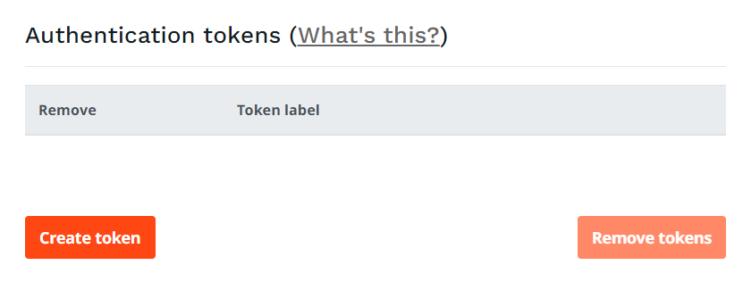

# Access to eZ Enterprise

!!! enterprise

    ## Setting up authentication tokens for eZ Enterprise

    eZ Enterprise subscribers have access to commercial packages at [updates.ez.no/bul/](https://updates.ez.no/bul/).
    The site is password-protected. You will need to set up authentication tokens to get access to it.

    Log in to your service portal on [support.ez.no](https://support.ez.no) and look for the following on the *"Maintenance and Support agreement details"* screen:

    

    1. Select "Create token" (this requires the "Portal administrator" access level).
    2. Fill in a label describing the use of the token. This will allow you to revoke access later.
    3. Save the password, **you will not get access to it again**!

    !!! tip "Save authentication token in `auth.json` to avoid repeatedly typing it"

        Composer will ask to do this for you on updates.
        If you decline, you can create an `auth.json` file manually in one of the following ways:

        - A: Store your credentials in the project directory (for security reasons do not check it in to git):

        ``` bash
        composer config http-basic.updates.ez.no <installation-key> <token-password>
        ```

        - B: If you only have one project on the machine/server/vm, and want to install globally in [`COMPOSER_HOME`](https://getcomposer.org/doc/03-cli.md#composer-home) directory for machine-wide use:

        ``` bash
        composer config --global http-basic.updates.ez.no <installation-key> <token-password>
        ```
    
    After this, when running Composer to get updates, you will be asked for a username and password. Use:

    - as username – your Installation key found on the *"Maintenance and Support agreement details"* page in the service portal
    - as password – the token password you retrieved in step 3.

    !!! note "Authentication token validation delay"
    
        You can encounter some delay between creating the token and being able to use it in Composer. It might take up to 15 minutes.
        
    !!! note "Support agreement expiry"

        If your Support agreement expires, your authentication token(s) will no longer work.
        They will become active again if the agreement is renewed, but this process may take up to 24 hours.
        _(If the agreement is renewed before the expiry date, there will be no disruption of service.)_

    !!! tip "Usage of authentication token with `composer create-project`"

        If you have several projects set up on your machine,
        they should all use different tokens set in `auth.json` file in project directory.

        But in order to install a new project using `composer create-project` to get latest version of eZ Enterprise,
        you'll need to tell Composer which token to use before the project folder is created in the first place.
        This can be done in the following way:

        ``` bash
        COMPOSER_AUTH='{"http-basic":{"updates.ez.no":{"username":"<installation-key>","password":"<token-password>"}}}' composer create-project --keep-vcs ezsystems/ezplatform-ee my-new-ee-project
        ```
