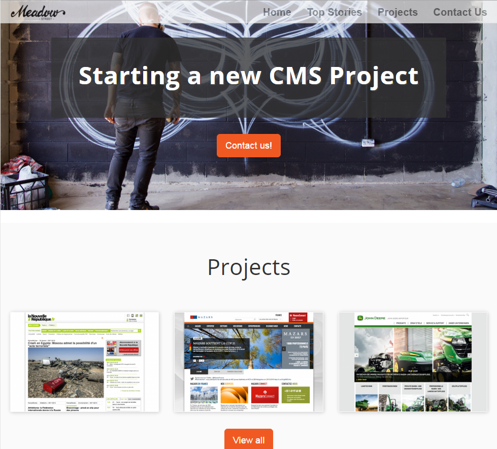
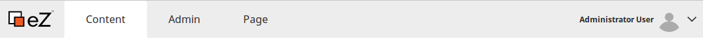

# eZ Platform Features

## Main eZ Platform Features

### [Content model](../guide/content_model.md)

Fully adaptable content model is based on the concepts of object-oriented programming.

### Version management

Versioning all content in the repository allows you to manage drafts and content history.

### [Multisite and multilanguage](../guide/multisite.md)

With eZ Platform it is possible to serve multiple, completely different sites, including different language versions, using one instance and database.

### [Permissions system](../guide/repository.md)

Access control system allows you to define very fine-grained rights for all your users.

### [Bundle structure](../guide/bundles.md)

eZ Platform is based on Symfony full stack and takes advantage of Symfony's bundle architecture. You can easily make use of existing external bundles, and organize your own project in bundles for easier management and sharing.

### [Extensibility](../guide/extending_ez_platform_ui.md)

eZ Platform is extensible at all levels, from content model to content rendering to interface.

For a comprehensive discussion of all features, take a look at [the Guide to eZ Platform](../guide/guide_to_ez_platform.md).

## eZ Platform Demo

When installing eZ Platform you have two distributions to choose from: you can select a clean installation which is empty and instantly ready for you to start working on your own website. Alternatively, you can choose to install a Demo, a sample website that lets you look around and get to know the system.

Installing the Demo is very similar to [creating a clean installation](install_using_composer.md).

### What's in the Demo?

The Demo is a showcase of the capabilities of the system. You can use it to familiarize yourself with the way eZ Platform works, organizes its content model and structures projects.

Feel free to dabble and experiment with your demo installation. However, if you are planning to start working on your actual project, it is recommended to make a clean installation of eZ Platform (without the demo).

Demo and clean versions of eZ Platform are stored in separate repositories on GitHub: <https://github.com/ezsystems/ezplatform> and <https://github.com/ezsystems/ezplatform-demo>.



### Using Composer to Install the Demo

Besides a "clean" eZ Platform installation there is an option to install eZ Platform with demo content. Demo installation is prepared for the presentation of how eZ Platform works and handles the content using real life examples.

Installation of eZ Platform Demo is very similar to a standard "clean" installation. Demo provides some previously prepared content and is stored in a separate github repository - you can find it [here.](https://github.com/ezsystems/ezplatform-demo)

Installation requires Composer global installation. You can find more information about using Composer [here.](about_composer.md)

To perform eZ Platform demo installation use commands below in the terminal/bash/command-line interface. 

``` bash
composer create-project --no-dev --keep-vcs ezsystems/ezplatform-demo
cd ezplatform-demo
  
php app/console ezplatform:install demo
```

Now you can check out the project structure and capabilities of the system.

!!! caution

    It is not recommended to start your own project on demo installation.

### Taking a look around

Once you have the Demo installed, take a look around it to familiarize yourself with the interface of eZ Platform.

To access the back office of your installation, append `/ez` to its path: &lt;`your_installation path>/ez`. You will be prompted for the username and password, which by default are:

username: admin
password: publish

#### Back office interface overview

The navigation hub at the top lets you switch between eZ Platform interface (Content) and interfaces for eZ Enterprise solutions (Page), as well as the Admin Panel.



The Content mode is the part of the interface which is the main workspace of editors and users. It is responsible for creating, editing and managing content.

The Page mode is available if your have an eZ Enterprise subscription. Take a look at [eZ Enterprise](ez_enterprise.md) to learn more.

The Admin Panel lets you manage the details of your installation, including building the content model and managing permissions.

#### Project structure

You can also take a look at the way the project files are structured on the example of the Demo Bundle. See [Structuring an eZ Platform Project](../guide/best_practices.md) for more information.
