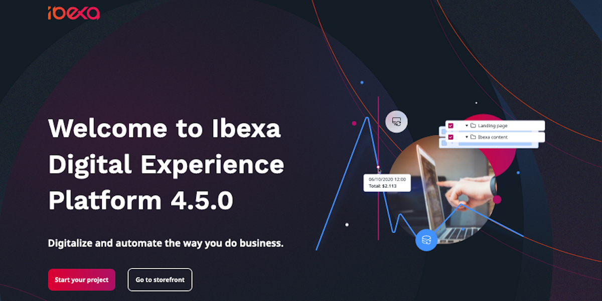

# First steps

This page lists first steps you can take after installing [[= product_name =]].
These are most common actions you may need to take in a new installation.

!!! tip "Beginner tutorial"

    To go through a full tutorial that leads from a clean installation to creating a full site,
    see [Building a bicycle route tracker in [[= product_name =]]](../tutorials/platform_beginner/building_a_bicycle_route_tracker_in_ez_platform.md).

## Remove welcome page



To remove the welcome page and get a completely clean installation to start your project with,
remove the following files and folders from your installation:

- Delete the file `config/packages/ezplatform_welcome_page.yaml`
- Delete the `templates/themes/standard` folder
- Delete the `assets/scss` folder
- Delete all `translations/ezplatform_welcome_page.*` files
- In `webpack.config.js` remove the `Encore.addEntry` section and uncomment the last line,
so that the end of the file looks like this:

``` js
// Put your config here.

// uncomment the two lines below, if you added a new entry (by Encore.addEntry() or Encore.addStyleEntry() method) to your own Encore configuration for your project
// const projectConfig = Encore.getWebpackConfig();
// module.exports = [ eZConfig, ...customConfigs, projectConfig ];

// comment-out this line if you've uncommented the above lines
module.exports = [ eZConfig, ...customConfigs ];
```

## Create a Content Type

1\. In your browser, go to the Back Office: `<your_domain>/admin`, and use the default credentials to log in: `admin/publish`.

!!! note "Password change"

    You will be requested to change your password at first login. 
    For more information about passwords, see [Passwords](../guide/user_management/user_management.md#passwords).

2\. Select Admin and go to Content Types.

3\. Enter the Content group and create a new Content Type.


4\. Input the Content Type's name, for example "Blog Post", and identifier: `blog_post`.

5\. Below, add a Field definition of the type Text Line. Name it "Title" and give it identifier `title`.

6\. Add another Field definition: Text (type Rich text) with identifier `text`.

7\. Save the Content Type.

!!! tip "More information"

    - [Content model](../guide/content_model.md)

## Create Twig templates and match then with view config

To display Content in the front page you need to define content views and templates.

Content views decide which templates and controllers are used to display content.

1\. In `config/packages/ezplatform.yaml`, under `ezplatform.system`
add the following block (pay attention to indentation: `site_group` should be one level below `system`):

``` yaml
site_group:
    content_view:
        full:
            blog_post:
                template: full\blog_post.html.twig
                match:
                    Identifier\ContentType: [blog_post]
```

Content view templates use the [Twig templating engine](https://twig.symfony.com/).

2\. Create a template file `templates/full/blog_post.html.twig`:

``` html+twig
<h1>{{ ez_render_field(content, 'title') }}</h1>
<div>{{ ez_render_field(content, 'text') }}</div>
```

!!! tip "More information"

    - [Templates](../guide/templates.md)
    - [Twig documentation](https://twig.symfony.com/doc/2.x/)

## Create content and test view templates

1\. Go to the Back Office, activate Content/Content structure and create a new Content item using the button in the right menu.


2\. Select a Blog Post Content Type. Fill in the Content item and publish it.

3\. To preview the new Content item on the front page, go to `<yourdomain>/<Content-item-name>`.
For example, if the title of the Blog post is "First blog post", the address will be `<yourdomain>/first-blog-post`.


## Add SiteAccesses

You can use SiteAccesses to serve different versions of the website.

SiteAccesses are used depending on matching rules. They are set up in YAML configuration under the `ezplatform.siteaccess.list` key.

1\. In `config/packages/ezplatform.yaml` add a new SiteAccess called `de` for the German version of the website:

``` yaml
ezplatform:
    # ...
    siteaccess:
        list: [site, de]
        groups:
            site_group: [site, de]
```

The SiteAccess will automatically be matched using the last part of the URI.

2\. You can now access the front page through the new SiteAccess: `<yourdomain>/de`.

!!! note "Log in"

    At this point you need to log in to preview the new SiteAccess,
    because an anonymous visitor does not have permissions to view it.
    See [section about permissions below](#set-up-permissions).

For now the new SiteAccess does not differ from the main site.

!!! tip "More information"

    - [SiteAccess](../guide/siteaccess.md)
    - [SiteAccess matchers](../guide/siteaccess_matching.md#available-matchers)

## Add a language and translate Content

One of the most common use cases for SiteAccesses is having different language versions of a site.

1\. To set up the `de` SiteAccess to use a different language, add its configuration under `ezplatform.system`,
below `site.languages`:

``` yaml
site:
    languages: [eng-GB]
de:
    languages:
        - ger-DE
        - eng-GB
```

This means that German will be used as the main language for this SiteAccess, and English as a fallback.

2\. Go to the Back Office and select **Admin** > **Languages**. Add a new language called "German", with the language code `ger-DE`.
Make sure it is enabled.


3\. Next, go to the Content structure and open the blog post you had created earlier.
Switch to the Translations tab and add a new translation.


4\. Select German and base the new translation on the English version. Edit the Content item and publish it.

5\. Go to the front page. The blog post will now display different content, depending on which SiteAccess you enter it from:
`<yourdomain>/<content-name>` or `<yourdomain>/de/<content-name>`.


!!! tip "More information"

    - [Languages](../guide/internationalization.md)
    - [Multi-language SiteAccesses and corresponding translations](../guide/multi_language_siteaccesses.md)

## Add a design

The design engine enables you to use different themes consisting of templates and assets.
Each theme is stored in a separate folder and assigned to a SiteAccess.

To create a new theme:

1\. Add the following configuration at the bottom of `config/packages/ezplatform.yaml` (at the same level as `ezplatform`):

``` yaml
ezdesign:
    design_list:
        site_design: [site_design]
        de_design: [de_design]
```

2\. In configuration of the `de` SiteAccess (under `ezplatform.system.de`) add: `design: de_design`

3\. Under `site`, add `design: site_design`

4\. Go back to the `content_view` configuration for the blog post. Change the path to the template so that it points to the folder for the correct design:
`template: '@ezdesign\full\blog_post.html.twig'`

This means that the app will look for the `blog_post.html.twig` file in a folder relevant for the SiteAccess: `de_design` for the `de` SiteAccess, or `site_design` for other SiteAccesses in `site_group`.

5\. Create a `themes` folder under `templates`, and two folders under it: `de_design` and `site_design`.

6\. Move the existing `full\blog_post.html.twig` file under `site_design`.

7\. Copy it also under `de_design`. Modify the second one in any way (for example, add some html), so you can preview the effect.

8\. To see the difference between the different themes, compare what is displayed at `<yourdomain>/<content-name>` and `<yourdomain>/de/<content-name>`

## Set up permissions

To allow a group of users to edit only a specific Content Type (in this example, blog posts), you need to set up permissions for them.

Users and User Groups are assigned Roles. A Role can contain a number of Policies, which are rules that permit the user to perform a specific function.
Policies can be additionally restricted by Limitations.

1\. Go to Admin > Users. Create a new User Group (the same way you create regular Content).
Call the group "Bloggers".

2\. In the new group create a User. Remember their username and password. Mark the user as "Enabled".


3\. Go to Admin > Roles. Create a new Role called "Blogger".

4\. Add Policies that will allow the User to log in:

- `User/Login`
- `Content/Read`
- `Content/Versionread`
- `Section/View`
- `Content/Reverserelatedlist`

5\. Now add Policies that will allow the User to create and publish content, limited to Blog Posts:

- `Content/Create` with Limitation for Content Type Blog Post
- `Content/Edit` with Limitation for Content Type Blog Post
- `Content/Publish` with Limitation for Content Type Blog Post


6\. In the Assignments tab assign the "Blogger" Role to the "Bloggers" group.


You can now log out and log in again as the new User.
You will be able to create Blog Posts only.

!!! tip  "More information"

    - [Permissions](../guide/permissions.md)
