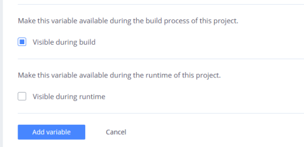

# Install eZ Enterprise

This page describes how to gain access to commercial packages and security releases
when installing eZ Platform Enterprise Edition and eZ Commerce.
They are available via [updates.ez.no](https://updates.ez.no).

!!! enterprise

    To install eZ Enterprise, start with the procedure described in [Install eZ Platform](install_ez_platform.md).
    Because you do not have access to the Enterprise GitHub repositories,
    you need to [download an archive](install_ez_platform.md#a-download-ez-platform) from the Support Portal, or follow instructions below in order to use `composer create-project`.

    When dealing with software from updates.ez.no, you need to take care of [channels](#select-correct-updatesezno-channels) and [authentication](#set-up-authentication-tokens):

    ## Select correct updates.ez.no channel(s)

    The following channels are available:

    - Trial (limited access to try for up to 120 days):
        - [ttl](https://updates.ez.no/ttl/) eZ Platform Enterprise Trial packages
        - [ttl_com](https://updates.ez.no/ttl_com/) eZ Commerce Trial packages
    - Enterprise Business User License (requires valid subscription):
        - [bul](https://updates.ez.no/bul/) available with an eZ Platform Enterprise subscription
        - [bul_com](https://updates.ez.no/bul_com/) available with an eZ Commerce subscription

    Once you have set up authentication below, the links above give you access to see the available packages and releases.

    ## Set up authentication tokens

    eZ Enterprise subscribers have access to commercial packages at [updates.ez.no/bul/](https://updates.ez.no/bul/).
    The site is password-protected. You will need to set up authentication tokens to get access to it.

    Log in to your service portal on [support.ez.no](https://support.ez.no), go to your **Service Portal**, and look for the following on the **Maintenance and Support agreement details** screen:

    

    1. Select **Create token** (this requires the **Portal administrator** access level).
    2. Fill in a label describing the use of the token. This will allow you to revoke access later.
    3. Save the password, **you will not get access to it again**!

    !!! tip "Save authentication token in `auth.json` to avoid repeatedly typing it"

        Composer will ask to do this for you on updates.
        If you decline, you can create an `auth.json` file manually in one of the following ways:

        - A: Store your credentials in the project directory (for security reasons do not check it in to git):

        ``` bash
        composer config http-basic.updates.ez.no <installation-key> <token-password>
        ```

        - B: If you only have one project on the machine/server/vm, and want to install globally in [`COMPOSER_HOME`](https://getcomposer.org/doc/03-cli.md#composer-home) directory for machine-wide use:

        ``` bash
        composer config --global http-basic.updates.ez.no <installation-key> <token-password>
        ```

    !!! note "eZ Platform Cloud"

        If you are using Platform.sh, you can set the token as an environment variable.

        When you do, make sure the **Visible during runtime** box in Platform.sh configuration is unchecked.
        This will ensure that the token is not exposed.
        
        

    After this, when running Composer to get updates, you will be asked for a username and password. Use:

    - as username – your Installation key found on the **Maintenance and Support agreement details** page in the service portal
    - as password – the token password you retrieved in step 3.

    !!! note "Authentication token validation delay"

        You can encounter some delay between creating the token and being able to use it in Composer. It might take up to 15 minutes.

    !!! note "Support agreement expiry"

        If your Support agreement expires, your authentication token(s) will no longer work.
        They will become active again if the agreement is renewed, but this process may take up to 24 hours.
        _(If the agreement is renewed before the expiry date, there will be no disruption of service.)_

    ## Create project

    In order to install a new project using `composer create-project` to get latest version of eZ Enterprise,
    you'll need to tell Composer which token to use before the project folder is created in the first place.
    This can be done in the following way:

    ``` bash
    COMPOSER_AUTH='{"http-basic":{"updates.ez.no":{"username":"<installation-key>","password":"<token-password>"}}}' composer create-project --keep-vcs --repository=https://updates.ez.no/bul/ ezsystems/ezplatform-ee my-new-ee-project
    ```

    !!! tip "Usage of authentication token with `composer create-project`"

        If you have several projects set up on your machine,
        they should all use different tokens set in `auth.json` file in project directory.

    !!! note "Moving from trial"

        If you started with a trial installation, you should [adjust the channel(s)](#edit-composerjson) you use in order to get software under [BUL license instead of a TTL license](https://ez.no/About-our-Software/Licenses-and-agreements/).

    ## Edit composer.json

    Edit `composer.json` in your project root and change the URL defined in the `repositories` section to point to the `bul*` URLs listed above.
    Once that is done, you can execute `composer update` to get packages with the correct license.

    !!! note

        You can now refer back to [Installing eZ Platform](install_ez_platform/#provide-installation-parameters) for finishing steps of the installation process.

    ## Enable Date-based Publisher

    To enable delayed publishing of Content using the Date-based Publisher, you need to set up cron to run the command `bin/console ezstudio:scheduled:publish` periodically.

    For example, to check for publishing every minute, add the following script:

    `echo '* * * * * cd [path-to-ezplatform]; php bin/console ezplatform:cron:run --quiet --env=prod' > ezp_cron.txt`

    For 5-minute intervals:

    `echo '*/5 * * * * cd [path-to-ezplatform]; php bin/console ezplatform:cron:run --quiet --env=prod' > ezp_cron.txt`

    Next, append the new cron to user's crontab without destroying existing crons.
    Assuming the web server user data is `www-data`:

    `crontab -u www-data -l|cat - ezp_cron.txt | crontab -u www-data -`

    Finally, remove the temporary file:

    `rm ezp_cron.txt`
