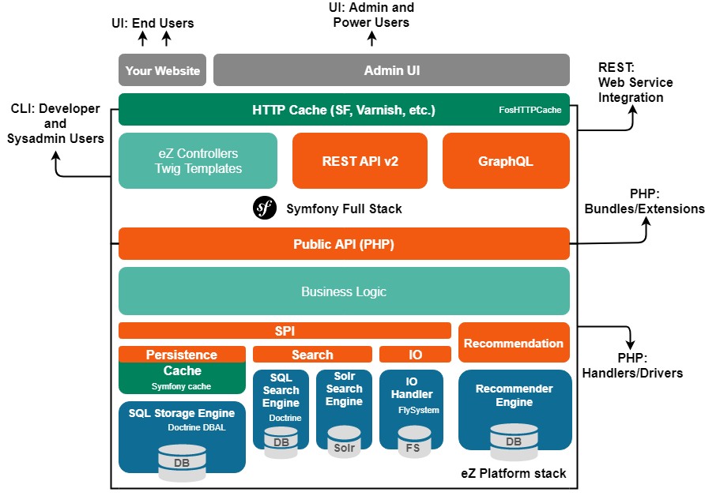

# Architecture

eZ architecture is based on the philosophy to **use APIs** that will be maintained in the long term. This **makes upgrades easier and provides lossless couplings** between all parts of the architecture, at the same time improving the migration capabilities of the system.

The structure of an eZ Platform app is based on the Symfony framework
but content management functions rely on the public PHP API.
Other applications integrate with eZ Platform via REST API, which also relies on the public PHP API.

The architecture of eZ Platform is layered and uses clearly defined APIs between the layers.

| Layer                                                                                      | Description                                                                                                                                                                                    |
|--------------------------------------------------------------------------------------------|------------------------------------------------------------------------------------------------------------------------------------------------------------------------------------------------|
| [Admin UI](extending/extending_back_office.md)                                             | Admin UI together with Admin UI Modules contain all the necessary parts to run the eZ Platform Back Office interface.                                                                          |
| [HTTP Cache](cache/http_cache.md)                                                          | Symfony HTTP cache is used to manage content "view" cache with an expiration model. In addition it is extended by using FOSHttpCache to add several advanced features.                         |
| [eZ Controllers](controllers.md)                                                           | Controllers created by you to read information from a Request object, create and return a Response objects.                                                                                    |
| [Twig templates](twig_functions_reference.md)                                              | Set of custom and built-in Twig templates. User interfaces are developed using the Twig template engine and query the public PHP API directly.                                                 |
| [REST API v2](../api/rest_api_guide.md)                                                    | The REST API v2 enables you to interact with an eZ Platform installation using the HTTP protocol, following a REST interaction model.                                                          |
| [GraphQL](../api/graphql.md)                                                               | GraphQL for eZ Platform exposes the domain model using the repository, based on Content Type groups, Content Types and Field definitions.                                                      |
| [Public PHP API](../api/public_php_api.md)                                                 | Public PHP API exposes a Repository which enables you to create, read, update, manage and delete all objects available in eZ Platform.                                                         |
| Business Logic                                                                             | The business logic is defined in the kernel. This business logic is exposed to applications via an API. It is used to organize development of the user interface layer.                        |
| [SPI](repository.md#spi)                                                                   | Service Provider Interface which defines contracts for implementing various parts of the system, including persistence layer (`SPI\Persistence`), custom Field Types, custom Limitations, etc. |
| [Persistence cache](persistence_cache.md)                                                  | The implementation of SPI\Persistence that decorates the main backend implementation.                                                                                                          |
| [Search](search/search.md)                                                                 | Search API that allows both full-text search and querying the content.                                                                                                                         |
| [SQL Storage Engine](search/search_engines.md#legacy-search-engine-bundle)                 | Legacy search engine is SQL-based and uses Doctrine's database connection.                                                                                                                     |
| [Solr Storage Engine](search/solr.md)                                                      | Transparent drop-in replacement for the SQL-based Legacy search engine.                                                                                                                        |
| [IO](file_management.md#native-io-handler)                                                 | The IO API is organized around two types of handlers, both used by the IOService.                                                                                                              |
| [IO Handler](clustering.md#dfs-io-handler)                                                 | The IO Handler manipulates metadata, making up for the potential inconsistency of network-based filesystems.                                                                                   |
| [Recommendation](personalization/recommendation_client.md#enabling-recommendations)        | Recommendation API.                                                                                                                                                                            |
| [Recommendation Engine](personalization/recommendation_client.md#enabling-recommendations) | Recommendation Engine allows displaying recommendations on your website.                                                                                                                       |
