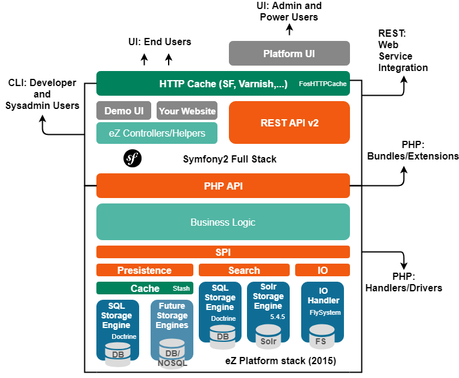

# Architecture

The architecture of eZ Platform is layered and uses clearly defined APIs between the layers.

- The **business logic** is defined in the kernel. This business logic is exposed to applications via an API (the [Public API](../api/public_php_api.md)). Developers rely on this to develop websites and web applications using Symfony to organize the way they develop the user interface layer.

- User interfaces are developed using the Twig template engine but directly querying the Public API.

- Integration of eZ Platform in other applications is done using the REST API, which itself relies also on the Public API.

- Finally, the development of bundles for eZ Platform is done using the Symfony framework when it comes to the structure of the code, and once again relying on the Public API when it comes to accessing content management functions.

A motto for the architecture is to **heavily use APIs** that will be maintained in the long term to **ease upgrades and provide lossless couplings** between all parts of the architecture, at the same time improving the migration capabilities of the system.
