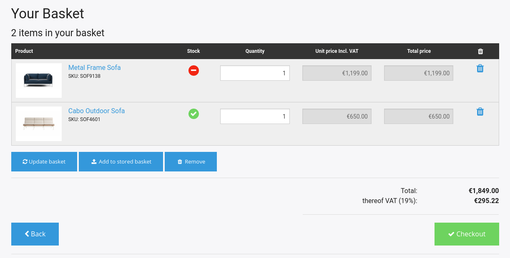

# Basket [[% include 'snippets/commerce_badge.md' %]]

Baskets are stored in the database and identified by: 

- session ID (if the user is not logged in)
- user ID (if the user is logged in)

A basket can be of one of the following types:

- `basket`
- [`quickOrder`](../quick_order/quick_order.md)
- [`storedBasket`](wishlist_and_stored_baskets.md#basket-type)
- [`wishList`](wishlist_and_stored_baskets.md#basket-type)
- [`comparison`](../product_comparison/product_comparison.md)

A standard basket (type `basket`) can have different states during the checkout process. After the order is sent, the basket is assigned the state `ordered`.

## Basket structure

Apart from the identifying information, the [basket data model](basket_api/basket_data_model.md) contains the following elements:

- additional fields (`dataMap` Field)
- basket lines with information for each row of the basket
- information about basket parties (buyer, invoice and delivery)
- additional costs (such as shipping, packaging, discounts etc.)
