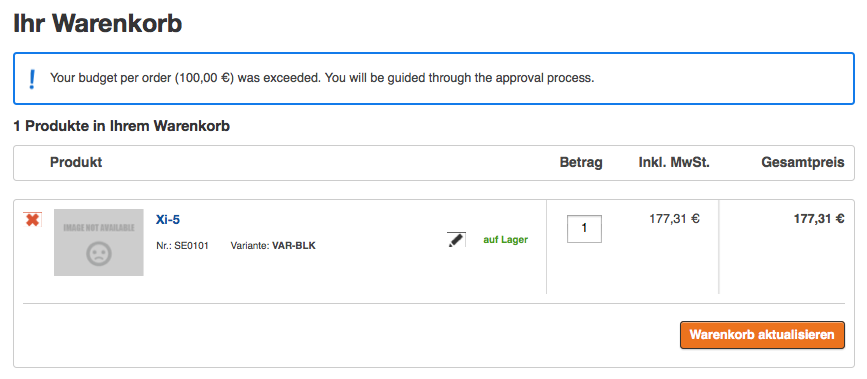

# Basket Events

The basket provides a list of events. These events can be used to change the logic for the main basket functions. 

They can be used for example to:

- check the total amount of a basket if the user is just allowed to order within a given budget
- check if a user is allowed to add this product to the basket
- perform a detailed check if the stock is still available
- check if the minimum quantity has to be checked. For an example, see [Product quantity validation](../../basket_features/product_quantity_validation.md)

Some [standard Eventlisteners](basket_eventlistener_in_the_standard.md) in eZ Commerce  will take care that e.g. a basket preview cache is updated correctly. 

## BasketLine Events

The following events are thrown when interacting with the [BasketService](../basketservice.md) on a basket line-object: There are some possible results, that can be returned. (STATUS_INIT is default).

The executed action (add-to, update...) is assumed to be allowed, unless some event listeners set the status to failed.

``` php
//nothing changed, action is allowed
const STATUS_OK = 'ok';
//something changed (quantity), action is allowed
const STATUS_CHANGED = 'changed';
//something failed (quantity not valid), action is forbidden
const STATUS_FAILED = 'failed';
//default
const STATUS_INIT = 'ok';

//set status
$preEvent->setStatus(AbstractBasketLineEvent::STATUS_FAILED);
//get the status
$preEvent->getStatus();
```

| Event name                          | Thrown in                                                                                                      | Event ID                               |
| ----------------------------------- | -------------------------------------------------------------------------------------------------------------- | -------------------------------------- |
| PreAddBasketLineEvent               | BasketService.addBasketLineToBasket(Basket $basket, $sku, $quantity)                                           | silver_eshop.pre_add_basketline     |
| PostAddBasketLineEvent | BasketService.addBasketLineToBasket(Basket $basket, $sku, $quantity)                              | silver_eshop.post_add_basketline    |
| PreUpdateBasketLineEvent            | BasketService.updateBasketLineInBasket(Basket $basket, BasketLine $basketLine, $increase = false) | silver_eshop.pre_update_basketline  |
| PostUpdateBasketLineEvent           | BasketService.updateBasketLineInBasket(Basket $basket, BasketLine $basketLine, $increase = false) | silver_eshop.post_update_basketline |
| PreRemoveBasketLineEvent            | BasketService.removeBasketLineFromBasket(Basket $basket, BasketLine $basketLine)                  | silver_eshop.pre_remove_basketline  |
| PostRemoveBasketLineEvent           | BasketService.removeBasketLineFromBasket(Basket $basket, BasketLine $basketLine)                  | silver_eshop.post_remove_basketline |

### Connecting to the events

To take advantage from the existing events, for example to modify some Basket or BasketLine data, your `EventService` must listen to these Events (Events IDs see above):

``` 
<service id="silver_basket.standard_basket_listener" class="%silver_basket.standard_basket_listener.class%">
    <tag name="kernel.event_listener" event="silver_eshop.pre_add_basketline" method="onPreBasketAdd" />
    <tag name="kernel.event_listener" event="silver_eshop.pre_update_basketline" method="onPreBasketUpdate" />
    <tag name="kernel.event_listener" event="silver_eshop.post_update_basketline" method="onPostBasketUpdate" />
    <tag name="kernel.event_listener" event="silver_eshop.pre_remove_basketline" method="onPreBasketRemove" />
</service>
```

You also have to implement appropriate methods in your `EventService`:

``` php
public function onPreBasketAdd(PreAddBasketLineEvent $preBasketAddEvent)
{ 
    $basket = $preBasketAddEvent->getBasket();
    $basketLine = $preBasketAddEvent->getBasketLine();     
   
    //TODO do something with the data  
}
   
public function onPreBasketUpdate(PreUpdateBasketLineEvent $preBasketUpdateEvent)
{
    $basket = $preBasketUpdateEvent->getBasket();
    $basketLine = $preBasketUpdateEvent->getBasketLine();
       
    //TODO do something with the data        
}
   
public function onPostBasketUpdate(PostUpdateBasketLineEvent $postBasketUpdateEvent)
{
    $basket = $postBasketUpdateEvent->getBasket();
    $basketLine = $postBasketUpdateEvent->getBasketLine();
       
    //TODO do something with the data
}
    
public function onPreBasketRemove(PreRemoveBasketLineEvent $preBasketRemoveEvent)
{
    $basket = $preBasketRemoveEvent->getBasket();
    $basketLine = $preBasketRemoveEvent->getBasketLine();       
        
    //TODO do something with the data
}
```

## Basket Events

The following events are thrown when interacting with the [BasketService](../basketservice.md) on a basket-object: There are some possible results, that can be returned. (STATUS_INIT is default).

``` 
//default
const STATUS_INIT = 'ok';
//something changed, prices must be recalculated
const STATUS_PRICE_CALCULATION_REQUIRED = 'price_calculation_required';

//set status
$event->setStatus(AbstractBasketEvent::STATUS_PRICE_CALCULATION_REQUIRED);
//get the status
$event->getStatus();

//get custom event result
$event->getEventResults();

//set custom event results
$event->setEventResults(array('key' => &value));
//or
$event->addToEventResults('key', $value);
```

|Event name|Thrown in|Event ID|
|--- |--- |--- |
|PostPriceCalculationBasketEvent|BasketService:storeBasket()|silver_eshop.post_price_calculation_basket|
|PreBasketShowEvent|BasketController:showBasket()|silver_eshop.pre_basket_show|
|PreRemoveBasketEvent|BasketService:removeBasket()|silver_eshop.pre_remove_basket|

## Event PreBasketShowEvent

The Budget workflow in customer center makes usage of this event.

**BasketController**

``` php
public function showAction(Request $request)
{
   ...

    $event = new PreBasketShowEvent();
    $event->setBasket($basket);

    $eventDispatcher = $this->get('event_dispatcher');
    $eventDispatcher->dispatch(
        BasketEvents::PRE_BASKET_SHOW_EVENT,
        $event
    );

    $eventResults = $event->getEventResults();

    if (array_key_exists(PreBasketShowEvent::HTML_TOP, $eventResults)) {
        $params[PreBasketShowEvent::HTML_TOP] = $eventResults[PreBasketShowEvent::HTML_TOP];
    }
    if (array_key_exists(PreBasketShowEvent::HTML_BOTTOM, $eventResults)) {
        $params[PreBasketShowEvent::HTML_BOTTOM] = $eventResults[PreBasketShowEvent::HTML_BOTTOM];
    }

    return $this->render(
        'SilversolutionsEshopBundle:Basket:show.html.twig',
        $params
    );
}
```

### How to listen to this event?

Example:

``` php
public function onPreBasketShow(PreBasketShowEvent $event)
{
    $basket = $event->getBasket();
    $userId = $basket->getUserId();

    if (isset($userId)) {
        try {
            $this->budgetService->isBudgetExceeded($basket->getTotalsSumGross(), $userId);
        } catch(BudgetExceededException $e) {
            $noticeMessage = $e->getMessage() . ' ' . $this->translator->translate(self::EXCEEDED_BASKET_MESSAGE);
            $template = $this->templating->render('SisoCustomerCenterBundle:Basket:messages.html.twig', array(
                'notice' => $noticeMessage
            ));
            $event->addHtmlToEventResults($template, PreBasketShowEvent::HTML_TOP);
        }
    }
}
```

``` xml
<service id="siso_customer_center.check_budget_event_listener" 
class="%siso_customer_center.check_budget_event_listener.class%">
    <argument type="service" id="siso_customer_center.budget_service.order" />
    <argument type="service" id="silver_trans.translator" />
    <argument type="service" id="siso_customer_center.content_service" />
    <argument type="service" id="ses.customer_profile_data.ez_erp" />
    <argument type="service" id="templating" />   
    <tag name="kernel.event_listener" event="silver_eshop.pre_basket_show" method="onPreBasketShow" />
</service>
```

#### Result


 
