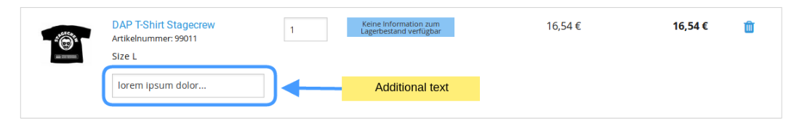
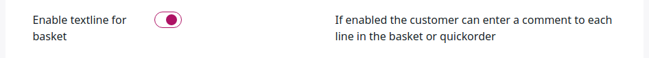

# Basket configuration [[% include 'snippets/commerce_badge.md' %]]

## Additional data in the basket line

Each basket item can contain an additional line of data.



You can enable this additional line and set its length in the Back Office, the **eCommerce** tab, **Configuration Settings**:



You can also enable it in `config/packages/ezcommerce/ecommerce_parameters.yaml`:

``` yaml
ses_basket.default.additional_text_for_basket_line: true
ses_basket.default.additional_text_for_basket_line_input_limit: 25
```

## Basket storage time

The time for which a basket is stored depends on whether the basket belongs to an anonymous user or a logged-in user.

A basket for a logged-in customer is stored forever.

A basket for an anonymous user is stored for 120 hours by default.
You can configure a different value:

``` yaml
ses_basket.default.validHours: 120
```

You can use the `silversolutions:baskets:clear` command to delete anonymous expired baskets:

``` bash
php bin/console silversolutions:baskets:clear <validHours>
```

It deletes all anonymous baskets from the database that are older than `validHours`.

For example:

``` bash
php bin/console silversolutions:baskets:clear 720
```

## Discontinued products

A listener can check if the product is still available, or discontinued.
You can disable this setting in configuration:

``` yaml
siso_basket.default.discontinued_products_listener_active: false
```

The listener checks if the current stock is greater than or equal to the quantity the customer wants to order.
In this case the order is allowed.

The optional setting `discontinued_products_listener_consider_packaging_unit` enables ignoring the packaging unit
in order to sell the remaining products, even if the remaining stock does not fit the packing unit rule
(for example, the packing unit is 10 pieces but 9 are left in stock).
The listener reduces the quantity in the order to the number of products that are in stock. 

``` yaml
siso_basket.default.discontinued_products_listener_consider_packaging_unit: true
```

## Product quantity validation

You can configure the minimum and maximum quantity that can be ordered per basket line:

``` yaml
silver_basket.basketline_quantity_max: 1000000
silver_basket.basketline_quantity_min: 1
```

If the quantity is more than the maximum or less than the minimum, it is set to either max or min.

## Shared baskets

A basket can be shared if a user logs in from a different browser (default), or it can be bound to the session.

If you do not want the basket to be shared between different sessions, change the following setting to `true`:

``` yaml
ses_basket.default.basketBySessionOnly: true
```
