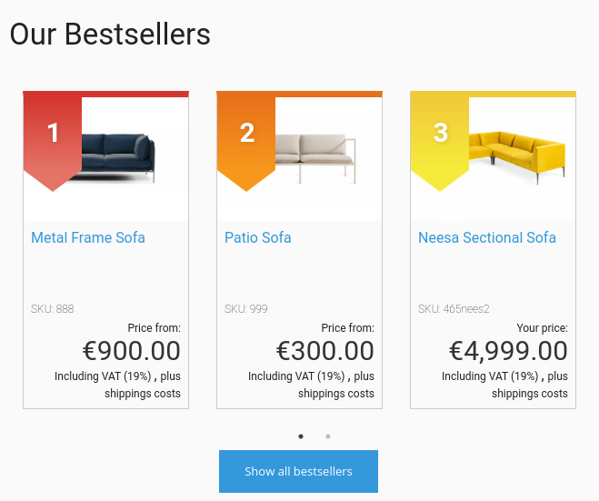
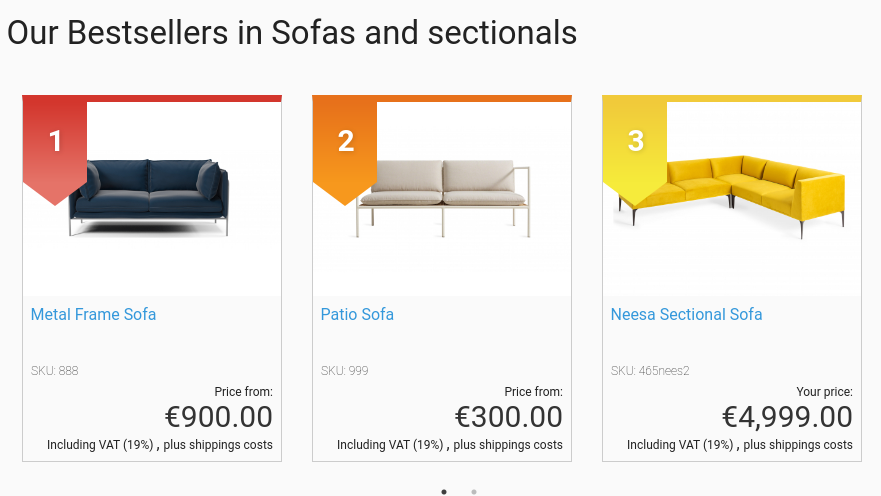

# Bestsellers [[% include 'snippets/commerce_badge.md' %]]

Bestsellers are determined based on all confirmed orders. The information how often a product was purchased is stored in Solr by a Solr plugin.
The shop owner can specify from which point a product counts as a bestseller.

Bestsellers can be displayed on Landing Pages, category pages and a bestseller page. 

## Configuration

To enable bestsellers, set the following parameter to true:

``` yaml
siso_core.default.enable_bestsellers: true
```

The following settings are available in the eCommerce->Configuration Settings->Miscellaneous section in the Back Office:

| Configuration        | Description      |
| -------------------- | ---------------- |
| Number of bestsellers displayed on bestseller page | |
| Number of bestsellers displayed on catalog pages   | |
| Number of bestsellers displayed in a slider        | How many bestsellers should be available in a slider on a Landing Page      |
| Threshold   | How often a product has to be sold to count as a bestseller  |

## Template list

- `EshopBundle/Resources/views/Bestsellers/bestsellers.html.twig` renders a bestseller page, available by default under the `/bestsellers` route.


- `EshopBundle/Resources/views/Bestsellers/bestsellers_box.html.twig` renders a slider for the Bestseller Page block.



- `EshopBundle/Resources/views/Bestsellers/bestsellers_catalog.html.twig` renders a slider for the catalog page.



- `EshopBundle/Resources/views/Bestsellers/bestsellers_box_esi.html.twig` creates an Edge Side Includes tag and calls the controller for Landing Page bestsellers.

!!! note "Category pages/Caching"

    Catalog bestsellers are cached independently of the rest of the page using ESI.

## API

### `BestsellerService`

`Siso/Bundle/SearchBundle/Service/BestsellerService.php` fetches bestsellers from Solr.

### `EcontentBestsellerIndexerPlugin`

`Siso/Bundle/SearchBundle/Service/EcontentBestsellerIndexerPlugin.php` adds an additional Solr field with a sum of basket lines.
