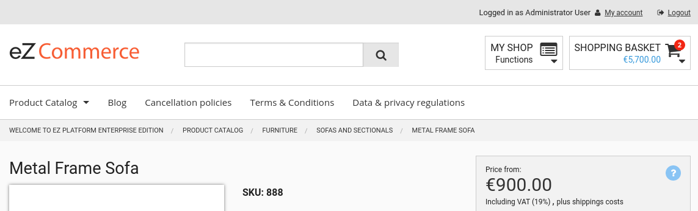

# Breadcrumbs [[% include 'snippets/commerce_badge.md' %]]

[[= product_name_com =]] automatically generates breadcrumbs for every part of the shop, including the catalog,
internal shop routes (e.g. my profile, search), Content items and forms.



Breadcrumbs are rendered using the `breadcrumb_list.html.twig` template that is called from `pagelayout.html.twig`.

The breadcrumb system uses the [WhiteOctober breadcrumbs bundle](https://github.com/whiteoctober/BreadcrumbsBundle).

## Configuration

You can configure the Fields that will be used as labels for breadcrumb nodes.
The first match wins.

``` yaml
parameters:
    siso_core.default.breadcrumb_content_label_fields: ['name', 'title']
```
