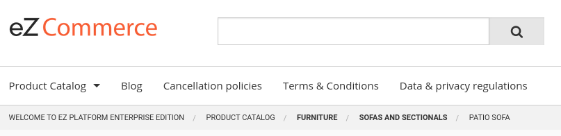

# Breadcrumb templates [[% include 'snippets/commerce_badge.md' %]]

## Template list

| Path  | Description     |
| ----- | --------------- |
| `Silversolutions/Bundle/EshopBundle/Resources/views/pagelayout.html.twig` | Defines the `breadcrumb` block, which calls the sub-controller for the breadcrumb generation. |
| `Silversolutions/Bundle/EshopBundle/Resources/views/Breadcrumbs/breadcrumb_list.html.twig` | Used by all WhiteOctober-based breadcrumb generators to render the generated breadcrumbs elements. |

!!! note "No breadcrumbs displayed"

    The possible reasons why breadcrumbs might not be displayed:

    - The `breadcrumb` block of the `pagelayout.html.twig` template is overridden, extending the template with empty content.
    - The matched generator encounters an error and doesn't render the breadcrumbs
    - No generator is matched. In the standard setup, the lowest priority `RoutesBreadcrumbsGenerator` checks the active Router service
    to match the active Request service. That should always be the case.

## Custom Twig functions

The `wo_breadcrumbs()` function returns a `WhiteOctober\BreadcrumbsBundle\Model\Breadcrumbs` object.
It is used in `breadcrumb_list.html.twig` to determine the number of generated breadcrumbs.

## Additional data in the breadcrumb nodes

The `translationParameters` property of a breadcrumb contains additional data,
which includes `type` of the breadcrumb. The type depends on the generator used:

- `CatalogBreadcrumbsGenerator` - `ez_content`
- `EzContentBreadcrumbsGenerator` - `catalog`
- `RoutesBreadcrumbsGenerator` - `route`


### Example: non-clickable breadcrumbs

Additional data can be used, for example, to define if a breadcrumb of a Location should be clickable or hidden.

The following example (from `breadcrumb_list.html.twig`) changes the breadcrumbs to non-clickable bold text (if `translationParameters.type` is of type `catalog`):

``` html+twig

  <li itemprop="itemListElement" itemscope itemtype="http://schema.org/ListItem">
    
      <b>
        <span itemprop="name">{{ crumb.text }}
        <meta itemprop="position" content="{{ loop.index }}"/>
      </b>
    
      <a itemprop="item" href="{{ crumb.url }}">
        <span itemprop="name">{{ crumb.text }}
      </a>
      <meta itemprop="position" content="{{ loop.index }}" />
    
  </li>

  {# TODO make last element link configurable #}
  <li itemprop="itemListElement" itemscope itemtype="http://schema.org/ListItem">
    <span itemprop="name">{{ crumb.text }}
    <meta itemprop="position" content="{{ loop.index }}" />
  </li>

```


