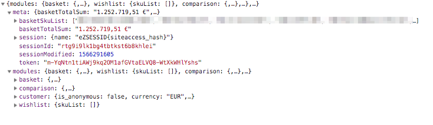
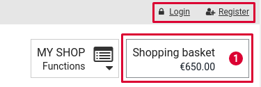

# Basketpreview cache and user-specific data [[% include 'snippets/commerce_badge.md' %]]

[[= product_name_com =]] uses a lot of dynamic data which has to be displayed in the shop:

- basket preview shows the number of products and a list of products
- the name of the customer
- the number of items in the wishlist

To improve the caching and speed up page loading, a special route is used to provide the dynamic data using a REST call.

This enables you to cache pages in a more efficient way and place dynamic attributes with JavaScript.

## The REST route

The route `silversolutions_session_data` is used to send a call to the server to get the updated data for the dynamic attributes.

By default the following attributes are returned:



The response is cached via HTTP cache. It is purged whenever a basket is updated or a customer logs in.
After page load JavaScript fetches the current data from the server and updates:

- the logged-in user
- the basket preview



### JS Event

An event is trigged after the data has been received via REST:

```
new CustomEvent("ses:dynamic-data", { "detail": response.data });
```

You can subscribe to the event inside a vue app using `this.$on`:

```
document.addEventListener("ses:dynamic-data", function(e) {
    console.log("ses:dynamic-data");
    console.log(e.detail); // Prints "meta and modules data"
});
```

## Extending the REST call

The modules section can be used for the project-specific data. It uses a tagged service that has to implement a service via service tag:

```
<tag name="siso_core.session_data" alias="mydata"/>
```

The alias `mydata` is used as a key in the modules section.

### Working with HTML fragments

Each service implementing `SessionDataInterface` can return HTML fragments.
The keys should use the ID of a container inside your site. [[= product_name_com =]] automatically replaces this container with the indicated HTML.

Example for providing the data in a service:

``` php
/**
 * Get header login session data
 *
 * @return \Symfony\Component\HttpFoundation\Response
 */
public function getSessionData()
{
    return array(
        'loginHeader' => array(
            'html' => array(
                'headerLoginMobile' => $this->getLoginData(true),
                'headerLoginDesktop' => $this->getLoginData(false)
            )
          )
    );
}
```

The corresponding div in the website needs to use the key `headerLoginDesktop`, e.g. as an ID:

```
<ul class="inline-list c-nav-meta" id="headerLoginDesktop">
...
</ul>
```

## Updating existing projects

1\. Allow accessing cookies via JS:

``` 
ezpublish:
    system:
        my_siteaccess:
            session:
                cookie_httponly: false
```

2\. Add `vue.js` in `pagelayout.html.twig` within the header:

``` 
<script src="{{ asset("bundles/silversolutionseshop/js/vue/vue.js") }}"></script>
```

3\. Add the `routeconfig` to the `pagelayout.html.twig` at the beginning of the `javascripts` block:

``` html+twig


<script type="text/json" id="ses-url-config">
{
        "urlGetSessionData": "{{ path('silversolutions_session_data') }}",
        "session_name": "{{ ses_config_parameter('session', '').name }}"
}
</script>
```

4\. Add three JavaScript files to `pagelayout.html.twig`:

``` html+twig
// If you plan to support the old IE as well:
<script src="https://cdn.jsdelivr.net/npm/es6-promise@4/dist/es6-promise.js"></script>
<script src="https://cdn.jsdelivr.net/npm/es6-promise@4/dist/es6-promise.auto.js"></script> 
{% javascripts
...
  'bundles/silversolutionseshop/js/vue/md5.js'
  'bundles/silversolutionseshop/js/vue/axios.min.js'
  'bundles/silversolutionseshop/js/dynamic-header.js'
....
```

5.\ Change the Twig block `basket_preview` in `pagelayout.html.twig` using a static HTML markup which is replaced by JavaScript after loading the session data:

``` html+twig

       {# This block is rendered via JS #}
       <div class="item c-icon-bar__item--fluid c-icon-bar__item--primary js-basket-flyout inactive">
          <a class="c-icon-bar__items-wrap"
             href=""
             data-dropdown="dropdown-basket">
            <div class="c-icon-bar__border">
              <div class="c-icon-bar__labels show-for-large-up">
                <h5 class="c-icon-bar__heading">{{ 'Shopping basket'|st_translate }}</h5>
                <span class="c-icon-bar__label" data-price-wrap="user">
              <div class="c-icon-bar__icons u-inline-block right">
                <i class="fa fa-shopping-cart c-icon-bar__icon-main">
                  <span class="label alert round c-icon-bar__counter">
                </i>
                <i class="fa fa-caret-down right c-icon-bar__icon-secondary"></i>
              
          </a>

```
