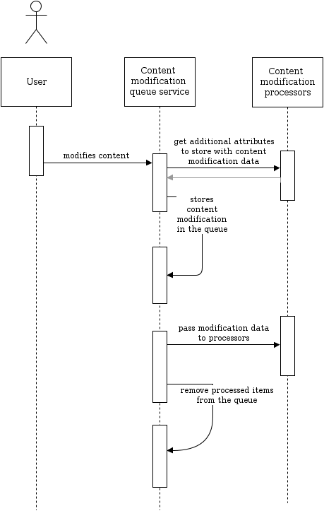

# Content cache refresh [[% include 'snippets/commerce_badge.md' %]]

The content cache refreshing system enables displaying the current information when objects in the Back Office are modified.

The content cache refresh service is used in the following situations:

- Navigation cache is refreshed for example if one or many navigation nodes are changed
- If a category is changed, the cached names for categories used by the search are updated (`CategoryNameService`)

!!! note

    You need to have a cron job set up to use this feature.

##  Set up cron job to refresh caches

To set up a cron job to refresh caches, create a system cron job to run the following console command:

``` bash
php bin/console silversolutions:cache:refresh
```

## Slot implementation

!!! note

    See [SignalSlot documentation](https://doc.ezplatform.com/en/2.5/guide/signalslots/#signals-reference) for more information about the SignalSlot system.

The `ContentModificationSlot` pushes content modification data into the queue by using the `ContentModificationQueueService`.

## Definitions

Content modification is an array of information about the modified content.

|Attribute (key)|Value type|Description|
|--- |--- |--- |
|`content_id`|int|Content ID of the modified Content item.|
|`action`|string|Name of the action which resulted in content modification, e.g. `publish` or `delete`.|
|`trigger`|string|Legacy trigger name which caused content modification, e.g. `post_publish`, `pre_delete`. This attribute is created only to provide additional information for content modification processor developers.|

!!! note

    You can find a list of actions and triggers in [supported content modification actions and triggers](#supported-content-modification-actions-and-triggers)

    Content modification processors can provide additional attributes.

Content modification queue is a series of content modifications.
It is implemented with Doctrine.

- `ContentModificationQueue` - Doctrine entity (queue item).
- `ContentModificationQueueRepository` - Doctrine entity repository for queue items.

`ContentModificationQueueService` is a service that stores content modifications in the queue and runs processors to handle content modifications.

Content modification processor is a service implemented to process information about content modification (e.g. refreshes related caches).

## ContentModificationQueueService

`ContentModificationQueueService` has several responsibilities:

1. Gathers all services that are tagged with `siso_tools.content_modification_processor` (content modification processors).
1. Fetches all current content modifications from the queue.
1. Gets additional attributes from processors.
1. Pushes content modifications to the queue (table `ses_content_modification_queue`).
1. Passes every content modification object to every processor service.
1. Removes processed content modifications from the queue.



## Content modification processor

Every content modification processor must implement two actions:

1. Get content ID and expose additional attributes that the processor can process later.  
    For example, a navigation cache processor retrieves a Content item's language code from the given content ID. This information is added to content modification data along with initial data.
2. Process content modification data (e.g. clear cache).

### Content modification processor actions

Content modifications are stored in the content modification queue immediately after content is changed.
However, processing of the queue doesn't happen immediately.
Shop administrator can process the queue manually with a console script or configure a cron job task.

It means that if a user removes a Content item, there is no data that the processor can use for clearing the cache.
For this reason, a content modification processor has to store information about the removed Content item before it is processed.

Content modification processing is usually a resource-consuming operation. Therefore it should be done as a deferred task.

### Implementing a new content modification processor

There are two steps to add your own Processor Service to the chain for content cache refresh.

#### Step 1. Prepare service definition

Prepare service definition to add a service with the tag `siso_tools.content_modification_processor`.

``` xml
<!-- your own content modification processor service -->
<service id="domain.yourname_content_modification_processor" class="%domain.yourname_content_modification_processor.class%">
    ...
    <tag name="siso_tools.content_modification_processor" />
</service>
```

#### Step 2. Create processor service class

Create a processor service class, which has to implement the `ContentModificationProcessorServiceInterface` interface.

``` php
interface ContentModificationProcessorServiceInterface
{
    /**
     * Processes modified eZ content.
     *
     * @param ContentModificationQueueItemInterface[] $queue
     * @return void
     */
    function process($queue);

    /**
     * Get an array of attributes to use them later on the process stage.
     *
     * @param $contentId
     * @return array|null
     */
    function getContentModificationAttributes($contentId);
}
```

#### Example

To understand how the `getContentModificationAttributes` and `process` methods cooperate,
you can refer to the example of `TransContentModificationProcessorService`
which is responsible for clearing translation caches.

``` php
function getContentModificationAttributes($contentId)
{
    // 1. Get services
    $contentService = $this->repository->getContentService();
    $content = $contentService->loadContent($contentId);
    $contentTypeService = $this->repository->getContentTypeService();

    // 2. Get data to store in attributes
    $contentType = $contentTypeService->loadContentType($content->contentInfo->contentTypeId);
    $languageCode = $content->getVersionInfo()->initialLanguageCode;

    // 3. Define array of attributes
    return array(
        'content_type' => $contentType->identifier,
        'language_code' => $languageCode,
    );
}
// ...
public function process($queue)
{
    ...

    foreach($queue as $queueItem) {

        $data = $queueItem->getData();

        // Content type attribute is requested
        if (!isset($data['content_type']) || $data['content_type'] !== self::TRANSLATION_IDENTIFIER) {
            continue;
        }

        if(in_array($data['action'], array('delete','removetranslation', 'hide'))) {
            $this->transService->removeTranslationCache(
                ...
                // Language code attribute is requested
                $data['language_code']
            );
        }
    }
}
```

!!! note

    Please pay attention that process method uses attributes `language_code` and `content_type`
    which were added to content modification array using the `getContentModificationAttributes` method.

#### Supported content modification actions and triggers

|Action|Trigger|
|--- |--- |
|`publish`|`post_publish`|
|`delete`|`pre_delete`|
|`hide`|`post_hide`|
|`move`|`post_move`|
|`swap`|`post_swap`|
|`updateobjectstate`|`post_updateobjectstate`|
|`updatepriority`|`post_updatepriority`|
|`addlocation`|`post_addlocation`|
|`removelocation`|`pre_removelocation`|
|`removetranslation`|`pre_removetranslation`|

### Implemented content modification processor services

|Service|Purpose|
|--- |--- |
|`NavigationContentModificationProcessorService`|Clears navigation cache|
|`TransContentModificationProcessorService`|Clears translation cache|
