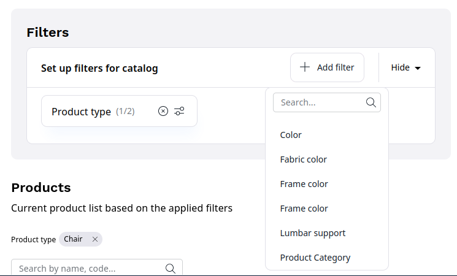

# Product catalog

The product catalog enables handling of products offered in the shop,
including their specifications and pricing.

## Catalogs

You can create multiple catalogs containing subsets of the whole product list.

Use them, for example, to build special catalogs for B2B and B2C uses, for retailers and distributors or for different regions.

When creating a catalog, you can filter the products by:

- price
- product attributes
- product type
- product code
- availability
- product category
- the date when the product was created

## Products

Products are a special type of content that contains typical content Fields
as well as additional product information.

Each product belongs to a product type (similar to how a Content item belongs to a Content Type).

## Product types

Product types represent categories that a product can belong to.
A product type can be, for example, a sofa or a keyboard.

Product types, like Content Types, define the global properties of products and Fields a product consists of.
A product type also defines the attributes that all products of this type can have.

## Product attributes

Product attributes provide different information about a product.
Typical product attribute examples are: length, weight, color, format, and so on.

The following attribute types are available:

- Checkbox
- Color
- Float
- Integer
- Measurement
- Selection

Product attributes are collected in groups.
An example of an attribute group can be dimensions (length, width, height).

You can assign both whole attribute groups or individual attributes to a product type.

## Product availability and stock

Product availability defines whether a product is available in the catalog.

When a product is available, it can have numerical stock defined.
The stock can also be set to infinite (for example, in case of digital products).

!!! note

    Availability does not automatically mean that a product can be ordered.
    A product can be available, but have zero stock.

    A product can only be ordered when it has either positive stock, or stock set to infinite.
