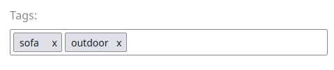

# Extending a CatalogFactory [[% include 'snippets/commerce_badge.md' %]]

If you need to prepare special fields for products or categories, or you need to do a mapping,
then the easiest way is to extend the catalog factory.

The catalog factory maps the data from the provider to the standard catalog elements or product nodes.
It is called every time a product is provided by the data provider. 
Each provider has a separate catalog factory.
The data provider is defined by the `silver_eshop.default.catalog_data_provider` parameter.

For more information about data providers, see [Content model data provider](../../data_providers/content_model_dataprovider.md).

The following example provides an additional mapping for the Keyword Field Type
which enables you to display tags added to the product:



## Step 1: Override the CatalogFactory

Create a new class that extends the catalog factory.

The extended service does the mapping for the Keyword Field Type.
In this example, the Keyword Field always uses the name `tags`.
A full implementation could use the identifier of the Content item directly. 

``` php
<?php

namespace App\Services;

use Silversolutions\Bundle\EshopBundle\Services\Factory\Ez5CatalogFactory;
use Silversolutions\Bundle\EshopBundle\Catalog\CatalogElement;
use Silversolutions\Bundle\EshopBundle\Content\Fields\ArrayField;

class CustomCatalogFactory extends Ez5CatalogFactory
{
    protected function fillCatalogElementDataMap(CatalogElement $catalogElement, array $dataMap = array())
    {
        parent::fillCatalogElementDataMap($catalogElement, $dataMap);
        foreach ($dataMap as $ezFieldIdentifier => $ezField) {
            $identifiers = array_slice(explode('_', $ezFieldIdentifier), 1);
            $catalogElementFieldIdentifier = '';
            $identifiersCount = count($identifiers);
            for ($i = 0; $i < $identifiersCount; $i++) {
                $catalogElementFieldIdentifier .= $i == 0 ? strtolower($identifiers[$i])
                    : ucfirst(strtolower($identifiers[$i]));
            }

            if ($ezField instanceof \eZ\Publish\Core\FieldType\Keyword\Value) {
                $catalogElement->addFieldToDataMap('tags',
                    $this->extractKeywords($ezField)
                );
            }
        }
        return $catalogElement;
    }

    protected function extractKeywords (\eZ\Publish\Core\FieldType\Keyword\Value $keywordField) {

        $keywordFields = array();
        $keywordData = $keywordField->values;

        foreach ($keywordData as $keyword) {
            $keywordFields[] = $keyword;
        }

        return new ArrayField(array('array' => $keywordFields));
    }
}
```

Define the new class as a service in your service definition file:

``` yaml
parameters:
    silver_catalog.ez5_catalog_factory.class: App\Services\CustomCatalogFactory
```

## Step 2: Extend the template and display the keywords

The new field `tags` is available in the `dataMap` of the `CatalogElement`.
To render it, extend the default template `SilversolutionsEshopBundle:Catalog:parts/productData.html.twig`:

``` html+twig

    <p class="u-no-margin">
        <strong>{{ 'Tags'|st_translate }}</strong>
        
                <span class="label">{{ tag }}
        
    </p>

```
