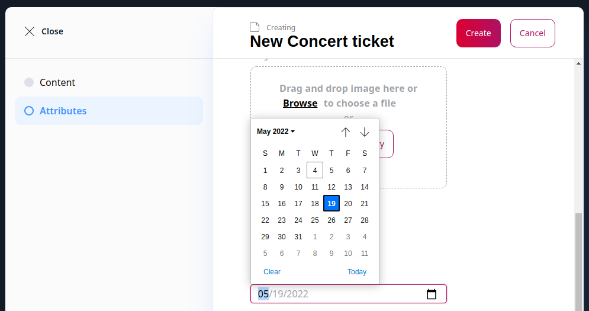

# Create custom attribute type

Besides the [built-in attribute types](catalog.md#product-attributes), you can also create custom ones.

The example belows shows how to add a Date attribute type.
You could use it, for example, in a "Concert ticket" or "Film" product to indicate the event or release date.

## Select attribute type class

First, you need to register the type class that the attribute uses:

``` yaml
[[= include_file('code_samples/catalog/custom_attribute_type/config/custom_services.yaml', 0, 8) =]]
```

Use the `ibexa.product_catalog.attribute_type` tag to indicate the use as a product attribute type.
The custom attribute type has the identifier `date`.

## Create value form mapper

A form mapper maps the data entered in an editing form into an attribute value.

The form mapper must implement `Ibexa\Contracts\ProductCatalog\Local\Attribute\ValueFormMapperInterface`.

In this example, you can use the Symfony's built-in `DateType` class (line 38).

``` php hl_lines="28-29 38"
[[= include_file('code_samples/catalog/custom_attribute_type/src/Attribute/Date/Form/DateValueFormMapper.php') =]]
```

The `options` array contains additional options for the form, including options resulting from the selected form type. In this case, these are [`input`](https://symfony.com/doc/current/reference/forms/types/date.html#input) and [`widget`](https://symfony.com/doc/current/reference/forms/types/date.html#widget) options (lines 28-29) which define how the date input looks like and what type of data it returns.

Register the form mapper as a service and tag it with `ibexa.product_catalog.attribute.form_mapper.value`:

``` yaml
[[= include_file('code_samples/catalog/custom_attribute_type/config/custom_services.yaml', 8, 12) =]]
```

## Create value formatter

A value formatter prepares the attribute value for rendering in the proper format.

In this example, you can use the `IntlDateFormatter` to ensure the date takes into account the selected locale.

``` php
[[= include_file('code_samples/catalog/custom_attribute_type/src/Attribute/Date/DateValueFormatter.php') =]]
```

!!! tip

    When rendering product attributes, use the [`ibexa_format_product_attribute`](../content_rendering/twig_function_reference/product_twig_functions.md#ibexa_format_product_attribute) Twig filter to render the attribute in a proper format.


Register the value formatter as a service and tag it with `ibexa.product_catalog.attribute.formatter.value`:


``` yaml
[[= include_file('code_samples/catalog/custom_attribute_type/config/custom_services.yaml', 12, 16) =]]
```

## Use new attribute type

In the Back Office you can now add a new Date attribute to your product type and create a product with it.


