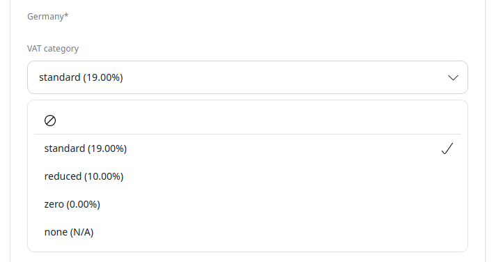

# Enable purchasing products

To enable purchasing from the catalog, the following configuration is required:

- at least [one region and one currency for the shop](#region-and-currency)
- [VAT rates for the product type](#vat-rates)
- at least [one price for the product](../pricing/price_engine.md)
- [availability with positive or infinite stock for the product](catalog.md#product-availability-and-stock)

## Region and currency

All currencies available in the system must be enabled in the Back Office under **Commerce** -> **Currencies**.

Additionally, you must configure currencies valid for specific SiteAccesses in configuration:

``` yaml
ibexa:
    system:
        shop:
            product_catalog:
                currencies:
                    - EUR
                    - USD
                regions:
                    - france
                    - germany
                    - norway
```

### Configuring other regions and currencies

By default, the system always uses the first currency and the first region configured.

To implement a different logic, for example a switcher for preferred currencies and regions,
you need to subscribe to `Ibexa\Contracts\ProductCatalog\Events\CurrencyResolveEvent`
and `Ibexa\Contracts\ProductCatalog\Events\RegionResolveEvent` in your customization.

## VAT rates

You can configure VAT rates per product type in the Back Office.

In the product type editing mode, access the definition of the Product Specification Field.



## Product price

The product must have at least one [price](../pricing/price_engine.md) configured.

## Product availability

To enable adding a product to basket, you must configure product [availability](catalog.md#product-availability-and-stock)
with positive or infinite stock.
