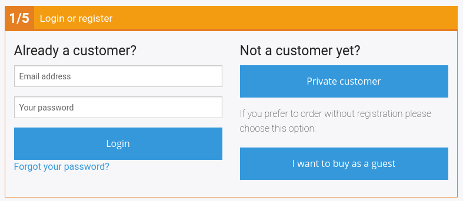

# Checkout [[% include 'snippets/commerce_badge.md' %]]

[[= product_name_com =]] provides a multi-step checkout process that takes place on one page.

All the steps are validated when an Ajax call is sent.

[CheckoutController](checkout_api/checkout_controllers.md#checkoutcontroller) and [AjaxCheckoutController](checkout_api/checkout_controllers.md#ajaxcheckoutcontroller)
are responsible for the checkout logic.

By default, orders are placed in the ERP system. If you do not have an ERP system connected,
you can use [local orders](local_orders.md) to store orders in the shop.
