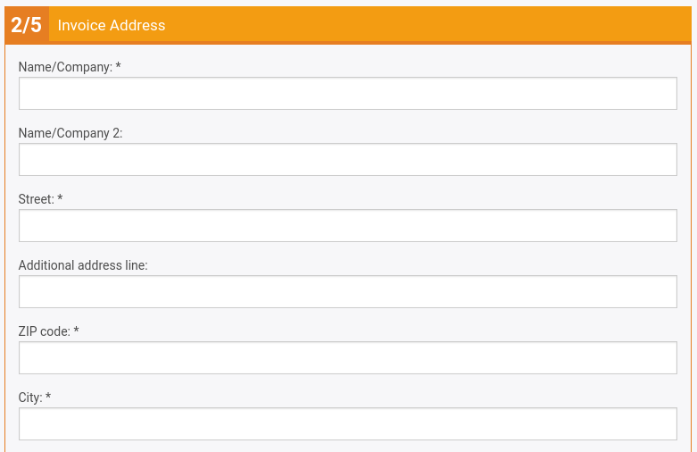
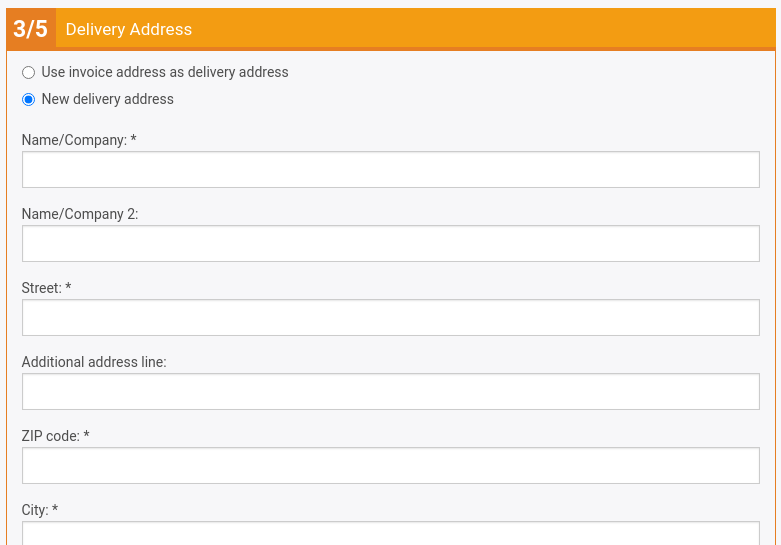
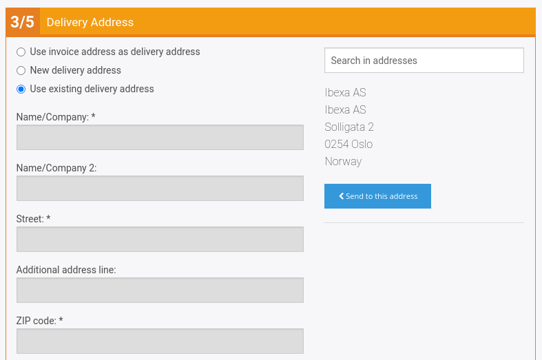
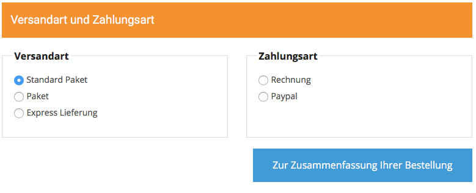
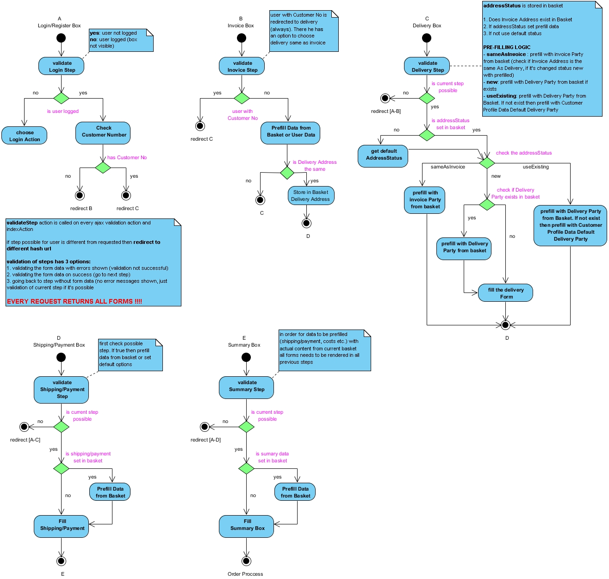

# Checkout

eZ Commerce provides one-page checkout with a varying number of steps.

If a user is not logged in, they see two more steps: one with a login form and a second one for the invoice address.
Customers who already have a customer number is forwarded to step 3. 

### Step 1 - Login form


### Step 2 - Invoice form

A customer without a customer number or an anonymous user has to add their invoice address first:



### Step 3 - Delivery address

A customer without a delivery address sees an empty delivery form. They can also chose the invoice address.



A customer with addresses can choose an address from a list:



### Step 4 - Delivery and payment



### Step 5 - Order summary


## Checkout logic

[CheckoutController](checkout_api/checkoutcontroller.md) and [AjaxCheckoutController](checkout_api/ajaxcheckoutcontroller.md)
are responsible for the checkout logic.

One-page checkout enables the customer to go through the process back and forth. All the steps are validated when an Ajax call is sent.

All the logic is moved into controllers which are responsible also for rendering.



## How to do things after an order has been placed

You can define an event listener which is triggered when an order has been placed.

``` xml
<service id="ezcommerce_demo.confirmation_listener" class="%ezcommerce_demo.confirmation_listener.class%">
    <argument type="service" id="silver_basket.basket_repository" />
    <argument type="service" id="silver_trans.translator" />
    <argument type="service" id="siso_tools.mailer_helper" />
    <argument type="service" id="silver_catalog.data_provider_service" />
    <argument type="collection">
        <argument key="addresses">$siso_core.default.ses_swiftmailer$</argument>
        <argument key="subject">$order_confirmation.subject;siso_checkout$</argument>
    </argument>

    <tag name="kernel.event_listener" event="silver_eshop.response_message" method="onOrderResponse" priority="-10" />
    <tag name="kernel.event_listener"  event="silver_eshop.exception_message" method="onExceptionMessage" />

</service>
```

There are two tags involved: one to be used when no ERP system is connected and one for an installation connected with ERP.

``` php
/**
 * Listens to the MessageExceptionEvent event.
 * The appropriate exception was thrown by the previous listener ("sendMessage" of the "AbstractMessageTransport")
 * This function:
 * - checks for downloads and send an email to the customer 
 *
 * @param MessageExceptionEvent $messageExceptionEvent
 * @return void
 *
 */
public function onExceptionMessage(MessageExceptionEvent $messageExceptionEvent)
{
    $message = $messageExceptionEvent->getMessage();
    $exception = $messageExceptionEvent->getException();
    if ($message instanceof CreateSalesOrderMessage && $exception instanceof LocalOrderRequiredException) {
        /** @var Order $requestDocument */
        $requestDocument = $message->getRequestDocument();

        /** @var Basket $basket */
        $basket = $this->basketRepository->findOneBy(array('guid' => $requestDocument->UUID->value));

        $this->checkForDownloads($basket);
    }
}
/**
 * This method must registered as a listener to the
 * 'silver_eshop.response_message' event. It will act in case an ERP is in place
 *
 * @param MessageResponseEvent $event
 */
public function onOrderResponse(MessageResponseEvent $event)
{
    $message = $event->getMessage();
    if ($message instanceof CreateSalesOrderMessage) {

        /** @var Order $requestDoc */
        $requestDoc = $message->getRequestDocument();

        $basket = $this->basketRepository->findOneBy(array('guid' => $requestDoc->UUID->value));
        $this->checkForDownloads($basket);
    }
}
```
