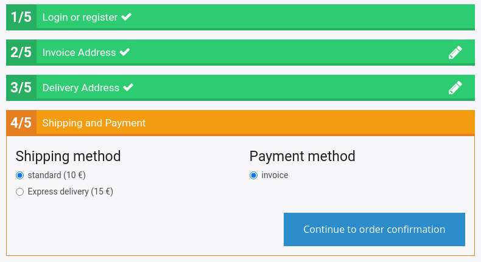

# Checkout events [[% include 'snippets/commerce_badge.md' %]]

The following events are dispatched during the checkout process:

| Event                                  | Dispatched                                                                   |
| -------------------------------------- | ----------------------------------------------------------------------------- |
| [`siso_checkout.pre_checkout`](#pre-checkout-event) | Before user enters the checkout process         |
| [`siso_checkout.pre_form_checkout`](#pre-form-checkout-event) | Before form preparation in the checkout process |
| [`siso_checkout.post_form_checkout`](#post-form-checkout-event) | After form preparation in the checkout process  |
| `silver_eshop.response_message` | After an event has been placed, without ERP connection |
| `silver_eshop.exception_message`| After an event has been placed, with ERP connection |

## Pre-checkout event

Before the user enters the checkout process,
the shop throws the `siso_checkout.pre_checkout` event to enable checking the basket.
You can use it, for example, to check for invalid items in the basket.

If the event listener needs to interrupt the checkout process,
it sets the event status to `failed` and sets a custom error message in the basket.
It then redirects the user back to the basket and displays the error message.

### ValidBasketListener

`ValidBasketListener` (service ID: `siso_checkout.empty_basket_listener`) checks if the basket is empty and the prices are valid.

If the prices are invalid, the customer cannot make an order.
You can allow making an order with invalid prices (for example for B2B), by setting `invalid_prices_allowed` to `true`:

``` yaml
parameters:
    siso_checkout.default.invalid_prices_allowed: true
```

### MinOrderAmountListener

`MinOrderAmountListener` (service ID: `siso_checkout.min_order_amount_listener`) checks if the minimum order amount was reached.
This is set in the configuration. You can also enable/disable the listener:

``` yaml
parameters:
    siso_checkout.default.min_order_amount_listener_active: true
    siso_eshop.min_order_amount: 0.01
```

## Pre-form-checkout event

Before the form is rendered in the checkout, the shop throws the `siso_checkout.pre_form_checkout` event to enable modifying the form.
You can, for example, modify payment or shipping options.

### Change the shipping or payment options

If you want to change the shipping or payment options (e.g. you need to set them dynamically depending on the basket data),
implement the following listener and store the options in the basket `dataMap`.
The options automatically appear in the checkout process.

``` php
public function onPreFormCheckout(PreFormCheckoutEvent $event)
{
    /**
     * code that is sent to NAV => value/translation key for the user
     */
    $shippingMethods = array(
        'LIEFERUNG' => 'standard_mail'
    );       

    $paymentMethods = array('invoice' => 'invoice');
    
    $basket = $event->getBasket();
    $dataMap = $basket->getDataMap();
    if(!array_key_exists('shippingMethods',$dataMap)) {
        $basket->addToDataMap($shippingMethods, 'shippingMethods');
    }

    if(!array_key_exists('paymentMethods',$dataMap)) {
        $basket->addToDataMap($paymentMethods, 'paymentMethods');
    }
}
```

### PriceShippingListener

`PriceShippingListener` (service ID `siso_checkout.tests.price_shipping_listener`) adds information about prices to shipping options:

``` yaml
parameters:
    siso_checkout.default.tests.price_shipping_listener_active: false
```



## Post-form-checkout event

After a form is submitted in the checkout, the shop throws the `siso_checkout.post_form_checkout` event
to enable you to modify the submitted values and check them.
You can use it, for example, to validate the address.
For this to work, every checkout form must implement the `CheckoutFormInterface`.

The validation has three options:

1. status success - go to the next step
2. status error - stay in the current step, display error message and display rendered HTML in the template above current form
3. status notice - stay in the current step, display notice message and display rendered HTML in the template above current form  
It adds checkbox to force next step in every checkout form. User has to check this checkbox if he wants to continue

### ValidAddressListener

`ValidAddressListener` (service ID `siso_checkout.tests.valid_address_listener`) checks if address is valid. 

``` yaml
parameters:
    siso_checkout.default.tests.valid_address_listener_active: false
```
