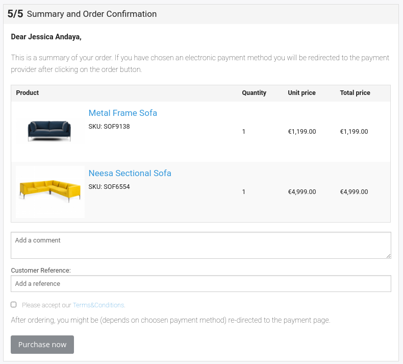

# Order summary

Summary is the last step in the checkout process. In order to finish the process, the customer needs to accept terms and conditions.

## Templates

|                              |           |
| ---------------------------- | --------- |
| Main template                | `checkout/summary.html.twig` |
| Sidebar template for summary | `checkout/sidebar_summary.html.twig`  |

## Terms and conditions

In [checkout summary form](checkout_summary_form.md) there is a field `termsAndConditions` which is rendered as a checkbox.

The texts for terms and conditions are stored as translatable text modules.
This text module is a label in the form type and is fetched via `TransService`.

The customer must accept the terms and conditions to complete the order.

