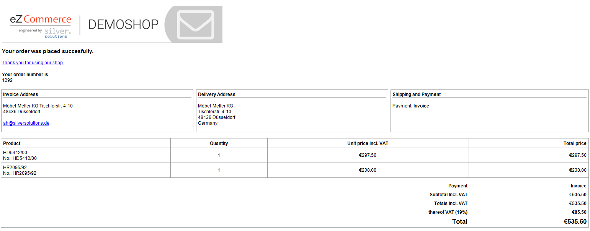

# Order confirmation

After finishing the checkout (in case of an electronic payment transaction after redirection from the payment provider) the user is redirected to the confirmation page.

If the customer has a customer number, the data from the ERP is fetched again since there might be some changes.

## Confirmation email

The shop sends a confirmation email to the customer and to a sales contact (if configured).

In case of a failure (e.g. if the mail server is unreachable) the issue is logged into `var/logs/dev/dev-siso.mails.log`
(in `prod` mode the file name contains `env=prod`). 

The log file contains the recipient, the email text and an error text.

### Setting confirmation email address

Processing the confirmation email address is handled in `\Siso\Bundle\CheckoutBundle\Service\SummaryCheckoutFormService`.

#### Customer confirmation

The customer's confirmation email address depends on the user type and is stored in the basket object during the checkout process in several steps. There are two options:

- For an anonymous customer the email address is taken from the Invoice Address of the basket object which is captured during the checkout process.
- For a logged-in customer with or without a number the email is taken from Customer Profile Data from the e-shop.

#### Sales contact confirmation

Depending on the setup of the e-shop, a second confirmation email is sent to a sales contact.
This address is also stored in the basket object next to the customer's address. The behavior is configurable:

##### sales_email_mode

`siso_checkout.default.order_confirmation.sales_email_mode` can take the the following values:

- `config` - the sales contact's email address is read from the `sales_email_address` setting
- `customer` - the sales contact's email address is read from `salesContactEmail` from `sesUser` from the [customer's profile data](../../../customers/customers_api/customer_profile_data_components/customer_profile_data_model.md). If no address is found in the contact data, the configuration parameter below is used as the default.

##### sales_email_address

`siso_checkout.default.order_confirmation.sales_email_address` can be set to a valid email address of the sales contact person.
If it's left empty, no sales contact confirmations are sent, except if `sales_email_mode` above is set to `customer` and the respective profile data contains a valid address.

### OrderConfirmationListener

The `\Siso\Bundle\CheckoutBundle\EventListener\OrderConfirmationListener` event listener sends the order confirmations as soon as an order is successfully accepted by the ERP.

This class is configured as a service which listens to the event `silver_eshop.exception_message`.
If the response contains an ERP order number, it is considered successful and the confirmation emails are sent as configured.
The following parameters are used:

``` yaml
siso_core.default.ses_swiftmailer:
    mailSender: "mail@example.com"
siso_checkout.default.order_confirmation_subject: "Email subject"
```

### Order confirmation email

The order confirmation is sent via the `MailHelperService`.  
The confirmation action searches for the basket with the given ID and state `confirmed`.

``` 
$basket = $this->getBasket($request, BasketService::STATE_CONFIRMED, $basketId);
```

#### Mail templates

|                 |        |
| --------------- | ------ |
| Plain text email | `vendor/silversolutions/silver.e-shop/src/Silversolutions/Bundle/EshopBundle/Resources/views/Checkout/Email/order_confirmation.txt.twig`  |
| HTML email       | `vendor/silversolutions/silver.e-shop/src/Silversolutions/Bundle/EshopBundle/Resources/views/Checkout/Email/order_confirmation.html.twig` |

#### Example email


