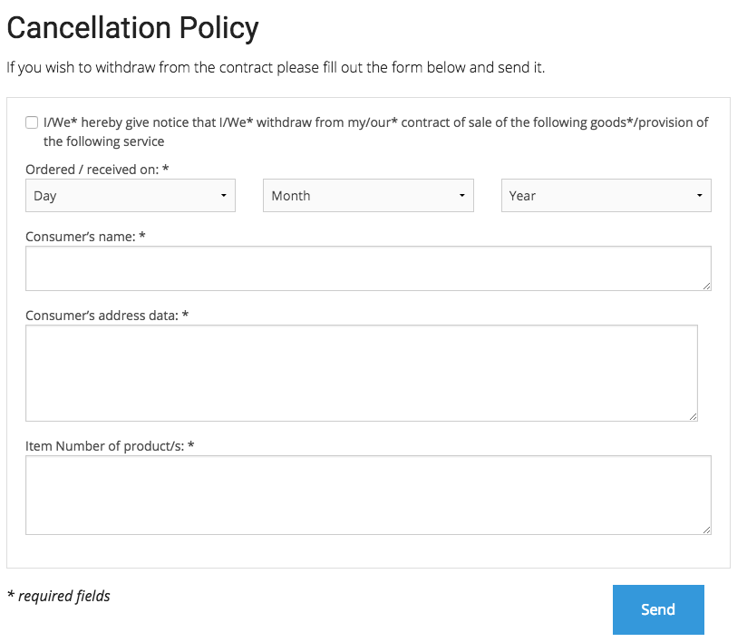

# RMA process

eZ Commerce offers a simple RMA (return merchandise authorization) process.
The goal is to inform the user about the cancellation policies and give them the possible to return their goods - online as well.

The cancellation process validates the input and sends an email to the shop administrator. 



## Link to cancellation form

There is a link to the cancellation policies and online cancellation form displayed in the footer.
The text modules that are used to render the footer can be configured per SiteAccess:

``` yaml
parameters:
    siso_core.default.identifier_footer_block_address: footer_block_address
    siso_core.default.identifier_footer_block_company: footer_block_company
    siso_core.default.identifier_footer_block_service: footer_block_service
    siso_core.default.identifier_footer_block_ordering: footer_block_ordering
```

## Online cancellation form

There is an online cancellation form.
After a user submits the form, an email is sent to the admin by using [SendCancellationEmailDataProcessor](../../forms/form_api/dataprocessors.md#sendcancellationemaildataprocessor).

See [Forms](../../forms/forms.md) for more information.

``` html+twig
{{ path('silversolutions_service', {'formTypeResolver': 'cancellation'}) }}
```

``` yaml
parameters:
    #form configuration
    ses_forms.configs.cancellation:
        modelClass: Silversolutions\Bundle\EshopBundle\Form\Cancellation
        typeService: siso_core.cancellation_type
        template: SilversolutionsEshopBundle:Forms:cancellation.html.twig
        invalidMessage: error_message_register
        validMessage: common.success_cancellation
        dataProcessors:
            - siso_core.data_processor.send_cancellation_email
```

## Online RMA form

eZ Commerce also offers an online RMA form. 
After a user submits the form, an email is sent to the admin by using [SendRmaEmailDataProcessor](../../forms/form_api/dataprocessors.md#sendrmaemaildataprocessor).

The email recipient has to generate a delivery note with a return number and send it to the customer.
The customer then can return their goods together with return number.

See [Forms](../../forms/forms.md) for more information.

``` html+twig
{{ path('silversolutions_service', {'formTypeResolver': 'rma'}) }}
```

``` yaml
parameters:
    #form configuration
    ses_forms.configs.rma:
        modelClass: Silversolutions\Bundle\EshopBundle\Form\RMA
        typeService: siso_core.rma_type
        template: SilversolutionsEshopBundle:Forms:rma.html.twig
        invalidMessage: error_message_register
        validMessage: common.success_rma
        dataProcessors:
            - siso_core.data_processor.send_rma_email
```

## Checkout process

In the summary checkout process there is a checkbox where the user has to confirm that they accept the cancellation policies.
The text module that defines those texts can be configured per SiteAccess:

``` yaml
paramaters:
    siso_core.default.identifier_data_protection_policy: label.accept_data_protection_and_cancellation_policies
```

The cancellation policies are rendered in the confirmation email as well.

You can switch this behavior off per SiteAccess:

``` yaml
parameters:
    #true if the cancellation is allowed in the shop
    siso_core.default.cancellation_allowed: true 
```
