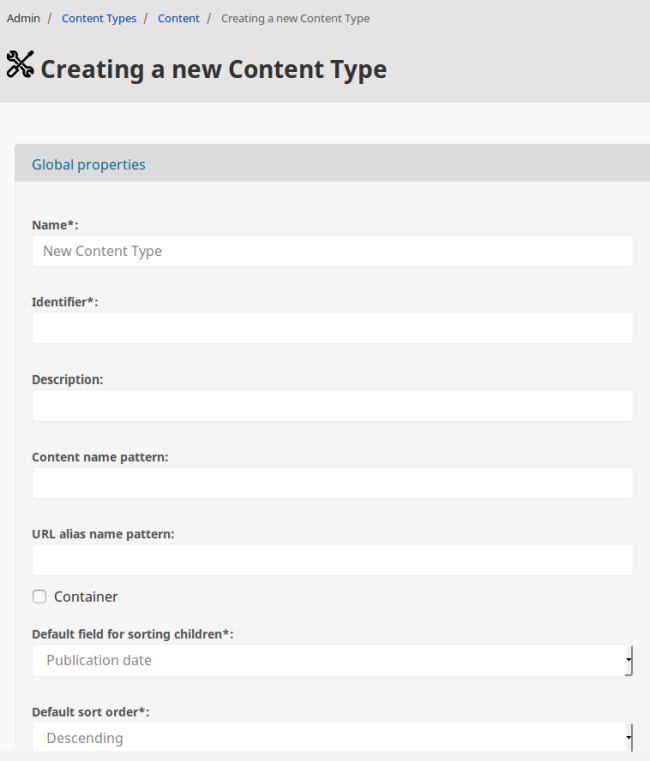
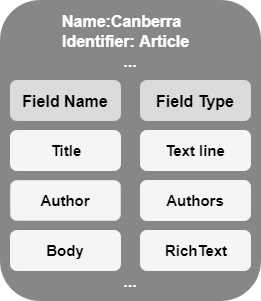

# Content Model

## Content model overview

The content structure in [[= product_name =]] is based on Content items.
A Content item represents a single piece of content: an article, a blog post, an image, a product, etc.
Each Content item is an instance of a Content Type.

!!! tip

    An introduction to the content model for non-developer users is available in [[[= product_name =]] user documentation](https://doc.ezplatform.com/projects/userguide/en/latest/content_model/).

## Content items

A Content item consists of:

- [Content information](#content-information)
- [Fields](#fields), defined by the [Content Type](#content-types).
The Fields can cover data ranging from single variables and text lines to media files or blocks of formatted text.

#### Content information

General information about a Content item is stored in a [`ContentInfo`](https://github.com/ezsystems/ezplatform-kernel/blob/v1.0.0/eZ/Publish/API/Repository/Values/Content/ContentInfo.php) object.
`ContentInfo` does not include Fields. It contains following information:

**`id`** - the unique ID of the Content object. These numbers are not recycled, so if an item is deleted, its ID will not be reused when a new one is created.

**`contentTypeId`** - the unique ID of the Content Type on which the Content item is based.

**`name`** - the name is generated automatically based on a [pattern specified in the Content Type definition](#content-name-pattern).
The name is in the main language of the Content item.

!!! note

    `name` is always searchable, even if the Field(s) used to generate it are not.

**`sectionId`** - the unique number of the Section to which the Content item belongs.
New Content items are placed in the Standard Section by default.
This behavior can be changed, but content must always belong to some Section.
See [Sections](admin_panel.md#sections) for more information.

**`currentVersionNo`** - current version number is the number of the published version or of a newly created draft (which is 1).

**`published`** - true if a published version exists, otherwise false.

**`ownerId`** - ID of the User who initially created the Content item.
It is set by the system the first time the Content item is published.
The ownership of an item cannot be modified and will not change even if the owner is removed from the system.

**`modificationDate`** - date and time when the Content item was last modified.
This is set by the system and cannot be modified manually, but will change every time the item is published again.

**`publishedDate`** - date and time when the Content item was published for the first time.
This is set by the system and cannot be modified.

**`alwaysAvailable`** - indicates if the Content item is shown in the main language when it's not present in another requested language.
It is [set per Content Type](#default-content-availability).

**`remoteId`** - a global unique ID of the Content item.
Accepts up to 100 characters. Cannot contain non-printable characters and control sequences (anything in ASCII range `\x00` - `\x1F`).
It's recommended to either let this value be generated by the Public PHP API as an MD5 hash, or at least to generate it as a hash (e.g. one from SHA family).

**`mainLanguageCode`** - the main language code of the Content item.
If the `alwaysAvailable` flag is set to true, the Content item is shown in this language when the requested language does not exist.

**`mainLocationId`** - identifier of the Content item's main [Location](content_management.md#locations).

**`status`** - status of the Content item. It can have three statuses: 0 – *draft*, 1 – *published* and 2 – *archived*.
When an item is created, its status is set to *draft*. After publishing the status changes to *published*.
When a published Content item is moved to Trash, the item becomes *archived*.
If a published item is removed from the Trash (or removed without being put in the Trash first), it is permanently deleted.

The Fields of a Content item are defined by the Content Type to which the Content item belongs.

## Content Types

### Content Type metadata

Each Content Type is characterized by a set of metadata which define the general behavior of its instances:

**Name** – a user-friendly name that describes the Content Type. This name is used in the interface, but not internally by the system. It can consist of letters, digits, spaces and special characters; the maximum length is 255 characters. (Mandatory.)

!!! note

    Note that even if your Content Type defines a Field intended as a name for the Content item (for example, a title of an article or product name), do not confuse it with this Name, which is a piece of metadata, not a Field.

**Identifier** – an identifier for internal use in configuration files, templates, PHP code, etc. It must be unique, can only contain lowercase letters, digits and underscores; the maximum length is 50 characters. (Mandatory.)

**Description** – a detailed description of the Content Type. (Optional.)

**Content name pattern** – a pattern that defines what name a new Content item based on this Content Type gets. The pattern usually consists of Field identifiers that tell the system which Fields it should use when generating the name of a Content item. Each Field identifier has to be surrounded with angle brackets. Text outside the angle brackets will be included literally. If no pattern is provided, the system will automatically use the first Field. (Optional.)

**URL alias name pattern** – a pattern which controls how the virtual URLs of the Locations will be generated when Content items are created based on this Content Type. Note that only the last part of the virtual URL is affected. The pattern works in the same way as the Content name pattern. Text outside the angle brackets will be converted using the selected method of URL transformation. If no pattern is provided, the system will automatically use the name of the Content item itself. (Optional.)

!!! tip "Changing URL alias and Content name patterns"

    If you change the Content name pattern or the URL alias name pattern,
    existing Content items will not be modified automatically.
    The new pattern will only be applied after you modify the Content item and save a new version.

    The old URL aliases will continue to redirect to the same Content items.

**Container** – a flag which indicates if Content items based on this Content Type are allowed to have sub-items or not.

!!! note

    This flag was added for convenience and only affects the interface. In other words, it doesn't control any actual low-level logic, it simply controls the way the graphical user interface behaves.

**Sort children by default by** – rule for sorting sub-items. If the instances of this Content Type can serve as containers, their children will be sorted according to what is selected here.

**Sort children by default in order** – another rule for sorting sub-items. This decides the sort order for the criterion chosen above.

**Make content available even with missing translations** – a flag which indicates if Content items of this Content Type should be available even without a corresponding language version. See [Content availability](content_management.md#content-availability).

### Field definitions

Aside from the metadata, a Content Type may contain any number of Field definitions (but has to contain at least one).
They determine what Fields of what Field Types will be included in all Content items based on this Content Type.

!!! note

    You can assign each Field defined in a Content Type to a group by selecting one of the groups in the Category drop-down. [Available groups can be configured in the content repository](configuration.md#content-repository-configuration).

!!! caution

    In case of Content Types containing many Field Types you should be aware of possible memory-related issues with publishing/editing.
    They are caused by the limitation of how many `$_POST` input variables can be accepted.

    The easiest way to fix them is by increasing the `max_input_vars` value in the `php.ini` configuration file.
    Note that this solution is not universally recommended and you're proceeding on your own risk.

    Setting the limit inappropriately may damage your project or cause other issues.
    You may also experience performance problems with such large Content Types, in particular when you have many Content items.
    If you're experincing too many issues, consider rearranging your project to avoid them.

### Modifying Content Types

A Content Type and its Field definitions can be modified after creation,
even if there are already Content items based on it in the system.
When a Content Type is modified, each of its instances will be changed as well.
If a new Field definition is added to a Content Type, this Field will appear (empty) in every relevant Content item.
If a Field definition is deleted from the Content Type, all the corresponding Fields will be removed from Content items of this type.

## Fields

A Field is the smallest unit of storage in the content model and the building block of all Content items. Every Field belongs to a Field Type.

Beyond the built-in set of Field Types, you can create your own.

### Field value validation

The values entered in a Field may undergo validation, which means the system makes sure that they are correct for the chosen Field Type and can be used without a problem.

Validation depends on the settings of a particular Field Type. It cannot be turned off for a Field if its Field Type supports it.

### Field details

Aside from the Field Type, the Field definition in a Content Type provides the following information:

**Name** – a user-friendly name that describes the Field. This name is used in the interface, but not internally by the system. It can consist of letters, digits, spaces and special characters; the maximum length is 255 characters. If no name is provided, a unique one is automatically generated.

**Identifier** – an identifier for internal use in configuration files, templates, PHP code, etc. It can only contain lowercase letters, digits and underscores; the maximum length is 50 characters. This identifier is also used in name patterns for the Content Type.

**Description** – a detailed description of the Field.

**Required** – a flag which indicates if the Field is required for the system to accept the Content item. By default, if a Field is flagged as Required, a user will not be able to publish a Content item without filling in this Field.

!!! note
    You can use the `ContentService::validate()` method to decide whether the required Fields or whole Content items are checked for 
    completeness at other stages of the editing process.

    The Required flag is in no way related to Field validation. A Field's value is validated whether the Field is set as required or not.

**[Searchable](search/search.md)** – a flag which indicates if the value of the Field will be indexed for searching.

The Searchable flag is not available for some Fields, because some Field Types do not allow searching through their values.

**[Translatable](internationalization.md)** – a flag which indicates if the value of the Field can be translated. This is independent of the Field Type, which means that even Fields such as "Float" or "Image" can be set as translatable.

Depending on the Field Type, there may also be other, specific information to fill in. For example, the "Country" Field Type allows you to select the default country, as well as to allow selecting multiple countries at the same time.

## Content versions

Each Content item can have multiple versions.
Each version has one of the following statuses: *draft*, *archived* or *published*.

A new version is created every time a Content item is edited. The previous published version is not modified.

Only one version can be published at the same time.
When you publish a new version, the previous published version changes its status to Archived.

The number of preserved archived versions is set in `ezplatform.repositories.default.options.default_version_archive_limit`.
By default it is set to 5.

A new version is also created when a new [language](internationalization.md) is added to the Content item.
