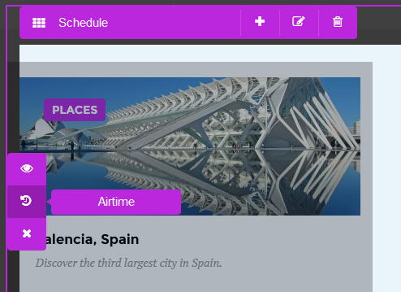
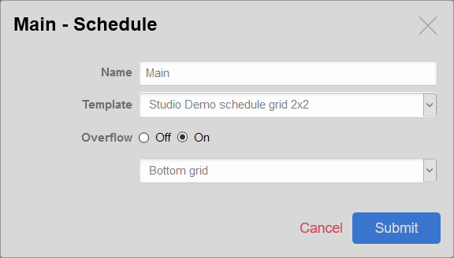
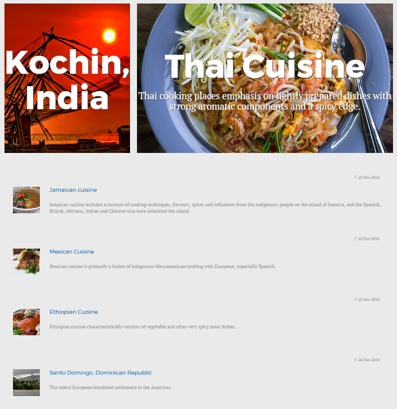

# Content Rendering

## Introduction

### The ViewController

eZ Platform comes with a native controller to display your content, known as the **`ViewController`**. It is called each time you try to reach a Content item from its **Url Alias** (human-readable, translatable URI generated for any content based on URL patterns defined per Content Type). It is able to render any content created in the admin interface or via the [Public API Guide](../api/public_php_api.md#public-api-guide).

It can also be called straight by its direct URI: 

`/view/content/<contentId>/full/true/<locationId>`

`/view/content/<contentId>`

A Content item can also have different **view types** (full page, abstract in a list, block in a landing page, etc.). By default the view type is **full** (for full page), but it can be anything (*line*, *block, etc*.).

## Configuring views: the ViewProvider

The **ViewProvider** allows you to configure template selection when using the `ViewController`, either directly from a URL or via a sub-request.

#### Principle

The ViewProvider takes its configuration from your SiteAccess in the `content_view` section. This configuration is [necessary for views to be defined](design.md#design-basics) and is a hash built in the following way:

``` yaml
#app/config/ezplatform.yml
ezpublish:
    system:
        # Defines the scope: a valid SiteAccess, SiteAccess group or even "global"
        front_siteaccess:
            # Configuring the ViewProvider
            content_view:
                # The view type (full/line are standard, but you can use custom ones)
                full:
                    # A simple unique key for your matching ruleset
                    folderRuleset:
                        # The template identifier to load, following the Symfony bundle notation for templates
                        # See http://symfony.com/doc/current/book/controller.html#rendering-templates
                        template: eZDemoBundle:full:small_folder.html.twig
                        # Hash of matchers to use, with their corresponding values to match against
                        match:
                            # The key defines the matcher rule (class name or service identifier)
                            # The value will be passed to the matcher's setMatchingConfig() method.
                            Identifier\ContentType: [small_folder, folder]
```

!!! caution "Template matching and non-existent Field Types"

    **Template matching will NOT work if your content contains a Field Type that is not supported by the repository**. It can happen when you are in the process of migrating from eZ Publish 4.x, where custom datatypes have been developed.

    In this case the repository will throw an exception, which is caught in the `ViewController`, and *if* you are using Legacy Bridge it will end up doing a [fallback to legacy kernel](https://doc.ez.no/display/EZP/Legacy+template+fallback).

    The list of Field Types supported out of the box [is available here](field_type_reference.md).

!!! tip

    You can define your template selection rules, alongside other settings, in a different bundle. [Read the cookbook recipe to learn more about it](../cookbook/importing_settings_from_a_bundle.md).

    You can also [use your own custom controller to render a Content/Location](#custom-controllers).

## View Matchers

To be able to select the right templates for the right conditions, the view provider uses matcher objects which implement the `eZ\Publish\Core\MVC\Symfony\View\ContentViewProvider\Configured\Matcher` interface.

##### Matcher identifier

The matcher identifier can comply to 3 different formats:

1. **Relative qualified class name** (e.g. `Identifier\ContentType`). This is the most common case, it is used for native matchers. It is relative to `eZ\Publish\Core\MVC\Symfony\Matcher\ContentBased`.
1. **Full qualified class name** (e.g. `\Foo\Bar\MyMatcher`). This is a way to specify a **custom matcher** that doesn't need specific dependency injection. Note that it **must** start with a backslash (`\`).
1. **Service identifier**, as defined in Symfony service container. This is the way to specify a **more complex custom matcher** that has dependencies.

!!! note "Injecting the Repository"

    If your matcher needs the repository, make it implement `eZ\Publish\Core\MVC\RepositoryAwareInterface` or extend the `eZ\Publish\Core\MVC\RepositoryAware` abstract class. The repository will then be correctly injected before matching.

##### Matcher value

The value associated with the matcher is passed to its `setMatchingConfig()` method. The value can be anything that is supported by the matcher.

!!! note

    Native matchers support both **scalar values** or **arrays of scalar values**. Passing an array amounts to applying a logical OR.

##### Combining matchers

It is possible to combine multiple matchers:

``` yaml
# ...
match:
    Identifier\ContentType: [small_folder, folder]
    Identifier\ParentContentType: frontpage
```

The example above can be translated as "Match any content whose **ContentType** identifier is `small_folder` OR `folder` , **AND** having `frontpage` as **ParentContentType** identifier".

#### Available matchers

The following table presents all native matchers.

|Identifier|Description|
|------|------|
|`Id\Content`|Matches the ID number of the Content item.|
|`Id\ContentType`|Matches the ID number of the Content Type that the Content item is an instance of.|
|`Id\ContentTypeGroup`|Matches the ID number of the group containing the Content Type that the Content item is an instance of.|
|`Id\Location`|Matches the ID number of a Location. *In the case of a Content item, matched against the main location.*|
|`Id\ParentContentType`|Matches the ID number of the parent Content Type. *In the case of a Content item, matched against the main location.*|
|`Id\ParentLocation`|Matches the ID number of the parent Location. *In the case of a Content item, matched against the main location.*|
|`Id\Remote`|Matches the remoteId of either Content or Location, depending on the object matched.|
|`Id\Section`|	Matches the ID number of the Section that the Content item belongs to.|
|`Identifier\ContentType`|Matches the identifier of the Content Type that the Content item is an instance of.|
|`Identifier\ParentContentType`|Matches the identifier of the parent Content Type. *In the case of a Content item, matched against the main Location.*|
|`Identifier\Section`|Matches the identifier of the Section that the Content item belongs to.|
|`Depth`|Matches the depth of the Location. The depth of a top level Location is 1.|
|`UrlAlias`|Matches the virtual URL of the Location (i.e. `/My/Content-Uri`). **Important: Matches when the UrlAlias of the Location starts with the value passed.** *Not supported for Content (aka content_view).*|

### Content view templates

#### Available variables

|Variable name|Type|Description|
|------|------|------|
|`location`|[eZ\Publish\Core\Repository\Values\Content\Location](https://github.com/ezsystems/ezpublish-kernel/blob/master/eZ/Publish/Core/Repository/Values/Content/Location.php)|The Location object. Contains meta information on the Content (ContentInfo) (only when accessing a Location) |
|`content`|[eZ\Publish\Core\Repository\Values\Content\Content](https://github.com/ezsystems/ezpublish-kernel/blob/master/eZ/Publish/Core/Repository/Values/Content/Content.php)|The Content item, containing all Fields and version information (VersionInfo)|
|`noLayout`|Boolean|If true, indicates if the Content item/Location is to be displayed without any pagelayout (i.e. AJAX, sub-requests, etc.). It's generally `false` when displaying a Content item in view type **full**.|
|`viewBaseLayout`|String|The base layout template to use when the view is requested to be generated outside of the pagelayout (when `noLayout` is true).|

#### Template inheritance and sub-requests

Like any template, a content view template can use [template inheritance](http://symfony.com/doc/current/book/templating.html#template-inheritance-and-layouts). However keep in mind that your Content may be also requested via [sub-requests](http://symfony.com/doc/current/book/templating.html#embedding-controllers) (see below how to render [embedded Content items](#embedding-content-items)), in which case you probably don't want the global layout to be used.

If you use different templates for embedded content views, this should not be a problem. If you'd rather use the same template, you can use an extra `noLayout` view parameter for the sub-request, and conditionally extend an empty pagelayout:

``` html



...

```

#### Default view templates

Content view uses default templates to render content unless custom view rules are used.

Those templates can be customized by means of container- and SiteAccess-aware parameters.

##### Overriding the default template for common view types

Templates for the most common view types (content/full, line, embed, or block) can be customized by setting one the `ezplatform.default.content_view_templates` variables:

| Controller                                              | ViewType | Parameter                                         | Default value                                           |
|---------------------------------------------------------|----------|---------------------------------------------------|---------------------------------------------------------|
| `ez_content:viewAction`                                 | `full`   | `ezplatform.default_view_templates.content.full`  | `"EzPublishCoreBundle:default:content/full.html.twig"`  |
| `ez_content:viewAction`                                 | `line`   | `ezplatform.default_view_templates.content.line`  | `"EzPublishCoreBundle:default:content/line.html.twig"`  |
| `ez_content:viewAction`                                 | `embed`  | `ezplatform.default_view_templates.content.embed` | `"EzPublishCoreBundle:default:content/embed.html.twig"` |
| `ez_page:viewAction`                                    | `n/a`    | `ezplatform.default_view_templates.block`         | `"EzPublishCoreBundle:default:block/block.html.twig"`   |

###### Example

Add this configuration to `app/config/config.yml` to use `app/Resources/content/view/full.html.twig` as the default template when viewing Content with the `full` view type:

``` yaml
parameters:
    ezplatform.default_view_templates.content.full: "content/view/full.html.twig"
```

##### Customizing the default controller

The controller used to render content by default can also be changed. The `ezsettings.default.content_view_defaults` container parameter contains a hash that defines how content is rendered by default. It contains a set of [content view rules for the common view types](https://github.com/ezsystems/ezpublish-kernel/blob/v6.0.0/eZ/Bundle/EzPublishCoreBundle/Resources/config/default_settings.yml#L21-L33). This hash can be redefined to whatever suits your requirements, including custom controllers, or even matchers.

### Content and Location view providers

#### View\\Manager & View\\Provider

The role of the `(eZ\Publish\Core\MVC\Symfony\)View\Manager` is to select the right template for displaying a given Content item or Location. It aggregates objects called *Content and Location view providers* which respectively implement the `eZ\Publish\Core\MVC\Symfony\View\Provider\Content` and `eZ\Publish\Core\MVC\Symfony\View\Provider\Location` interfaces.

Each time a Content item is to be displayed through the `Content\ViewController`, the `View\Manager` iterates over the registered Content or Location `View\Provider` objects and calls `getView()`.

##### Provided View\\Provider implementations

|Name|Usage|
|------|------|
|[View provider configuration](#configuring-views-the-viewprovider)|Based on application configuration. Formerly known as *Template override system*.|
|`eZ\Publish\Core\MVC\Legacy\View\Provider\Content`, `eZ\Publish\Core\MVC\Legacy\View\Provider\Location`|Forwards view selection to the legacy kernel by running the old content/view module. Pagelayout used is the one configured in `ezpublish_legacy.<scope>.view_default_layout`. For more details about the `<scope>` please refer to the [scope configuration documentation](siteaccess.md#scope).|

#### Custom View\\Provider

##### Difference between `View\Provider\Location` and `View\Provider\Content`

- A `View\Provider\Location` only deals with `Location` objects and implements the `eZ\Publish\Core\MVC\Symfony\View\Provider\Location` interface.
- A `View\Provider\Content` only deals with `ContentInfo` objects and implements the `eZ\Publish\Core\MVC\Symfony\View\Provider\Content` interface.

##### When to develop a custom `View\Provider\(Location|Content)`

- You want a custom template selection based on a very specific state of your application
- You depend on external resources for view selection
- You want to override the default one view provider (based on configuration)

`View\Provider` objects need to be properly registered in the service container with the `ezpublish.location_view_provider` or `ezpublish.content_view_provider` service tag.

``` yaml
parameters:
    acme.location_view_provider.class: Acme\DemoBundle\Content\MyLocationViewProvider

services:
    acme.location_view_provider:
        class: %ezdemo.location_view_provider.class%
        tags:
            - {name: ezpublish.location_view_provider, priority: 30}
```

`priority` is an integer giving the priority to the `View\Provider\(Content|Location)` in the `View\Manager`. The priority range is from -255 to 255.

##### Example

``` php
// Custom View\Provider\Location
<?php
namespace Acme\DemoBundle\Content;

use eZ\Publish\Core\MVC\Symfony\View\ContentView;
use eZ\Publish\Core\MVC\Symfony\View\Provider\Location as LocationViewProvider;
use eZ\Publish\API\Repository\Values\Content\Location;

class MyLocationViewProvider implements LocationViewProvider
{
    /**
     * Returns a ContentView object corresponding to $location, or void if not applicable
     *
     * @param \eZ\Publish\API\Repository\Values\Content\Location $location
     * @param string $viewType
     * @return \eZ\Publish\Core\MVC\Symfony\View\ContentView|null
     */
    public function getView( Location $location, $viewType )
    {
        // Let's check location Id
        switch ( $location->id )
        {
            // Special template for home page, passing "foo" variable to the template
            case 2:
                return new ContentView( "AcmeDemoBundle:$viewType:home.html.twig", array( 'foo' => 'bar' ) );
        }

        // ContentType identifier (formerly "class identifier")
        switch ( $location->contentInfo->contentType->identifier )
        {
            // For view full, it will load AcmeDemoBundle:full:small_folder.html.twig
            case 'folder':
                return new ContentView( "AcmeDemoBundle:$viewType:small_folder.html.twig" );
        }
    }
}
```

## Rendering Content items

### Content item Fields

A view template receives the requested Content item, holding all Fields.
In order to display the Fields' value the way you want, you can either manipulate the Field Value object itself, or use a custom template.

#### Getting raw Field value

As you have access to the Content item in the template, you can use [its public methods](https://github.com/ezsystems/ezpublish-kernel/blob/master/eZ/Publish/Core/Repository/Values/Content/Content.php) to access all the information you need. You can also use the `ez_field_value` helper to get the [Field's value only](#ez_field_value). It will return the correct language if there are several, based on language priorities.

``` html
{# With the following, myFieldValue will be in the Content item's main language #}
{# It will also takes languages you provided to API on retrieval into account #}


{# Here myTranslatedFieldValue will be in the current language if a translation is available (read from SiteAccess configuration). If not, the Content item's main language will be used #}

```

#### Using the Field Type's template block

All built-in Field Types come with [their own Twig template](https://github.com/ezsystems/ezpublish-kernel/blob/master/eZ/Bundle/EzPublishCoreBundle/Resources/views/content_fields.html.twig). You can render any Field using this default template using the `ez_render_field()` helper.

``` html
{{ ez_render_field( content, 'some_field_identifier' ) }}
```

Refer to [`ez_render_field`](#ez_render_field) for further information.

!!! tip

    As this makes use of reusable templates, **using `ez_render_field()` is the recommended way and is to be considered the best practice**.

### Content name

The **name** of a Content item is its generic "title", generated by the repository based on the Content Type's naming pattern. It often takes the form of a normalized value of the first field, but might be a concatenation of several fields. There are 2 different ways to access this special property:

- Through the name property of ContentInfo (not translated).
- Through VersionInfo with the TranslationHelper (translated).

#### Translated name

The *translated name* is held in a `VersionInfo` object, in the `names` property which consists of a hash indexed by locale. You can easily retrieve it in the right language via the `TranslationHelper` service.

``` html
{# Languages provided to API will be taken into account so you can do this: #}
<h2>Translated Content name: {{ content.name }}</h2>

{# In earlier versions the same is available using Twig translation helper ez_content_name() #}
<h2>Translated Content name: {{ ez_content_name( content ) }}</h2>
<h3>Also works from ContentInfo: {{ ez_content_name( content.contentInfo ) }}</h3>
```

The helper will by default follow the prioritized languages order. If there is no translation for your prioritized languages, the helper will always return the name in the main language.

You can also **force a locale** in a second argument:

``` html
{# Force fre-FR locale. #}
<h2>{{ ez_content_name( content, 'fre-FR' ) }}</h2>
```

!!! note "Name property in ContentInfo"

    This property is the actual Content name, but **in the main language only** (so it is not translated).

    ``` html
    <h2>Content name: {{ content.contentInfo.name }}</h2>
    ```

    In PHP that would be:

    ``` php
    $contentName = $content->getContentInfo->getName();
    ```

    So make sure to use `$content->getName() or $versionInfo->getName()`, which takes translations into account.

#### Exposing additional variables

It is possible to expose additional variables in a content view template. See [parameters injection in content views](../cookbook/injecting_parameters_in_content_views.md).

### Embedding images

The Rich Text Field allows you to embed other Content items within the Field.

Content items that are identified as images will be rendered in the Rich Text Field using a dedicated template.

You can determine which Content Types will be treated as images and rendered using this template in the `ezplatform.content_view.image_embed_content_types_identifiers` parameter. By default it is set to cover the Image Content Type, but you can add other types that you want to be treated as images, for example:

``` yaml
parameters:
    ezplatform.content_view.image_embed_content_types_identifiers: ['image', 'photo', 'banner']
```

The template that is used when rendering embedded images can be set in the `ezplatform.default_view_templates.content.embed_image` container parameter:

``` yaml
parameters:
    ezplatform.default_view_templates.content.embed_image: 'content/view/embed/image.html.twig'
```

### Adding Links

#### Links to other Locations

Linking to other Locations is done with a [native `path()` Twig helper](http://symfony.com/doc/2.3/book/templating.html#linking-to-pages) (or `url()` if you want to generate absolute URLs). When you pass it the Location object, `path()` will generate the URLAlias.

``` html
{# Assuming "location" variable is a valid eZ\Publish\API\Repository\Values\Content\Location object #}
<a href="{{ path( location ) }}">Some link to a Location</a>
```

If you don't have the Location object, but only its ID, you can generate the URLAlias the following way:

``` html
<a href="{{ path( "ez_urlalias", {"locationId": 123} ) }}">Some link to a Location, with its ID only</a>
```

You can also use the Content ID. In that case the generated link will point to the Content item's main Location.

``` html
<a href="{{ path( "ez_urlalias", {"contentId": 456} ) }}">Some link from a contentId</a>
```

!!! note "Under the hood"

    In the back end, `path()` uses the Router to generate links.

    This makes it also easy to generate links from PHP, via the `router` service.

See also: [Cross-SiteAccess links](siteaccess.md#cross-siteaccess-links)

### Embedding Content items

To render an embedded Content from a Twig template you need to **do a subrequest with the `ez_content` controller**.

#### Using the `ez_content` controller

This controller is exactly the same as [the ViewController presented above](#the-viewcontroller). It has one main `viewAction` that renders a Content item.

You can use this controller from templates with the following syntax:

``` html
{{ render(controller("ez_content:viewAction", {"contentId": 123, "viewType": "line"})) }}
```

The example above renders the Content item whose ID is **123** with the view type **line**.

Referencing the `ez_content` controller follows the syntax of *controllers as a service*, [as explained in Symfony documentation](http://symfony.com/doc/current/cookbook/controller/service.html).

##### Available arguments

As with any controller, you can pass arguments to `ez_content:viewLocation` or `ez_content:viewContent` to fit your needs.

|Name|Description|Type|Default value|
|---|---|---|---|
|`contentId`|ID of the Content item you want to render. Only for `ez_content:viewContent`|integer|N/A|
|`locationId`|ID of the Location you want to render. Only for `ez_content:viewLocation`|integer|Content item's main location, if defined|
|`viewType`|The view type you want to render your Content item/Location in. Will be used by the ViewManager to select a corresponding template, according to defined rules. </br>Example: full, line, my_custom_view, etc.|string|full|
|`layout`|Indicates if the sub-view needs to use the main layout (see [available variables in a view template](#available-variables))|boolean|false|
|`params`|Hash of variables you want to inject to sub-template, key being the exposed variable name.|hash|empty hash|

For example:

``` html
{{ render(
      controller(
          "ez_content:viewAction",
          {
              "contentId": 123,
              "viewType": "line",
              "params": { "some_variable": "some_value" }
          }
      )
) }}
```

!!! enterprise

    ### Schedule block

    Schedule block is an Enterprise-only feature that enables you to plan content to be published at a predetermined time in the future.

    Schedule blocks are placed on a Landing Page and can be configured like any other block. This includes providing different templates for the editor to choose in the Studio UI.

    A Schedule block consists of a number of slots. Each slot can hold one Content item.

    The number of slots and their order is defined in the template. A template for a Schedule block must include the `data-studio-slots-container` and `data-studio-slot` attributes to enable placing Content in the slots. See [the demo bundle for an example](https://github.com/ezsystems/ezstudio-demo-bundle/blob/master/Resources/views/blocks/schedule_grid-4.html.twig#L3).

    #### Behavior

    

    You can preview the content added to a Schedule block in full, as it is viewed in PlatformUI, by activating the **Preview** button.

    When content is added to the block, it is initially assigned an airtime equal to the current time. The airtime can then be changed to a date and time in the future. Content items are ordered in the block according to the airtime. When you add more items to a block than there are slots, oldest content (i.e., with earliest airtime), is pushed off the block.

    A Schedule block tracks all content that is added, deleted and pushed off it. In the back office (both in View and Edit mode) you can see all activity (adding, deleting or overflow) in a block using the timeline at the top of the editor. Colored stripes on the timeline indicate when any change to the block happens. You can select the stripe to see the details of the changes.

    **Full list** in the timeline bar gives you access to all changes. When you view it in Edit mode, it displays all changes in the selected Schedule block; when you select the list in View mode, you will see all changes in all blocks on the page.

    Overflow enables you to combine multiple Schedule blocks in one flow. It is set up in the editor. Overflow defines what happens with content that is pushed off a full block.

    

    Each Schedule block that has overflow enabled can have one target block defined. When a Content item is pushed off the block, it will overflow to the designated block. In target block the items will be ordered according to the original airtime, not the order in which they were overflown.

    You can connect more than two Schedule blocks in this way, one after the other. It is also possible for multiple Schedule blocks to overflow into one. However, it is not possible to build a circular overflow (where a sequence of overflowing items eventually points to the original block). This is disabled in the UI.

    The **Remove item** action removes the item from the block (but does not delete the Content item itself. Deleting a Content item is possible from Content structure). When an item is removed, other content is pulled back to fill its place. This also happens to content that has already been pushed off the block – it will be pulled back even from a target overflow block.

    ##### Special Schedule block use cases

    - **Enabling and disabling overflow.** When you disable overflow, items which have already overflown to a target block will be removed from preview, but will stay in the history of the source block. If some items have already been pushed off a block and you enable overflow on it afterwards, the moved items will still overflow to the target block. When the target block of overflow is deleted, overflow will turn off automatically.

    - **Multi-block configuration.** You can have more than one block overflow to a single target block. Content items will remember their history. This means that if content is removed in the source blocks, items will be pulled back into their original blocks.

    - **Multiple copies of the same Content item.** You cannot add the same Content item multiple times to the same Schedule block. If two copies would end up in the same block, e.g. as a result of overflow, the older copy will be removed.

    ###### Example

    A typical example of using a Schedule block is a "Featured" articles block which overflows to a regular "List" of articles.

    A multi-block setup can be used to collect items from two blocks into one list. In the example below two featured blocks at the top, "Places" and "Tastes", both overflow to a single list, where content is ordered according to its airtime:

    

#### Rendering and cache

##### ESI

Just like for regular Symfony controllers, you can take advantage of [ESI](https://symfony.com/doc/current/http_cache/esi.html) and use different cache levels:

``` html
{{ render_esi(controller("ez_content:viewAction", {"contentId": 123, "viewType": "line"})) }}
```

Only scalar variables (not objects) can be sent via `render_esi`.

##### Asynchronous rendering using hinclude

Symfony also supports asynchronous content rendering with the help of the [hinclude.js](http://mnot.github.com/hinclude/) library.

``` html
<!--Asynchronous rendering-->
{{ render_hinclude(controller("ez_content:viewAction", {"contentId": 123, "viewType": "line"})) }}
```

Only scalar variables (not objects) can be sent via `render_hinclude`.

##### Display a default text

If you want to display a default text while a controller is loaded asynchronously, you have to pass a second parameter to your `render_hinclude` Twig function.

``` html
<!--Display a default text during asynchronous loading of a controller-->
{{ render_hinclude(controller('EzCorporateDesignBundle:Header:userLinks'), {'default': "<div style='color:red'>loading</div>"}) }}
```

See also: [Custom controllers](#custom-controllers).

[hinclude.js](http://mnot.github.com/hinclude/) needs to be properly included in your layout to work.

[Refer to Symfony documentation](http://symfony.com/doc/current/book/templating.html#asynchronous-content-with-hinclude-js) for all available options.

## Custom controllers

In some cases, displaying a Content item/Location via the built-in `ViewController` is not sufficient to show everything you want. In such cases you may want to **use your own custom controller** to display the current Content item/Location instead.

Typical use cases include access to:

- Settings (coming from `ConfigResolver` or `ServiceContainer`)
- Current Content item's `ContentType` object
- Current Location's parent
- Current Location's children count
- Main Location and alternative Locations for the current Content item
- etc.

There are three ways in which you can apply a custom controller:

- Configure a custom controller alongside regular matcher rules to use **both** your custom controller and the `ViewController` (recommended).
- [**Override**](#overriding-the-built-in-viewcontroller) the built-in `ViewController` with the custom controller in a specific situation.
- **Replace** the `ViewController` with the custom controller for the whole bundle.

### Enriching ViewController with a custom controller

**This is the recommended way of using a custom controller**

To use your custom controller on top of the built-in `ViewController` you need to point to both the controller and the template in the configuration, for example:

``` yaml
#ezplatform.yml
ezpublish:
    system:
        default:
            content_view:
                full:
                    article:
                        controller: AcmeTestBundle:Default:articleViewEnhanced
                        template: AcmeTestBundle:full:article.html.twig
                        match:
                            Identifier\ContentType: [article]
```

With this configuration, the following controller will forward the request to the built-in `ViewController` with some additional parameters:

``` php
// Controller
<?php

namespace Acme\TestBundle\Controller;

use Symfony\Component\HttpFoundation\Response;
use eZ\Bundle\EzPublishCoreBundle\Controller;

class DefaultController extends Controller
{
    public function articleViewEnhancedAction( $locationId, $viewType, $layout = false, array $params = array() )
    {
        // Add custom parameters to existing ones.
        $params += array( 'myCustomVariable' => "Hey, I'm a custom message!" );
        // Forward the request to the original ViewController
        // And get the response. Possibly alter it (here we change the smax-age for cache).
        $response = $this->get( 'ez_content' )->viewLocation( $locationId, $viewType, $layout, $params );
        $response->setSharedMaxAge( 600 );

        return $response;
    }
}
```

Always ensure that you add new parameters to an existing `$params` associative array using the [**`+`** union operator](http://php.net/manual/en/language.operators.array.php) or `array_merge()`. **Not doing so (only passing your custom parameters array) can result in unexpected issues with content preview**. Previewed Content and other parameters are indeed passed in `$params`.

These parameters can then be used in templates, for example:

``` html
<!--article.html.twig-->



    <h1>{{ ez_render_field( content, 'title' ) }}</h1>
    <h2>{{ myCustomVariable }}</h2>
    {{ ez_render_field( content, 'body' ) }}

```

### Using only your custom controller

If you want to apply only your custom controller **in a given match situation** and not use the `ViewController` at all, in the configuration you need to indicate the controller, but no template, for example:

``` yaml
#ezplatform.yml
ezpublish:
    system:
        default:
            content_view:
                full:
                    folder:
                        controller: AcmeTestBundle:Default:viewFolder
                        match:
                            Identifier\ContentType: [folder]
                            Identifier\Section: [standard]
```

In this example, as the `ViewController` is not applied, the custom controller takes care of the whole process of displaying content, including pointing to the template to be used (in this case, `AcmeTestBundle::custom_controller_folder.html.twig`):

``` php
// Controller
<?php

namespace Acme\TestBundle\Controller;

use Symfony\Component\HttpFoundation\Response;
use eZ\Bundle\EzPublishCoreBundle\Controller;

class DefaultController extends Controller
{
    public function viewFolderAction( $locationId, $layout = false, $params = array() )
    {
        $repository = $this->getRepository();
        $location = $repository->getLocationService()->loadLocation( $locationId );
        // Check if Content is not already passed. Can be the case when using content preview.
        $content = isset( $params['content'] ) ? $params['content'] : $repository->getContentService()->loadContentByContentInfo( $location->getContentInfo() )
        $response = new Response();
        $response->headers->set( 'X-Location-Id', $locationId );
        // Set caching for 1h and make the cache vary on user hash
        $response->setSharedMaxAge( 3600 );
        $response->setVary( 'X-User-Hash' );
        return $this->render(
            'AcmeTestBundle::custom_controller_folder.html.twig',
            array(
                'location' => $location,
                'content' => $content,
                'foo' => 'Hey world!!!',
                'osTypes' => array( 'osx', 'linux', 'windows' )
            ) + $params
        );
    }
}
```

Here again custom parameters can be used in the template, e.g.:

``` html
<!--custom\_controller\_folder.html.twig-->



<h1>{{ ez_render_field( content, 'title' ) }}</h1>
    <h1>{{ foo }}</h1>
    <ul>
    
        <li>{{ os }}</li>
    
    </ul>

```

### Overriding the built-in ViewController

One other way to keep control of what is passed to the view is to use your own controller **instead of** the built-in `ViewController`. The base `ViewController` is defined as a service, with a service alias, so this can be achieved from your bundle's configuration:

``` yaml
parameters:
    my.custom.view_controller.class: Acme\TestBundle\MyViewController

services:
    my.custom.view_controller:
        class: %my.custom.view_controller.class%
        arguments: [@some_dependency, @other_dependency]

    # Change the alias here and make it point to your own controller
    ez_content:
        alias: my.custom.view_controller
```

!!! caution

    Doing so will completely override the built-in `ViewController`! Use this at your own risk!

### Custom controller structure

Your custom controller can be any kind of [controller supported by Symfony](http://symfony.com/doc/current/book/page_creation.html#step-2-create-the-controller) (including [controllers as a service](http://symfony.com/doc/current/cookbook/controller/service.html)).

The only requirement here is that your action method must have a similar signature to `ViewController::viewLocation()` or `ViewController::viewContent()` (depending on what you're matching of course). However, note that not all arguments are mandatory, since [Symfony is clever enough to know what to inject into your action method](http://symfony.com/doc/current/book/routing.html#route-parameters-and-controller-arguments). That is why **you don't need to exactly imitate the `ViewController`'s signature**. For example, if you omit the `$layout` and `$params` arguments, it will still be valid. Symfony will just avoid injecting them into your action method.

#### Built-in ViewController signatures

``` php
// viewLocation() signature
/**
 * Main action for viewing content through a location in the repository.
 *
 * @param int $locationId
 * @param string $viewType
 * @param boolean $layout
 * @param array $params
 *
 * @throws \Symfony\Component\Security\Core\Exception\AccessDeniedException
 * @throws \Exception
 *
 * @return \Symfony\Component\HttpFoundation\Response
 */
public function viewLocation( $locationId, $viewType, $layout = false, array $params = array() )
```

``` php
// viewContent() signature
/**
 * Main action for viewing content.
 *
 * @param int $contentId
 * @param string $viewType
 * @param boolean $layout
 * @param array $params
 *
 * @throws \Symfony\Component\Security\Core\Exception\AccessDeniedException
 * @throws \Exception
 *
 * @return \Symfony\Component\HttpFoundation\Response
 */
public function viewContent( $contentId, $viewType, $layout = false, array $params = array() )
```

!!! caution "Caching"

    When you use your own controller, **it is your responsibility to define cache rules**, like with every custom controller!

    So don't forget to set cache rules and the appropriate `X-Location-Id` header in the returned `Response` object.

    [See built-in ViewController](https://github.com/ezsystems/ezpublish-kernel/blob/master/eZ/Publish/Core/MVC/Symfony/Controller/Content/ViewController.php#L76) for more details on this.

## Query controller

The Query controller is a predefined custom content view controller that runs a repository Query.

You can use it as a custom controller in a view configuration, [alongside match rules](#enriching-viewcontroller-with-a-custom-controller). It can use properties of the viewed Content item or Location as parameters to the Query.

The Query controller makes it easy to retrieve content without writing custom PHP code and to display the results in a template. Example use cases include:

- List of Blog posts in a Blog
- List of Images in a Gallery

### Usage example

This example assumes a "Blog" container that contains a set of "Blog post" items. The goal is, when viewing a Blog, to list the Blog posts it contains.

Three items are required:

- a `LocationChildren` QueryType - It will generate a Query retrieving the children of a given Location id
- a View template - It will render the Blog, and list the Blog posts it contains
- a `content_view` configuration - It will instruct Platform, when viewing a Content item of type Blog, to use the Query Controller, the view template, and the `LocationChildren` QueryType. It will also map the id of the viewed Blog to the QueryType parameters, and set which Twig variable the results will be assigned to.

#### The LocationChildren QueryType

QueryTypes are described in more detail in the [next section](#querytype-objects). In short, a QueryType can build a Query object, optionally based on a set of parameters. The following example will build a Query that retrieves the sub-items of a Location:

``` php
// src/AppBundle/QueryType/LocationChildrenQueryType.php
<?php
namespace AppBundle\QueryType;

use eZ\Publish\API\Repository\Values\Content\LocationQuery;
use eZ\Publish\API\Repository\Values\Content\Query\Criterion\ParentLocationId;
use eZ\Publish\Core\QueryType\QueryType;

class LocationChildrenQueryType implements QueryType
{
    public function getQuery(array $parameters = [])
    {
        return new LocationQuery([
            'filter' => new ParentLocationId($parameters['parentLocationId']),
        ]);
    }

    public function getSupportedParameters()
    {
        return ['parentLocationId'];
    }

    public static function getName()
    {
        return 'LocationChildren';
    }
}
```

Any class will be registered as a QueryType when it:

- implements the QueryType interface,
- is located in the QueryType subfolder of a bundle, and in a file named `<Something>QueryType.php`.

If the QueryType has dependencies, it can be manually tagged as a service using the `ezpublish.query_type` service tag, but it is not required in that case.

#### The `content_view` configuration

We now need a view configuration that matches Content items of type "Blog", and uses the QueryController to fetch the blog posts:

``` yaml
# app/config/ezplatform.yml
ezpublish:
      system:
            site_group:
                content_view:
                    full:
                        blog:
                            controller: "ez_query:locationQueryAction"
                            template: "content/view/full/blog.html.twig"
                            match:
                                Identifier\ContentType: "blog"
                            params:
                                query:
                                    query_type: 'LocationChildren'
                                    parameters:
                                        parentLocationId: "@=location.id"
                                    assign_results_to: 'blog_posts'
```

The view's controller action is set to the QueryController's `locationQuery` action (`ez_query:locationQueryAction`). Other actions are available that run a different type of search (contentInfo or content).

The QueryController is configured in the `query` array, inside the `params` of the `content_view` block:

- `query_type` specifies the QueryType to use, based on its name.
- `parameters` is a hash where parameters from the QueryType are set. Arbitrary values can be used, as well as properties from the currently viewed Location and Content. In that case, the id of the currently viewed Location is mapped to the QueryType's `parentLocationId` parameter: `parentLocationId: "@=location.id"`
- `assign_results_to` sets which Twig variable the search results will be assigned to.

#### The view template

Results from the search are assigned to the `blog_posts` variable as a `SearchResult` object. In addition, since the standard ViewController is used, the currently viewed `location` and `content` are also available.

``` yaml
#app/Resources/views/content/full/blog.html.twig
<h1>{{ ez_content_name(content) }}</h1>


  <h2>{{ ez_content_name(blog_post.valueObject.contentInfo) }}</h2>

```

### Configuration details

#### `controller`

Three Controller Actions are available, each for a different type of search:

- `locationQueryAction` runs a Location Search
- `contentQueryAction` runs a Content Search
- `contentInfoQueryAction` runs a Content Info search

See the [Search](search.md) documentation page for more details about different types of search.

#### `params`

The Query is configured in a `query` hash in `params`, you could specify the QueryType name, additional parameters and the Twig variable that you will assign the results to for use in the template.

- `query_type` - Name of the Query Type that will be used to run the query, defined by the class name.
- `parameters` - Query Type parameters that can be provided in two ways:
        1. As scalar values, for example an identifier, an id, etc.
        1. Using the Expression language. This simple script language, similar to Twig syntax, lets you write expressions that get value from the current Content and/or Location:
            - For example, `@=location.id` will be evaluated to the currently viewed location's ID.`content`, `location` and `view` are available as variables in expressions.
- `assign_results_to`
    - This is the name of the Twig variable that will be assigned the results.
    - Note that the results are the SearchResult object returned by the SearchService.

#### QueryType objects

QueryType is an object that build a Query. It is different from [Public API queries](../api/public_php_api.md#public-api-guide).

To make a new QueryType available to the Query Controller, you need to create a PHP class that implements the QueryType interface, then register it as such in the Service Container.

For more information about the [Service Container on its documentation page](service_container.md).

### The QueryType interface

The PHP QueryType interface describes three methods:

1.  `getQuery()`
2.  `getSupportedParameters()`
3.  `getName()`

``` php
interface QueryType
{
 /**
 * Builds and returns the Query object
 *
 * The Query can be either a Content or a Location one.
 *
 * @param array $parameters A hash of parameters that will be used to build the Query
 * @return \eZ\Publish\API\Repository\Values\Content\Query
 */
 public function getQuery(array $parameters = []);

 /**
 * Returns an array listing the parameters supported by the QueryType
 * @return array
 */
 public function getSupportedParameters();

 /**
 * Returns the QueryType name
 * @return string
 */
 public static function getName();
}
```

#### Parameters

A QueryType may accept parameters, including string, array and other types, depending on the implementation. They can be used in any way, such as:

- customizing an element's value (limit, ContentType identifier, etc.)
- conditionally adding/removing criteria from the query
- setting the limit/offset

The implementations should use Symfony's `OptionsResolver` for parameter handling and resolution.

### QueryType example: latest content

This QueryType returns a Query that searches for **the 10 last published Content items, ordered by reverse publishing date**.
It accepts an optional `type` parameter that can be set to a ContentType identifier:

``` php
<?php
namespace AppBundle\QueryType;
use eZ\Publish\Core\QueryType\QueryType;
use eZ\Publish\API\Repository\Values\Content\Query;
class LatestContentQueryType implements QueryType
{
    public function getQuery(array $parameters = [])
    {
        $criteria[] = new Query\Criterion\Visibility(Query\Criterion\Visibility::VISIBLE);
        if (isset($parameters['type'])) {
            $criteria[] = new Query\Criterion\ContentTypeIdentifier($parameters['type']);
        }
        // 10 is the default limit we set, but you can have one defined in the parameters
        return new Query([
            'filter' => new Query\Criterion\LogicalAnd($criteria),
            'sortClauses' => [new Query\SortClause\DatePublished()],
            'limit' => isset($parameters['limit']) ? $parameters['limit'] : 10,
        ]);
    }
    public static function getName()
    {
        return 'AppBundle:LatestContent';
    }
    /**
     * Returns an array listing the parameters supported by the QueryType.
     * @return array
     */
    public function getSupportedParameters()
    {
        return ['type', 'limit'];
    }
}
```

### Naming of QueryTypes

Each QueryType is named after what is returned by `getName()`. **Names must be unique.** A warning will be thrown during compilation if there is a conflict, and the resulting behavior will be unpredictable.

QueryType names should use a unique namespace, in order to avoid conflicts with other bundles. We recommend that the name is prefixed with the bundle's name, e.g.: `AcmeBundle:LatestContent`. A vendor/company's name could also work for QueryTypes that are reusable throughout projects, e.g.: `Acme:LatestContent`.

### Registering the QueryType into the service container

In addition to creating a class for a `QueryType`, you must also register the QueryType with the Service Container. This can be done in two ways: by convention, and with a service tag.

#### By convention

Any class named `<Bundle>\QueryType\*QueryType` that implements the QueryType interface will be registered as a custom QueryType.
Example: `AppBundle\QueryType\LatestContentQueryType`.

#### Using a service tag

If the proposed convention doesn't work for you, QueryTypes can be manually tagged in the service declaration:

``` yaml
acme.query.latest_content:
    class: AppBundle\Query\LatestContent
    tags:
        - {name: ezpublish.query_type}
```

The effect is exactly the same as when registering by convention.

!!! tip "More information"

    Follow the FieldType creation Tutorial and learn how to [Register the Field Type as a service](https://github.com/ezsystems/TweetFieldTypeBundle/blob/documentation/docs/register_the_fieldtype_as_a_service.md)

### The OptionsResolverBasedQueryType abstract class

An abstract class based on Symfony's `OptionsResolver` makes the implementation of QueryTypes with parameters easier.

It provides final implementations of `getQuery()` and `getDefinedParameters()`.

A `doGetQuery()` method must be implemented instead of `getQuery()`. It is called with the parameters processed by the OptionsResolver, meaning that the values have been validated, and default values have been set.

In addition, the `configureOptions(OptionsResolver $resolver)` method must configure the OptionsResolver.

The LatestContentQueryType from the [example above](#querytype-example-latest-content) can benefit from the abstract implementation:

- validate that `type` is a string, but make it optional
- validate that `limit` is an int, with a default value of 10

!!! note

    For further information see the [Symfony's Options Resolver documentation page](http://symfony.com/doc/current/components/options_resolver.html)

``` php
<?php
namespace AppBundle\QueryType;
use eZ\Publish\API\Repository\Values\Content\Query;
use Symfony\Component\OptionsResolver\OptionsResolver;
class OptionsBasedLatestContentQueryType extends OptionsResolverBasedQueryType implements QueryType
{
    protected function doGetQuery(array $parameters)
    {
        $criteria[] = new Query\Criterion\Visibility(Query\Criterion\Visibility::VISIBLE);
        if (isset($parameters['type'])) {
            $criteria[] = new Query\Criterion\ContentTypeIdentifier($parameters['type']);
        }
        return new Query([
            'criterion' => new Query\Criterion\LogicalAnd($criteria),
            'sortClauses' => [new Query\SortClause\DatePublished()],
            'limit' => $parameters,
        ]);
    }
    public static function getName()
    {
        return 'AppBundle:LatestContent';
    }
    protected function configureOptions(OptionsResolver $resolver)
    {
        $resolver->setAllowedTypes('type', 'string');
        $resolver->setAllowedValues('limit', 'int');
        $resolver->setDefault('limit', 10);
    }
}
```

### Using QueryTypes from PHP code

All QueryTypes are registered in the QueryType registry.
It is available from the container as `ezpublish.query_type.registry`.

``` php
<?php
class MyCommand extends ContainerAwareCommand
{
    protected function execute(InputInterface $input, OutputInterface $output)
    {
        $queryType     = $this->getContainer()->get('ezpublish.query_type.registry')->getQueryType('AcmeBundle:LatestContent');
        $query         = $queryType->getQuery(['type' => 'article']);
        $searchResults = $this->getContainer()->get('ezpublish.api.service.search')->findContent($query);
        foreach ($searchResults->searchHits as $searchHit) {
            $output->writeln($searchHit->valueObject->contentInfo->name);
        }
    }
}
```

## Twig Functions Reference

!!! note "Symfony and Twig template functions/filters/tags"

    For the template functionality provided by Symfony Framework, see [Symfony Twig Extensions Reference page](http://symfony.com/doc/current/reference/twig_reference.html). For those provided by the underlying Twig template engine, see [Twig Reference page](http://twig.sensiolabs.org/documentation#reference)

In addition to the [native functions provided by Twig](http://twig.sensiolabs.org/doc/functions/index.html), eZ Platform offers the following:

#### `ez_content_name`

##### Description

`ez_content_name()` is a Twig helper which displays a Content item's name in the current language.

If the Content item does not have a translation in the current language, the name in the main language is always returned. This behavior is identical when forcing a language.

If languages were specified during retrieval of Content object, you can render name directly using `$content->getName()` (Twig: `content.name`) and it will take the prioritised languages into account. If not, it falls back to the main language, just like **ez\_content\_name()** does. For usage with ContentInfo, see examples below.

##### Prototype and Arguments

`ez_content_name( eZ\Publish\API\Repository\Values\Content\Content content[, string forcedLanguage] )ez_content_name(contentInfo[, string forcedLanguage] )`

| Argument name | Type | Description |
|---------------|------|-------------|
| `content` | `eZ\Publish\API\Repository\Values\Content\Content` or `eZ\Publish\API\Repository\Values\Content\ContentInfo ` | Content or ContentInfo object the displayable field belongs to.|
| `forcedLanguage` | `string` | Locale you want the content name translation in (e.g. "fre-FR"). Null by default (takes current locale) |

##### Usage

``` html
<h2>Content name in current language: {{ ez_content_name( content ) }}</h2>
<h2>Content name in current language, from ContentInfo: {{ ez_content_name( content.contentInfo ) }}</h2>
<h2>Content name in French (forced): {{ ez_content_name( content, "fre-FR" ) }}</h2>
```

##### Equivalent PHP code

###### Getting the translated name for a Content item

``` php
// Assuming you're in a controller action
$translationHelper = $this->get( 'ezpublish.translation_helper' );
 
// From Content
$translatedContentName = $translationHelper->getTranslatedContentName( $content );
// From ContentInfo
$translatedContentName = $translationHelper->getTranslatedContentNameByContentInfo( $contentInfo );
```

###### Forcing a specific language

``` php
// Assuming you're in a controller action
$translatedContentName = $this->get( 'ezpublish.translation_helper' )->getTranslatedName( $content, 'fre-FR' );
```

#### `ez_field_description`

##### Description

`ez_field_description()` is a Twig helper which returns the description from the FieldDefinition of a Content item's Field in the current language.

This can be useful when you don't want to use a sub-request and custom controller to be able to display this information.

If the Content item does not have a translation in the current language, the main language will be used. This behavior is identical when forcing a language using **forcedLanguage**.

##### Prototype and Arguments

`ez_field_description( Content|ContentInfo content, string fieldDefIdentifier[, string forcedLanguage] )`

| Argument name | Type | Description |
|---------------|------|-------------|
| `content` | `eZ\Publish\API\Repository\Values\Content\Content` or `eZ\Publish\API\Repository\Values\Content\ContentInfo ` | Content/ContentInfo object the **fieldDefIdentifier** belongs to. |
| `fieldDefIdentifier` | `string` | Identifier of the Field you want to get the FieldDefinition description from. |
| `forcedLanguage` | `string` | Language you want to force (e.g. "eng-US"), otherwise takes prioritized languages from SiteAccess settings. |

##### Usage

``` html
<p id="ez-content-article-title-description">{{ ez_field_description( content, "title" ) }}</p>
```

#### `ez_field_name`

##### Description

`ez_field_name()` is a Twig helper which returns the name from the FieldDefinition of a Content item's Field in the current language.

This can be useful when you don't want to use a sub-request and custom controller to be able to display this information.

If the Content item does not have a translation in the current language, the main language will be used. This behavior is identical when forcing a language using **forcedLanguage**.

##### Prototype and Arguments

`ez_field_name( Content|ContentInfo content, string fieldDefIdentifier[, string forcedLanguage] )`

| Argument name | Type | Description |
|---------------|------|-------------|
| `content` | `eZ\Publish\API\Repository\Values\Content\Content` or `eZ\Publish\API\Repository\Values\Content\ContentInfo` | Content / ContentInfo object the **fieldDefIdentifier** belongs to. |
| `fieldDefIdentifier` | `string` | Identifier of the Field you want to get the FieldDefinition name from. |
| `forcedLanguage` | `string` | Language you want to force (e.g. "`jpn-JP`"), otherwise takes prioritized languages from SiteAccess settings. |

##### Usage

``` html
<label for="ez-content-article-title">{{ ez_field_name( content, "title" ) }}</label>
```

#### `ez_field_value`

##### Description

`ez_field_value()` is a Twig helper which returns a Content item's Field value in the current language.

This can be useful when you don't want to use [`ez_render_field`](#ez_render_field) and manage the rendering by yourself.

If the Content item does not have a translation in the current language, the main language will be used. This behavior is identical when forcing a language using **forcedLanguage**.

!!! tip

    If languages were specified during retrieval of Content object, you can get field value directly using `content->getFieldValue('title')` and it will take the prioritised languages into account. If not, it falls back to the main language, just like **ez\_field\_value()** does.

##### Prototype and Arguments

`ez_field_value( eZ\Publish\API\Repository\Values\Content\Content content, string fieldDefIdentifier[, string forcedLanguage] )`

| Argument name        | Type                                               | Description                                                                                            |
|----------------------|----------------------------------------------------|--------------------------------------------------------------------------------------------------------|
| `content`            | `eZ\Publish\API\Repository\Values\Content\Content` | Content object the field referred to with `fieldDefIdentifier` belongs to.                           |
| `fieldDefIdentifier` | `string`                                           | Identifier of the field you want to get the value from.                                                 |
| `forcedLanguage`     | `string`                                           | Locale you want the Content name translation in (e.g. "fre-FR"). Null by default (takes current locale) |

##### Usage

``` html
<h2>My title value: {{ ez_field_value( content, "title" ) }}</h2>
```

#### `ez_field`

##### Description

`ez_field()` is a Twig helper which returns a Field value in the current language.

!!! tip

    Other Twig helpers are available to display specific information of the Field; they all start with `ez_field_`.

If the Content item does not have a translation in the current language, the main language will be used. This behavior is identical when forcing a language using **forcedLanguage**.

!!! tip

    If languages were specified during retrieval of Content object, you can get field directly using `content->getField('title')` and it will take the prioritised languages into account. If not, it falls back to the main language, just like **ez\_field()** does.

##### Prototype and Arguments

`ez_field( eZ\Publish\API\Repository\Values\Content\Content content, string fieldDefIdentifier[, string forcedLanguage] )`

| Argument name        | Type                                               | Description                                                                                            |
|----------------------|----------------------------------------------------|--------------------------------------------------------------------------------------------------------|
| `content`            | `eZ\Publish\API\Repository\Values\Content\Content` | Content object the field referred to with `fieldDefIdentifier` belongs to.                           |
| `fieldDefIdentifier` | `string`                                           | Identifier of the field you want to get the value from.                                                 |
| `forcedLanguage`     | `string`                                           | Locale you want the Content name translation in (e.g. "fre-FR"). Null by default (takes current locale) |

##### Usage

``` html
<h2>My title's id: {{ ez_field( content, "title" ).id }}</h2>
```

#### `ez_file_size`

##### Description

`ez_file_size()` is a Twig helper (Twig filter) which is mostly a byte calculator. It will convert a number from byte to the correct suffix (from B to EB). The output pattern will also vary with the current language of the SiteAccess (e.g. choosing between coma or point pattern).

It returns a string.

!!! note

    The byte factor is 1000 instead of 1024 to be more familiar for users.

##### Prototype and Arguments

`integer number_of_bytes|ez_file_size( integer number_of_decimal )`

| Argument name       | Type      | Description                                      |
|---------------------|-----------|--------------------------------------------------|
| `number_of_bytes`   | `integer` | The number in byte you want to convert            |
| `number_of_decimal` | `integer` | The number of decimal you want the output to have |

##### Usage

``` html
{{ 42698273|ez_file_size( 3 ) }} //Output with French SiteAccess : 42,698 MB

{{ 42698273|ez_file_size( 4 ) }} //Output with English SiteAccess : 42.6983 MB
```

#### `ez_first_filled_image_field`

##### Description

`ez_first_filled_image_field` is a Twig helper which returns the identifier of the first image field that is not empty.

It can be used for example to identify the first image in an article to render it in an embed or line view.

##### Prototype and Arguments

`ez_first_filled_image_field ( eZ\Publish\API\Repository\Values\Content\Content content )`

| Argument name | Type                                               | Description                       |
|---------------|----------------------------------------------------|-----------------------------------|
| `content`     | `eZ\Publish\API\Repository\Values\Content\Content` | Content item the Fields belong to |

#### `ez_image_alias`

##### Description

`ez_image_alias()` is a Twig helper that displays a selected variation (alias) of an image.

##### Prototype and Arguments

`ez_image_alias( eZ\Publish\API\Repository\Values\Content\Field field, eZ\Publish\API\Repository\Values\Content\VersionInfo versionInfo, string variantName )`

| Argument name | Type                                                   | Description                               |
|---------------|--------------------------------------------------------|-------------------------------------------|
| `field`       | `eZ\Publish\API\Repository\Values\Content\Field`       | The image Field                           |
| `versionInfo` | `eZ\Publish\API\Repository\Values\Content\VersionInfo` | The VersionInfo that the Field belongs to |
| `variantName` | `string`                                               | Name of the image variation to be used        |

See [images](images.md) for more information about image variations.

#### `ez_is_field_empty`

##### Description

`ez_is_field_empty()` is a Twig helper which checks if a Content item's Field value is considered empty in the current language.

It returns a boolean value (`true` or `false`).

If the Content item does not have a translation in the current language, the main language will be used. This behavior is identical when forcing a language using **forcedLanguage**.

##### Prototype and Arguments

`ez_is_field_empty( eZ\Publish\API\Repository\Values\Content\Content content, eZ\Publish\API\Repository\Values\Content\Field|string fieldDefIdentifier[, string forcedLanguage] )`

| Argument name | Type | Description |
|---------------|------|-------------|
| `content` | `eZ\Publish\API\Repository\Values\Content\Content` | Content item the displayed Field belongs to. |
| `fieldDefIdentifier` | `eZ\Publish\API\Repository\Values\Content\Field or string` | The Field you want to check or its identifier. |
| `forcedLanguage` | `string` | Locale you want the Content name translation in (e.g. "fre-FR"). Null by default (takes current locale) |

##### Usage

###### Using the Field identifier as parameter

``` html
{# Display "description" field if not empty #}

    <div class="description">
        {{ ez_render_field( content, "description" ) }}
    </div>

```

###### Using the Field as parameter

``` html
{# Display "description" field if not empty #}

    <div class="description">
        {{ ez_render_field( content, field.fieldDefIdentifier ) }}
    </div>

```

###### Checking if Field exists before use

``` html
{# Display "description" field if it exists and is not empty #}

    <div class="description">
        {{ ez_render_field( content, "description" ) }}
    </div>

```

#### `ez_render_field`

##### Description

`ez_render_field()` is a Twig helper that displays a Content item's Field value, taking advantage of the template block exposed by the Field Type used.

Template blocks for built-in Field Types [reside in EzPublishCoreBundle](https://github.com/ezsystems/ezpublish-kernel/blob/master/eZ/Bundle/EzPublishCoreBundle/Resources/views/content_fields.html.twig).

See section of [Using the Field Type's template block](#using-the-field-types-template-block) for more information.

##### Prototype and Arguments

`ez_render_field( eZ\Publish\API\Repository\Values\Content\Content content, string fieldDefinitionIdentifier[, hash params] )`

|Argument name|Type|Description|
|------|------|------|
|`content`|`eZ\Publish\API\Repository\Values\Content\Content`|Content item the displayable field belongs to.|
|`fieldDefinitionIdentifier`|`string`|The identifier the Field is referenced by.|
|`params`|`hash`|Hash of parameters that will be passed to the template block.</br>By default you can pass 2 entries:</br>`lang` (to override the current language, must be a valid locale with xxx-YY format)</br>`template` (to override the template to use, see below)</br>`attr` (hash of HTML attributes you want to add to the inner markup)</br>parameters (arbitrary parameters to pass to the template block)</br></br>Some Field Types might expect specific entries under the `parameters` key, like the [MapLocation Field Type](field_type_reference.md#maplocation-field-type).

##### Override a Field template block

In some cases, you may not want to use the built-in field template block as it might not fit your markup needs. In this case, you can choose to override the template block by specifying your own template. You can do this inline when calling `ez_render_field()`, or globally by prepending a Field template to use by the helper.

Your template block must comply to a regular Field Type template block, [as explained in the Field Type documentation](../api/field_type_api_and_best_practices.md#field-type-template).

###### Inline override

You can use the template you need by filling the `template` entry in the `params` argument.

``` html
{{ ez_render_field( 
       content, 
       'my_field_identifier',
       { 'template': 'AcmeTestBundle:fields:my_field_template.html.twig' }
   ) }}
```

The code above will load `my_field_template.html.twig` located in `AcmeTestBundle/Resources/views/fields/`.

``` html
{# AcmeTestBundle/Resources/views/fields/my_field_template.html.twig #}
{# Assuming "my_field_identifier" from the template above example is an ezkeyword field. #}

    
        
        <ul>
            
            <li>{{ keyword }}</li>
            
        </ul>
        
    

```

!!! tip "Overriding a block and calling the parent"

    When overriding a field template block, it is possible to call its parent. For this, you need to import original template horizontally (without inheritance), using the [`use` Twig tag](http://twig.sensiolabs.org/doc/tags/use.html).

    ``` html
    {# AcmeTestBundle/Resources/views/fields/my_field_template.html.twig #}
    {# Assuming "my_field_identifier" from above template example is an ezkeyword field. #}
     
    
     
    {# Surround base block with a simple div #}
    
        <div class="ezkeyword">
            {{ block("base_ezkeyword_field") }}
        </div>
    
    ```

###### Inline override using current template

If you want to override a specific Field template only once (i.e. because your override would be only valid in your current template), you can specify the current template to be the source of the Field block.

``` html
<!--Inline override using current template-->



    {# Note that "tags" is a field using ezkeyword fieldType #}
    <div class="tags">{{ ez_render_field( content, "tags" , { "template": _self } ) }}</div>


{# Here begins the inline block for my ezkeyword field #}

    
        
        <ul>
            
            <li>{{ keyword }}</li>
            
        </ul>
        
    

```

!!! caution "Limitation"

    **Using `_self` will only work if your current template is extending another one.**

    This is basically the same limitation as for [Symfony form themes](http://symfony.com/doc/current/book/forms.html#global-form-theming).

###### Global override

In the case where you want to systematically reuse your own Field template instead of the default one, you can append it to the Field templates list to use by `ez_render_field()`.

To make your template available, you must register it to the system.

``` yaml
# app/config/ezplatform.yml
ezpublish:
    system:
        my_siteaccess:
            field_templates:
                - 
                    template: "AcmeTestBundle:fields:my_field_template.html.twig"
                    # Priority is optional (default is 0). The higher it is, the higher your template gets in the list.
                    priority: 10
```

!!! tip

    You can define these rules in a dedicated file instead of `app/config/ezplatform.yml`. Read the [cookbook recipe to learn more about it](../cookbook/importing_settings_from_a_bundle.md).

#### `ez_trans_prop`

##### Description

`ez_trans_prop()` is a generic, low level Twig helper which gets the translated value of a multi valued(translations) property.

If the Content item does not have a translation in the current language, the main language (see [further down for details](#main-language-use)) will be used if this is supported by the provided **object**. This behavior is identical when forcing a language using **forcedLanguage**.

If languages were specified during retrieval of a given value object, you can get translated values directly in several cases now, including examples below. For further info see [Internationalization](internationalization.md).

##### Prototype and Arguments

`ez_trans_prop( ValueObject object, string property[, string forcedLanguage] )`

|Argument name|Type|Description|
|------|------|------|
|`object`|`eZ\Publish\API\Repository\Values\ValueObject`|ValueObject object **property** belongs to.|
|`property`|`string`|Property to get translated value from, logic is using one of the following (in this order):</br>object method `get{property}`</br>object property `{property}s`|
|`forcedLanguage`|`string`|Optional language we want to force (e.g. `"eng-US"``), otherwise takes prioritized languages from SiteAccess settings.|

###### Main language use

Main language is be applied in the following way for Value objects that support this:

- *When attribute is retrieved via object property*: Use **mainLanguageCode** property if it exists as fallback language, but only if either **alwaysAvailable** property does not exist, or is true.
- *When attribute is retrieved via object method*: Provide `$language = null` as the only argument to the method, the logic of the ValueObject decides if this gives a fallback value or not.

##### Usage

Example below shows how this function can be used to get the Content name with exact same result as using `ez_content_name(content)`:

``` html
{{ ez_trans_prop( versionInfo, "name" ) }}
```

Example for `ContentType->names`:

``` html
{{ ez_trans_prop( contentType, "name" ) }}
```

#### `ez_urlalias`

##### Description

`ez_urlalias` is a not a real Twig helper, but a special route name for generating URLs for a Location from the given parameters.

##### Prototype and Arguments

`path(  eZ\\Publish\\API\\Repository\\Values\\Content\\Location|string name\[, array parameters\]\[, bool absolute\] )`

|Argument name|Type|Description|
|------|------|------|
|`name`|`string | \eZ\Publish\API\Repository\Values\Content\Location`|The name of the route or a Location instance|
|`parameters`|`array`|A hash of parameters:</br>`locationId`</br>`contentId`|
|`absolute`|`boolean`|Whether to generate an absolute URL|

##### Working with Location

Linking to other Locations is fairly easy and is done with the [native `path()` Twig helper](http://symfony.com/doc/2.3/book/templating.html#linking-to-pages) (or `url()` if you want to generate absolute URLs). You just have to pass it the Location object and `path()` will generate the URLAlias for you.

``` html
{# Assuming "location" variable is a valid eZ\Publish\API\Repository\Values\Content\Location object #}
<a href="{{ path( location ) }}">Some link to a location</a>
```

##### I don't have the Location object

###### Generating a link from a Location ID

``` html
<a href="{{ path( "ez_urlalias", {"locationId": 123} ) }}">Some link to a location, with its Id only</a>
```

###### Generating a link from a Content ID

``` html
<a href="{{ path( "ez_urlalias", {"contentId": 456} ) }}">Some link from a contentId</a>
```

!!! note

    Links generated from a Content ID will point to its main location.

##### Error management

For a Location alias set up a 301 redirect to the Location's current URL when:

1. the alias is historical
1. the alias is a custom one with forward flag true
1. the requested URL does not match the one loaded (case-sensitively)

!!! note "Under the hood"

    In the back end, `path()` uses the Router to generate links.

    This makes it also easy to generate links from PHP, via the `router` service.

## Events

This section presents the events that are triggered by eZ Platform.

### eZ Publish Core

|Event name|Triggered when...|Usage|
|-------|------|------|
|`ezpublish.siteaccess`|After the SiteAccess matching has occurred.|Gives further control on the matched SiteAccess. The event listener method receives an `eZ\Publish\Core\MVC\Symfony\Event\PostSiteAccessMatchEvent` object.|
|`ezpublish.pre_content_view`|Right before a view is rendered for a Content item, via the content view controller.|This event is triggered by the view manager and allows you to inject additional parameters to the content view template. The event listener method receives an `eZ\Publish\Core\MVC\Symfony\Event\PreContentViewEvent` object.|
|`ezpublish.api.contentException`|The API throws an exception that could not be caught internally (missing field type, internal error...).|This event allows further programmatic handling (like rendering a custom view) for the exception thrown. The event listener method receives an `eZ\Publish\Core\MVC\Symfony\Event\APIContentExceptionEvent object`.|
