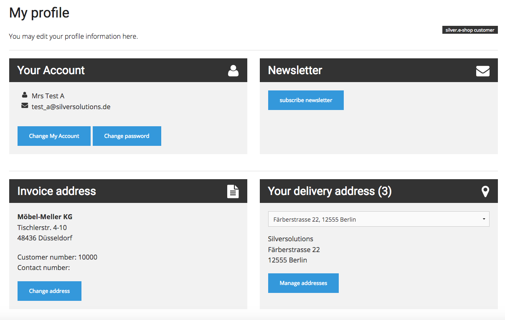

# Customer profile data

## Customer profile data model

### CustomerProfileData

`CustomerProfileData` (`Ibexa\Bundle\Commerce\Eshop\Model\CustomerProfileData\CustomerProfileData`)
is the main class for the customer profile data entity. 
It contains addresses, `SesUser`, and optional data within a `CustomerProfileDataMap`.

Addresses are stored in Party objects. 
These Party classes are generated by the message generator.

### SesUser

`Ibexa\Bundle\Commerce\Eshop\Model\CustomerProfileData\SesUser`
is located under `CustomerProfileData` and contains information about the user account such as customer number, login name, email address.

### Contact

`Ibexa\Bundle\Commerce\Eshop\Model\CustomerProfileData\Contact`
is located under `SesUser` and contains information about the contact.

## `CustomerProfileDataController`

### Methods

|Method|Route|Description|
|--- |--- |--- |
|`showDetailAction()`|`ibexa.commerce.customer.detail`|Renders the profile detail page|
|`addressBookAction()`|`ibexa.commerce.address.book.list`|Renders the address book (a list with delivery addresses that come from ERP)|
|`addressBookDeleteAction()`|`ibexa.commerce.address.book.delete`|Removes the given delivery address from ERP and customer profile data|
|`logoutAction()`|`ibexa.commerce.customer.logout`|Unsets all profile data within the session, logs out the user and redirects to the previous page|

### Profile detail page

## Customer profile data services

### `CustomerProfileDataServiceInterface`

`CustomerProfileDataServiceInterface` (`Ibexa\Bundle\Commerce\Eshop\Model\CustomerProfileData\CustomerProfileDataServiceInterface`)
is the general interface for any customer profile data service.

### AbstractCustomerProfileDataService

`AbstractCustomerProfileDataService` (`Ibexa\Bundle\Commerce\Eshop\Model\CustomerProfileData\AbstractCustomerProfileDataService`)
is the abstract service implementation for customer profile data. 
The service provides helper methods for derivative services.

### EzErpCustomerProfileDataService

`EzErpCustomerProfileDataService` (`Ibexa\Bundle\Commerce\Eshop\Model\CustomerProfileData\EzErpCustomerProfileDataService`)
is the concrete service implementation for customer profile data. 
The service uses ERP as source for customer and contact data.
It also uses the content model as source for account data and target for fallback data.

## Customer profile data events

### CustomerProfileDataEventInterface

`CustomerProfileDataEventInterface` (`Ibexa\Bundle\Commerce\Eshop\Model\CustomerProfileData\CustomerProfileDataEventInterface`)
is the general interface for any event that is thrown in customer profile data services.

### AbstractCustomerProfileDataEvent

`AbstractCustomerProfileDataEvent` (`Ibexa\Bundle\Commerce\Eshop\Model\CustomerProfileData\AbstractCustomerProfileDataEvent`)
is the abstract event for any customer profile data event and helper methods like `setCustomerProfileData()` to make a profile available for an event listener.

### EzErpCustomerProfileDataEvent

`EzErpCustomerProfileDataEvent` (`Ibexa\Bundle\Commerce\Eshop\Model\CustomerProfileData\EzErpCustomerProfileDataEvent`)
is the concrete event that also provides the User Content item, for example for fallback purposes when the ERP does not respond
(see [Customer profile data listeners](#customer-profile-data-listeners)).

The following events are dispatched by `Ibexa\Bundle\Commerce\Eshop\Model\CustomerProfileData\EzErpCustomerProfileDataService`:

|Event|Dispatched|
|--- |--- |
|`ses_ez_erp_customer_profile_data_pre_fetch`|Before any data is fetched from storage|
|`ses_ez_erp_customer_profile_data_post_fetch`|After all data is fetched from storage|
|`ses_ez_erp_customer_profile_data_pre_erp_customer_fetch`|Before ERP customer data is fetched|
|`ses_ez_erp_customer_profile_data_post_erp_customer_fetch_success`|After ERP customer data is fetched|
|`ses_ez_erp_customer_profile_data_post_erp_customer_fetch_fail`|After ERP customer data fetching failed|
|`ses_ez_erp_customer_profile_data_pre_erp_contact_fetch`|Before ERP contact data is fetched|
|`ses_ez_erp_customer_profile_data_post_erp_contact_fetch_success`|After ERP contact data fetching succeeded|
|`ses_ez_erp_customer_profile_data_post_erp_contact_fetch_fail`|After ERP contact data fetching failed|
|`ses_ez_erp_customer_profile_data_pre_get_customer`|Before customer data is returned|
|`ses_ez_erp_customer_profile_data_pre_save_customer`|Before customer data is saved|

## Customer profile data listeners

### ListenerInterface

`ListenerInterface` (`Ibexa\Bundle\Commerce\Eshop\Model\CustomerProfileData\ListenerInterface`)
defines the methods that all listeners must have (for example, the `onPreFetch()`, `onPostFetch()` events).

### EzErpListener

`EzErpListener` (`Ibexa\Bundle\Commerce\Eshop\Model\CustomerProfileData\EzErpListener`)
is the concrete event listener implementation. 
It provides ERP-related listeners, e.g. for ERP response success or fail.

- `onPostErpCustomerFetchFail()` loads customer data from the respective User Content item if it cannot be retrieved from the ERP.
Event: `ses_ez_erp_customer_profile_data_post_erp_customer_fetch_fail`
- `onPreFetch()` has no implementation
- `onPostFetch()` has no implementation
