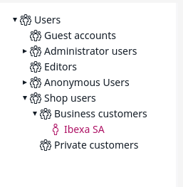

# Customers [[% include 'snippets/commerce_badge.md' %]]

Customers are stored as User Content items in the database.

[[= product_name_com =]] adds the following Fields to the User Content Type that are required for the shop:

- first name, last name
- salutation
- customer profile data
- customer number, contact number
- budget per order and per month (used by the Customer Center)

### User Groups

Each shop stores private and business customers in different User Groups.

### Customers in ERP system

The customers are directly connected to the ERP system if they have a customer number and/or a contact number. 

The ERP system usually identifies customers by their customer numbers.
The customer number is stored as a read-only Field in the User Content item. 

The shop gets the information from the ERP automatically when user information (customer profile data) is requested for the first time.

The information is stored in the session to reduce the number of calls to ERP.

The ERP system provides:

- invoice address
- buyer address
- a list of delivery addresses
- contact information if the user has a contact number
- further information depending on the ERP system

## Customer data model

[[= product_name_com =]] uses the UBL standard to model customer data. The most important type is the Party which describes an address. 

For each user, the following information is stored. If the user has a customer number, the following information is updated from the ERP after login: 

- Buyer Party
- Invoice Party
- Delivery Parties - a list of addresses in the Party format 
