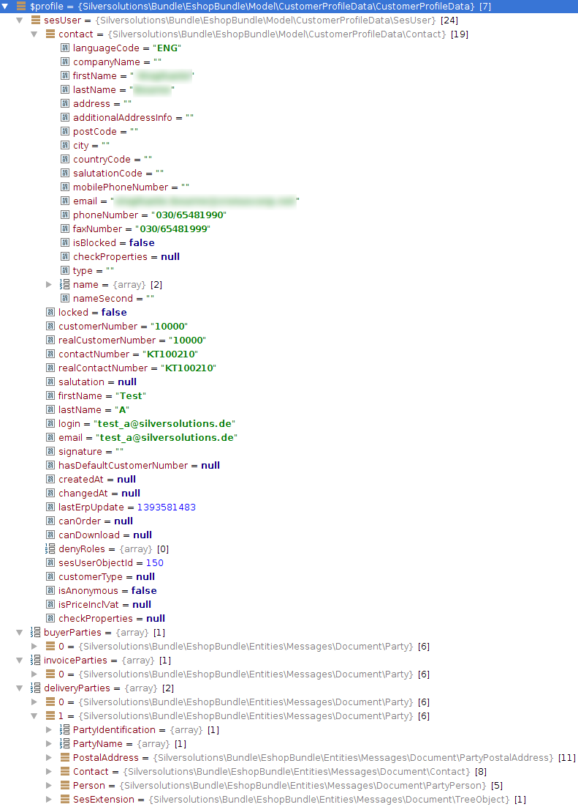

# Customer profile data model

## CustomerProfileData

`CustomerProfileData` (`Silversolutions\Bundle\EshopBundle\Model\CustomerProfileData\CustomerProfileData`)
is the main class for the customer profile data entity. It contains addresses, `SesUser`, and optional data within a `CustomerProfileDataMap`.

Addresses are stored in Party objects. These Party classes are generated by the message generator.

`CustomerProfileData` extends `ValueObject`, so any data is publicly readable.

## SesUser

`Silversolutions\Bundle\EshopBundle\Model\CustomerProfileData\SesUser`
is located under `CustomerProfileData` and contains information about the user account such as customer number, login name, email address.

It extends `ValueObject`, so any data is publicly readable.

## Contact

`Silversolutions\Bundle\EshopBundle\Model\CustomerProfileData\Contact`
is located under `SesUser` and contains information about the contact.

It extends `ValueObject`, so any data is publicly readable.

## DeprecatedCustomer

`Silversolutions\Bundle\EshopBundle\Model\CustomerProfileData\DeprecatedCustomer`
provides a mapping class which implements the deprecated `CustomerInterface`.
It is used for components that depend on the old model within the system and are built by the `DeprecatedCustomerMappingService`.

## Example

The following image shows an example of a filled `CustomerProfileData` entity.

