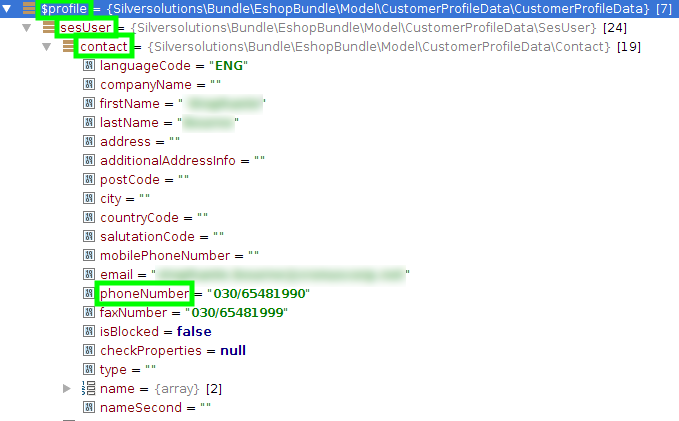

# Customer profile data services

## CustomerProfileDataServiceInterface

`CustomerProfileDataServiceInterface` (`Silversolutions\Bundle\EshopBundle\Services\CustomerProfileData\CustomerProfileDataServiceInterface`)
is the general interface for any customer profile data service.

## AbstractCustomerProfileDataService

`AbstractCustomerProfileDataService` (`Silversolutions\Bundle\EshopBundle\Services\CustomerProfileData\AbstractCustomerProfileDataService`)
is the abstract service implementation for customer profile data which provides helper methods for derivative services.

## EzErpCustomerProfileDataService

`EzErpCustomerProfileDataService` (`Silversolutions\Bundle\EshopBundle\Services\CustomerProfileData\EzErpCustomerProfileDataService`)
is the concrete service implementation for customer profile data using ERP as source for customer and contact data.
It also uses the content model as source for account data and target for fallback data.

## DeprecatedCustomerMappingService

`DeprecatedCustomerMappingService` (`Silversolutions\Bundle\EshopBundle\Services\CustomerProfileData\DeprecatedCustomerMappingService`)
is the concrete customer profile data service which implements the deprecated `AbstracCustomerService` to use with eZ Commerce components,
which depend on the deprecated model.

## Using customer profile data services in source code

!!! caution

    Do not use the customer services in any place that cannot access the session.
    An example would be a CLI tool, or processes that happen in background,
    like sending out the order if a customer paid via a payment service provider.

To use a customer profile data service, e.g. the `EzErpCustomerProfileDataService`,
you can inject the service into your method using Symfony DIC.

``` php
/** @var \Silversolutions\Bundle\EshopBundle\Services\CustomerProfileData\CustomerProfileDataServiceInterface $customerProfileDataService */
$customerProfileDataService = $container->get('ses.customer_profile_data.ez_erp');
 
/** @var \Silversolutions\Bundle\EshopBundle\Model\CustomerProfileData\CustomerProfileData $profile */
$profile = $customerProfileDataService->getCustomerProfileData();
 
$phoneNumberContact = $profile->sesUser->contact->phoneNumber;
```


