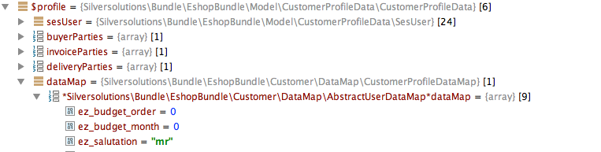

# Customers FAQ

## Building user menu

You can configure the list of the bundles that will build the user menu:

``` yaml
parameters:
    siso_core.default.user_menu_bundles: ['SilversolutionsEshopBundle', 'SisoCustomerCenterBundle', 'SisoOrderHistoryBundle']
```

You can add your own bundle to this configuration and extend the user menu as long as:

- your bundle name follows the conventions: `<one-word company name><bundle name>Bundle` in camelCase spelling, for example: `CompanyCustomProjectBundle`
- you create the following template: `views/<bundle name>/Components/user_menu.html.twig`, for example: `views/CustomProject/Components/user_menu.html.twig`
- you extend the user menu by custom code, for example:

``` html+twig
<li class="first_item menu_header">
    {{ 'My own functions'|st_translate }}
</li>
<li>
    <a href="{{ path('my_custom_controller') }}">
        <i class="fa fa-tasks fa-fw"></i> {{ 'Your custom function'|st_translate }}
    </a>
</li>
```

## Where is User data stored?

By default, the additional data of your User Content item is stored (with prefix `ez_`) in the `dataMap` of [`CustomerProfileData`](customers_api/customer_profile_data_components/customer_profile_data_services.md).

The following Field Types are supported:

- `eZ\Publish\Core\FieldType\TextLine\Value`
- `eZ\Publish\Core\FieldType\TextBlock\Value`
- `eZ\Publish\Core\FieldType\Float\Value`
- `eZ\Publish\Core\FieldType\Integer\Value`
- `eZ\Publish\Core\FieldType\Checkbox\Value`
- `eZ\Publish\Core\FieldType\Date\Value`
- `eZ\Publish\Core\FieldType\DateAndTime\Value`
- `Ibexa\Platform\Commerce\FieldTypes\FieldType\SesExternalData\Value`
- `EzSystems\EzPlatformMatrixFieldtype\FieldType\Value`

#### Default User class definition



In PHP:

`$customerProfileData->getDataMap()->getAttribute('ez_salutation')`
