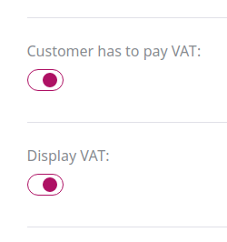
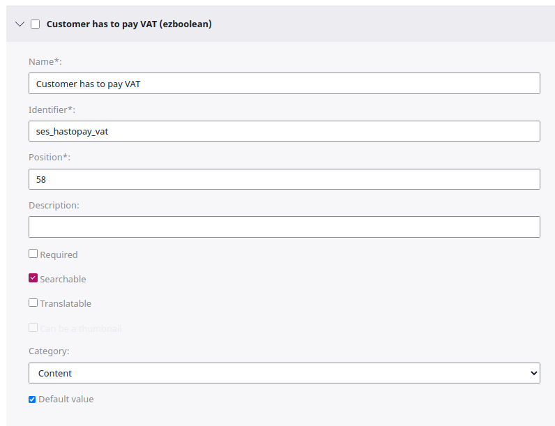

# VAT handling

The VAT handling for customers inside eZ Commerce is controlled by:

- The ERP system
- The settings from the User Content item 
- Default settings configured in a YAML file

The ERP system has the highest priority. It means that if ERP can provide the information about the VAT handling, this setting is used. 

If the attributes are set up in the User Content item, these settings are used if the ERP is not used or does not provide this information.

As the last fallback, the settings defined per SiteAccess are used. 

||Use case|What happens in the shop|
|--- |--- |--- |
|Customer has to pay VAT|`false` if for legal reasons the customer does not have to pay VAT (this is usually the case for some B2B cases).|If `false`, the shop will not calculate VAT|
|Display Price inc VAT|`false` only if the customer does not have to pay VAT|If `false`, the price in the shop will be without VAT|

## VAT settings from the ERP

The ERP can provide VAT settings per customer when a `selectcustomer` request is sent after a login.

There are two attributes which can be set by the ERP system:

- SesExtension->`HasToPayVat` 
- SesExtension->`DisplayPriceInclVat`

The default mapping is defined in `silver.e-shop/src/Silversolutions/Bundle/EshopBundle/Resources/mapping/wc3-nav/xsl/response.select_customer.xsl`:

``` xml
<CustomerResponse>
  <SesExtension>
    <!-- Has to be adjusted depending on ERP -->
    <xsl:choose>
        <xsl:when test="VAT_Bus_Posting_Group = 'NATIONAL'">
            <HasToPayVat>1</HasToPayVat>
        </xsl:when>
        <xsl:otherwise>
            <HasToPayVat>0</HasToPayVat>
            <DisplayPriceInclVat>0</DisplayPriceInclVat>
        </xsl:otherwise>
    </xsl:choose>
  </SesExtension>
```

## VAT settings from the user object 

The VAT handling can be defined per User. 



Remember to use the correct identifiers and select the **Default value** checkbox.



## VAT settings from the configuration

``` yaml
ses.customer_profile_data.isPriceInclVat: true
ses.customer_profile_data.setHasToPayVat: true
```
