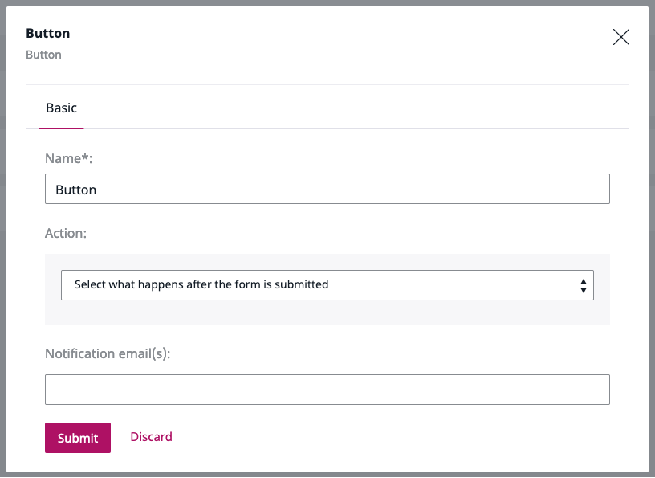

# Customizing Form Builder email notifications

!!! enterprise

    ## Override email template  

    Email is one of the Submit button options you can add to a form using the Form Builder.
    It allows you to list email addresses to which notifications about newly filled forms should be sent.

    

    To customize the Form Builder submission notification, you need to override the `form_builder/form_submit_notification_email.html.twig` template.
    It contains two blocks: subject and body.
    Each of them is rendered independently and consists of three sets of parameters.

    |Parameter|Type|Description|
    |---------|----|-----------|
    |`content`|`eZ\Publish\API\Repository\Values\Content\Content`|Name of the form, its Content Type|
    |`form`|`EzSystems\EzPlatformFormBuilder\FieldType\Model\Form`|Definition of the form|
    |`data`|`EzSystems\EzPlatformFormBuilder\FieldType\Model\FormSubmission`|Sent data|  

    By adjusting them to your needs, you will change your email template.

    ## Configure sender details

    To send emails, you also need to configure `sender_address` in `config/packages/swiftmailer.yaml`.
    It acts as a sender and return address for all bounced messages.
    For details, see [Symfony Mailer Configuration Reference.](https://symfony.com/doc/4.3/reference/configuration/swiftmailer.html#sender-address)
