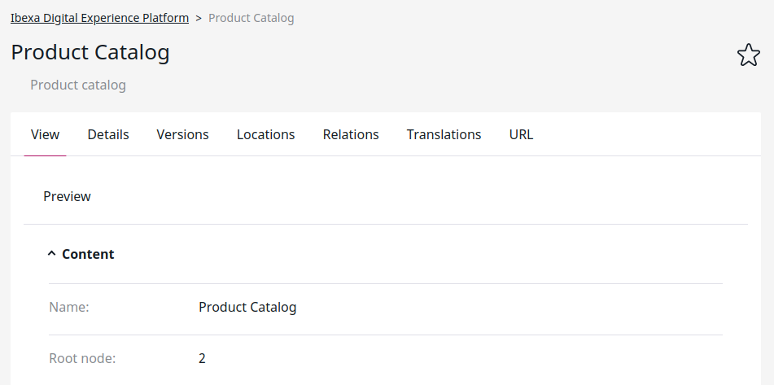
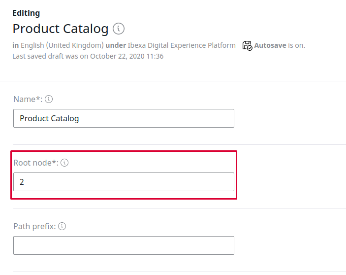

# Data providers [[% include 'snippets/commerce_badge.md' %]]

Data providers define where product information is stored.

You can use one of two data providers: the content model data provider and the eContent data provider.

## Switching the data provider

You can switch the data provider either with the command line or manually.
Only one data provider can be activated per installation.

### Command line switching

The `silversolutions:switchdataprovider` command switches between the content model data provider and eContent.
It is useful especially for testing purposes.

The command takes the following options:

|Option|Notes|
|--- |--- |
|`--new-root-node`|Default value is `56` for content model data provider, `2` for eContent|
|`--location-id`|Default value is `56`. This is the Location ID of the "Product catalog" Content item in [[= product_name =]]. If you are using another Location ID, change this parameter|

``` bash
# switch to eContent 
php bin/console silversolutions:switchdataprovider econtent --location-id=56 --new-root-node=2
php bin/console silversolutions:indexecontent --no-debug
php bin/console silversolutions:indexecontent swap --no-debug
 
# switch to content model
php bin/console silversolutions:switchdataprovider ez
```

Remember to clear the cache after you execute the command:

``` bash
php bin/console cache:clear --env=prod
```

### Data provider switch process

Switching the data provider introduces some changes to your project:

#### Changes to `config/packages/ecommerce.yml`

``` 
# eContent data provider
resource: '../../vendor/silversolutions/silver.e-shop/src/Silversolutions/Bundle/EshopBundle/Resources/config/config_data_provider_econtent.yml' or 
 
# content model data provider
resource: '../../vendor/silversolutions/silver.e-shop/src/Silversolutions/Bundle/EshopBundle/Resources/config/config_data_provider_ez.yml'
```

#### Changes to the "Product catalog" Content item

The Product catalog's root node is set accordingly.



- For eContent, the root node is set to `2` by default, for content model it is `56` (in case the demo data is used).
- The Location ID for the Product catalog can be set to a different value by using the `--location-id parameter`.

### Manual switching

#### 1. Load root element

First, ensure that you are loading the correct root element for your provider.



#### 2. Change configuration

The following settings are already set up in the configuration files `econtent_search.yml` or `ez_search.yml`:

``` yaml
silver_eshop.default.catalog_data_provider: ez5
# or for eContent
silver_eshop.default.catalog_data_provider: econtent 
```

#### 3. Configure search services

Change the alias for search services for every type (product, catalog, content).

``` xml
# set up alias for product search 
# for eZ dataprovider 
 <service id="siso_search.search_service.product" alias="siso_search.ezsolr_search_service">
 </service>
 
# for econtent
 <service id="siso_search.search_service.product" alias="siso_search.econtentsolr_search_service">
 </service>

# set up alias for catalog search 
<service id="siso_search.search_service.catalog" alias="siso_search.econtentsolr_search_service">
</service>

# set up alias for content search 
<service id="siso_search.search_service.content" alias="siso_search.ezsolr_search_service">
</service>
```

#### 4. Set up search groups

Set up search groups and configuration accordingly.

Check the complete configuration from the vendor as well:

- `vendor/silversolutions/silver.e-shop/src/Siso/Bundle/SearchBundle/Resources/config/econtent_search.yml`
- `vendor/silversolutions/silver.e-shop/src/Siso/Bundle/SearchBundle/Resources/config/ez_search.yml`

The path for products in econtent e.g. is `/2/` and for eZ `/1/2`

``` yaml
siso_search.default.groups.search:
        product:
            types:
                - ses_product
            path: '/1/2/'
            section: 1
            visibility: true
        content:
            types:
                - st_module
                - folder
                - article
                - landing_page
                - blog_post
                - event
            path: '/1/2/'
            section: 1
            visibility: true
        files:
            types:
                - file
                - video
            path: '/1/43/'
            section: 3
            visibility: true
```
