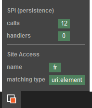

# Devops

## Introduction

### Cache Clearing

This page describes commands involved in clearing cache from the command line.

#### Clearing file cache using the Symfony cache:clear command

Out of the box Symfony provides a command to perform cache clearing. It will delete all file-based caches, which mainly consist of Twig template, Symfony container, and Symfony route cache, but also everything else stored in cache folder. Out of the box on a single-server setup this includes "Content cache". For further information on use, see the help text of the command:

``` bash
php app/console --env=prod cache:clear -h
```

!!! note

    If you do not specify an environment, by default `cache:clear` will clear the cache for the `dev` environment. If you want to clear it for `prod` you need to to use the --env=prod option.

!!! note "On each web server"

    In [Clustering](clustering.md) setup *(several web servers),* the command to clear file cache needs to be executed on each and every web server!

#### Clearing "Content Cache" on a Cluster setup

For [Cluster](clustering.md) setup, the content cache ([HTTP Cache](http_cache.md) and [Persistent Cache](repository.md#persistence-cache)) must be set up to be shared among the servers. And while all relevant cache is cleared for you on repository changes when using the APIs, there might be times where you'll need to clear cache manually: 

- Varnish: [Cache purge](http_cache.md#cache-purge)
- Persistence Cache: [Using Cache service](repository.md#using-cache-service)

### Web Debug Toolbar

When running eZ Platform in the `dev` environment you have access to the standard Symfony Web Debug Toolbar. It is extended with some eZ Platform-specific information:



##### SPI (persistence)

This section provides the number of non-cached [SPI](repository.md#spi) calls and handlers. You can see details of these calls in the [Symfony Profiler](http://symfony.com/doc/current/profiler.html) page.

##### SiteAccess

Here you can see the name of the current SiteAccess and how it was matched. For reference see the [list of possible siteaccess matchers](siteaccess.md#available-matchers).

## Configuration

### Logging and Debug Configuration

#### Introduction

Logging in eZ Platform consists of two parts, several debug systems that integrates with symfony developer toolbar to give you detailed information about what is going on. And standard [PSR-3](https://github.com/php-fig/fig-standards/blob/master/accepted/PSR-3-logger-interface.md) logger, as provided by Symfony using [Monolog](https://github.com/Seldaek/monolog).

#### Debugging in dev environment

When using the Symfony dev [environment](environments.md), the system out of the box tracks additional metrics for you to be able to debug issues, this includes [Stash](http://stash.tedivm.com/) cache use *(done by [StashBundle](https://github.com/tedivm/TedivmStashBundle))*, and a [persistence cache](repository.md#persistence-cache-configuration) use.

##### Reducing memory use

!!! tip

    For long running scripts, instead head over to [Executing long-running console commands](../cookbook/executing_long_running_console_commands.md) for some much more relevant info.

If you are running out of memory and don't need to keep track of cache hits and misses. Then StashBundle tracking, represented by the `stash.tracking` setting, and persistence cache logging, represented by the setting `parameters.ezpublish.spi.persistence.cache.persistenceLogger.enableCallLogging`, can optionally be disabled.

``` yaml
# config_dev.yml
stash:
    tracking: false                  # Default is true in dev
    tracking_values: false           # Default is false in dev, to only track cache keys not values
    caches:
        default:
            inMemory: false          # Default is true, but this uses a lot of php memory
            registerDoctrineAdapter: false

parameters:
    ezpublish.spi.persistence.cache.persistenceLogger.enableCallLogging: false
```

#### Error logging and rotation

eZ Platform uses the Monolog component to log errors, and it has a `RotatingFileHandler` that allows for file rotation.

According to their documentation, it "logs records to a file and creates one logfile per day. It will also delete files older than `$maxFiles`".

But then, their own recommendation is to use "`logrotate`" instead of doing the rotation in the handler as you would have better performance.

More details here:

- <https://github.com/Seldaek/monolog>
- <http://linuxcommand.org/man_pages/logrotate8.html>

If you decided to use Monolog's handler, it can be configured in `app/config/config.yml`

``` yaml
monolog:
    handlers:
        main:
            type: rotating_file
            max_files: 10
            path: "%kernel.logs_dir%/%kernel.environment%.log"
            level: debug
```
