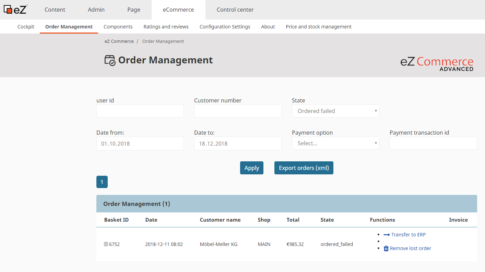
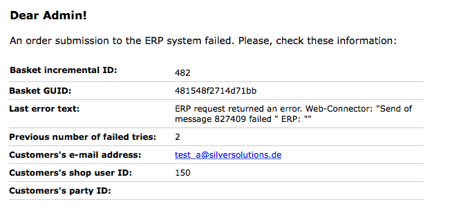

# Lost orders [[% include 'snippets/experience_badge.md' %]]

## Sending lost orders from Backend

If sending of an order to ERP fails, the order is stored in a database with a special state `ordered_failed`.
You can find lost order in the Back office tab **eCommerce/Order Management**.
Filter by **Order failed**.



There are several actions, that can be executed with lost orders:

|Action|Description|Result|
|--- |--- |--- |
|transfer to ERP|the lost order is resent to ERP|The user sees an error or success message depending whether the lost order could be resent to ERP or not. If the sending the lost order failed, the administrator gets an email. If sending of lost order was successful, the customer who made this order gets a confirmation email|
|remove lost order|The lost order is not removed, the state of lost order is changed to `confirmed`|The lost order does not appear in the list anymore|

## Technical implementation

### LostOrderService

`Siso\Bundle\CheckoutBundle\Service\LostOrderService` (service ID `siso_checkout.lost_order_service`) is responsible for handling all lost order features.

#### Service methods:

|Method|Description|Parameters|Peturns|
|--- |--- |--- |--- |
|`createFailedOrderList()``|creates a list of lost orders||Basket[]|

### LostOrderController

The `LostOrderController` controller handles all lost order actions

|Action|Parameters|Description|Policy|
|--- |--- |--- |--- |
|`processLostOrderAction()`|`$basketId`|Send the lost order to ERP|siso_policy/lostorder_process|
|`deleteLostOrderAction()`|`$basketId`|Set the state of lost order to `confirmed`|siso_policy/lostorder_process|

### Email notifications

Every time an order cannot be placed, the shop administrator gets an email.
The email can be defined in the configuration:

``` yaml
parameters:
    siso_core.default.ses_swiftmailer:
        lostOrderEmailReceiver: %ses_eshop.lostorder_email%
```



Templates are located in:

``` 
vendor/silversolutions/silver.e-shop/src/Silversolutions/Bundle/EshopBundle/Resources/views/Emails/NotificationMail_FailedOrder.html.twig
vendor/silversolutions/silver.e-shop/src/Silversolutions/Bundle/EshopBundle/Resources/views/Emails/NotificationMail_FailedOrder.txt.twig
```

## Lost order command

You can also resend lost orders using a command-line tool:

``` bash
php bin/console silversolutions:lostorder:process [id]
```

!!! note 

    The command sends the lost order in the same way as through the PHP code.
    If the sending of lost order fails, the administrator gets an email.
    If the sending was successful, the customer who made the order gets confirmation email.

    In the context of the command-line tool there is no request.
    Because of this no images embedded in email will be sent because it is not possible to generate the image path.

!!! caution

    To use the CLI the host must be set, otherwise the URLs and assets are not correct.

    ``` 
    parameters:
        siso_core.default.host: localhost
    ```
