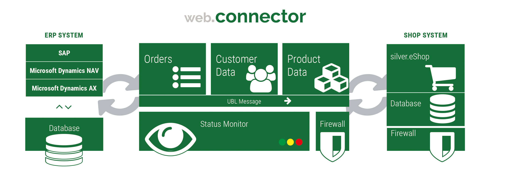

# Connecting shop to ERP [[% include 'snippets/experience_badge.md' %]]

[[= product_name_exp =]] can use both webservices/SOAP and REST transfer protocols to connect to ERP.

You can extend the transport layer if you need an additional protocol or way to access the ERP/CRM.

One way to connect to an SAP or Microsoft Dynamics NAV system is to use the Web.Connector (separately licensed product)
which already comes with prepared interfaces for those ERP systems.

There are other options besides using the Web.Connector:

- If the ERP offers a webservice/REST interface, you can connect [[= product_name_exp =]] directly with the ERP.
- You can use an enterprise service bus (ESB).



## Request process

### Step 1: Shop sends data request

The shop requests data using a request object.

For example:

The shop sends a request using the generated ERP classes for the selected customer.

Customer is set in `BuyerCustomerParty/Party/PartyIdentification/ID`

Mapping is done using specification in `@EshopBundle/Resources/specifications/xml/request.selectCustomer.xml`:

``` xml
<?xml version="1.0" encoding="UTF-8"?>
<BuyerCustomerParty>
    <Party ses_unbounded="PartyIdentification">
        <PartyIdentification>
            <ID>10000</ID>
        </PartyIdentification>
    </Party>
</BuyerCustomerParty>
```

### Step 2: Request is mapped

The shop maps the UBL request to a specific request for the ERP (optional step).

For example:

The request is mapped to `<PARTY><PARTY_ID>0100000</PARTY_ID></PARTY>`.

Mapping is done using specification in `app/Resources/xsl/request.selectcustomer.xsl`:

``` xml
<?xml version="1.0" encoding="UTF-8"?>
<xsl:stylesheet version="1.0" xmlns:xsl="http://www.w3.org/1999/XSL/Transform">
    <xsl:template match="/BuyerCustomerParty">
             <PARTY>
                 <PARTY_ID>
                     <xsl:value-of select="Party/PartyIdentification/ID" />
                 </PARTY_ID>
             </PARTY>
    </xsl:template>
</xsl:stylesheet>
```

### Step 3: Web.Connector receives request

The Web.Connector receives the request and maps the request into an ERP request.

For example:

The Web.Connector converts the request in the language of the ERP to: `<Params><Read><No>0100000</No></Read></Params>`.

Mapping is done using specification in `mapping/nav_ws/xsl/request.selectcustomer.xsl`:

``` xml
<xsl:stylesheet version="1.0"
    xmlns:xsl="http://www.w3.org/1999/XSL/Transform">
    <xsl:param name="WEBSITE" />
    <xsl:template match="/">
        <Params>
            <Read>
                <No><xsl:value-of select="PARTY/PARTY_ID" /></No>
            </Read>
        </Params>
    </xsl:template>
</xsl:stylesheet>
```

### Step 4: Web.Connectors sends request to ERP

The Web.Connector sends the request to the ERP.

### Step 5: ERP processes the request

The ERP processes the requests and sends an answer.

For example:

Data from ERP:

``` xml
<RawResponse>
 <Key>28;EgA...</Key>
  <No>0100000</No>
  <Blocked>_blank_</Blocked>
  <Name>Demo customer</Name>
  <Name_2>- Office  -</Name_2>
  <Address>Demo street</Address>
  <Post_Code>12555</Post_Code>
  <City>Berlin</City>
  <Country_Region_Code>DE</Country_Region_Code>
  <Fax_No>0301212</Fax_No>
  <Phone_No>03012121</Phone_No>
  <E_Mail>info@test.de</E_Mail>
  <Contact>- -</Contact>
  <Customer_Posting_Group>SAMMEL</Customer_Posting_Group>
  <Gen_Bus_Posting_Group>NATIONAL</Gen_Bus_Posting_Group>
  <VAT_Bus_Posting_Group>NATIONAL</VAT_Bus_Posting_Group>
    
  <Kontakt_EMail>info@test.de</Kontakt_EMail>
  <Kontakt_Ansprechpartner>- -</Kontakt_Ansprechpartner>
  <PaymentMethodCode>EINZUG</PaymentMethodCode>
  <Ship_to_Address>
    <Cust_Ship_to_Address_WS>
      <Key>44;3gAAAAJ7BzAAMQAwADAAMAAwADAAAAACe/9MADAAMQ==9;1326112700;</Key>
      <Customer_No>0100000</Customer_No>
      <Code>L01</Code>
      <Name>Demo customer</Name>
      <Name_2>Max Mueller</Name_2>
      <Address>Molkereistr. 1a</Address>
      <City>Berlin</City>
      <Post_Code>12555</Post_Code>
      <Blocked/>
    </Cust_Ship_to_Address_WS>
     
  </Ship_to_Address>
</RawResponse>
```

### Step 6: Answer is sent from ERP

The Web.Connector gets an answer from ERP and maps it to an answer for the shop.

For example:

The Web.Connector maps data for shop using a 1:1 conversion.

Mapping is done using specification in `mapping/nav_ws/xsl/response.selectcustomer.xsl`.

In this case the answer is not be mapped and mapping is done in the shop:

``` xml
<xsl:stylesheet version="1.0"
    xmlns:xsl="http://www.w3.org/1999/XSL/Transform">
    <xsl:param name="WEBSITE" />
    <xsl:template match="/SoapResponse/ReadResult">
        <RawResponse>
            <xsl:copy-of select="*" />
        </RawResponse>
    </xsl:template>
</xsl:stylesheet>
```

### Step 7: Shop receives the request

The shop receives the request and maps it to UBL (optional step).

For example:

The shop converts the answer into UBL using a mapping and converts the response to a UBL object as defined in the specification
(`@EshopBundle/Resources/specifications/xml/response.selectCustomer.xml`).

### Step 8: UBL response ready

The application gets a proper UBL response object.

!!! note "Specification for requests and responses"

    The shop uses a specification which describes how the request to the ERP (our Web.Connector) and the answer from the ERP will look like. 

    The specification is written in XML and located in `resources/specifications/xml`. It includes always two files: a request and a response specification. 

    It is used to [generate PHP objects](erp_communication/erp_components/erp_component_messages/erp_message_class_generator.md) which can be used to define a request or get the response back from the ERP.

## Web.Connector setup

Yo work with Web.Connectors, you need to set up the URL to the Web.Connector:

`webconnector_url: https://<ip: port>/webconnector/webconnector_opentrans.php5`

and the configuration for each message:

``` yaml
silver_erp.config.messages:
    # ...
        select_customer:
            message_class: "Silversolutions\\Bundle\\EshopBundle\\Message\\SelectCustomerMessage"
            response_document_class: "\\Silversolutions\\Bundle\\EshopBundle\\Entities\\Messages\\Document\\CustomerResponse"
            webservice_operation: "SV_OPENTRANS_SELECT_CUSTOMERINFO"
            mapping_identifier: "selectcustomer"
```

If `mapping_identifier` is defined, [[= product_name_exp =]] uses a mapping (XSLT based).

The Web.Connector performs mapping for each message according to the following configuration:

``` php
$cfg->setSetting('WebserviceHandler_Config', 'MethodSettings', array(
    // ...
    'SV_OPENTRANS_SELECT_CUSTOMERINFO' => array(
        'remote_reference'      => 'customer',
        'method'                => 'Read',
        'mapping'               => 'selectCustomer',
        'mapping_parameters'    => array(
            'WEBSITE' => 'HOME',
        ),
    ),
```

## Retrieving data using PHP API

To get customer information via the Web.Connector:

``` php
$erpService = $this->getContainer()->get('silver_erp.facade');

$customerNo = "1000";
$selectCustomerResponse = $erpService->selectCustomer($customerNo);
```

The answer is an object as defined in `@EshopBundle/Resources/specifications/xml/response.selectCustomer.xml`.

To retrieve products from ERP in a controller:

``` php
/** @var WebConnectorErpService $importer */
$importer = $this->get('silver_erp.facade');
//Starting SKU
$startSku = '1..';
//Number of items to be retrieved (optional, default is 10)
$itemMaxCount = 30;
$items = $importer->selectItem($startSku, $itemMaxCount);
foreach($items as $products)
{
    foreach($products as $product)
    {
        //Prints the product's name
        echo (string)$product->ProductMeta->name->TextField->text->translations->translation[0]->value;
        //Prints the product's price
        echo (string)$product->ProductMeta->price->PriceField->price->price->value;
    }
}
```
