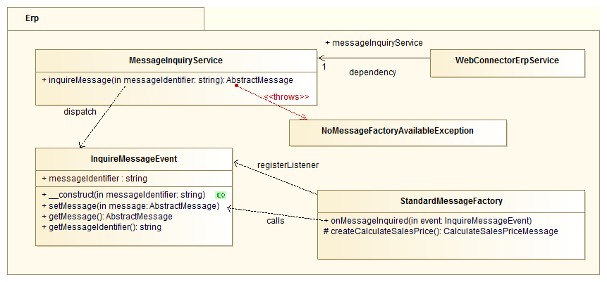

# ERP message component [[% include 'snippets/experience_badge.md' %]]

Communication uses specific messages classes that derive from `AbstractMessage`.
The abstract base class defines following properties:

``` php
/**
 * Object for requests, generated from UBL definitions
 *
 * @var object
 */
private $requestDocument;

/**
 * Object for responses, generated from UBL definitions
 *
 * @var object
 */
private $responseDocument;

/**
 * @var int
 */
private $responseStatus = self::RESPONSE_STATUS_NOT_SENT;

/**
 * @var string
 */
private $responseError = '';
```

These properties are publicly accessible by the respective getter and setter methods.
Since the properties could be changed anywhere, it is necessary to validate the value of the getter methods before further accessing (e.g. access to supposed members of a response object).

Derived and non-abstract message classes can provide methods for data feeding into the requests and response members
or retrieving specific data from them (e.g. address records in customer data messages).
But the classes may also just be empty stubs and leave data handling to other parts of the application.

The response status is set by the transport service according to the result of the ERP communication.
Following statuses are defined:

``` php
/**
 * The message was not sent, yet. This status is the initial value after
 * instantiation.
 */
const RESPONSE_STATUS_NOT_SENT = -1;

/**
 * The message was successfully sent and a valid response was received.
 */
const RESPONSE_STATUS_OK = 0;

/**
 * The message was processed by the remote service, but the ERP responded
 * with an error.
 */
const RESPONSE_STATUS_ERP_ERROR = 11;

/**
 * The message was processed by the remote service, but the ERP was busy
 * and the request timed out.
 */
const RESPONSE_STATUS_ERP_TIMEOUT = 12;

/**
 * The message was processed by the remote service, but the service itself
 * caused an error or the ERP was not reachable.
 */
const RESPONSE_STATUS_SERVICE_ERROR = 21;

/**
 * The message could not be sent to the remote service.
 */
const RESPONSE_STATUS_CONNECTION_ERROR = 22; 
```

The implementation of the [transport service](../erp_component_transport.md) is responsible for the evaluation of the result of the communication and must set the response status accordingly.  

## Documents

Message documents, as been seen in above, should be plain PHP objects.
These classes are intended to store the actual structured data which is mentioned above.
Currently all document classes are created mechanically by XSD2PHP.
This tool creates PHP classes out of XML Schema Definitions,
which may provide the opportunity to validate created data against that definitions.
The created classes only define public member attributes, so you can access data with:
`$object->memberVar->subMember->value = 'value';`

## Instantiation of message classes

See [ERP message instantiation](erp_message_instantiation.md) for more details.

## Creating a new listener

Create a new class and add a method, that accepts an `InquireMessageEvent` event:

``` php
class ExampleMessageFactoryListener {

    const EXAMPLEREQUEST = 'ExampleRequestMessage';

    public function onMessageInquired(InquireMessageEvent $event)
    {
        $messageIdentifier  = $event->getMessageIdentifier();
        $messageObject      = null;

        if ($messageIdentifier === self::EXAMPLEREQUEST) {
            $messageObject = new ExampleMessage();
        }

        if ($messageObject != null) {
            $event->setMessage($messageObject);
                $event->stopPropagation();
        }
    }
}
```

Register the new listener to the inquire message event:

``` yaml
services:
    example.message_inquiry_listener:
        class: "\Example\MessageInquiryListener"
        tags:
            - {name: kernel.event_listener, event: silver_erp.inquire_message, method: onMessageInquired}
```

Event listeners are defined as tagged services. The `name` and the `event` parameter of the tag must be `kernel.event_listener` and `silver_erp.inquire_message` respectively.
The `method` parameter must be the name of the method of the specified class which should be called if the event is dispatched.
This method must define a parameter of type `InquireMessageEvent` in order to retrieve the event object.

## Class model


