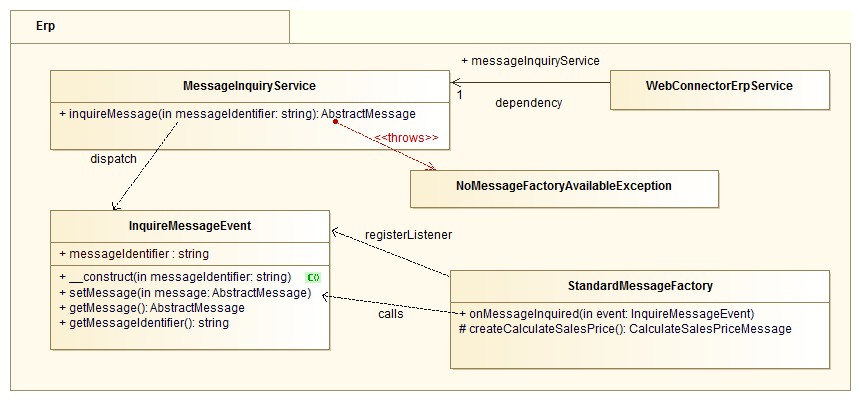

# ERP Message Instantiation [[% include 'snippets/experience_badge.md' %]]

Message creation uses the mechanics of the [Symfony event dispatcher system.](https://symfony.com/doc/3.4/components/event_dispatcher.html)

When a new message is required, a specific service delivers a message object of specific type (e.g. `calculate_sales_order`).
[[= product_name_exp =]] then dispatches an `InquireMessageEvent` event within that service,
containing the requested message type and a reference to an `AbstractMessage` object.
Specific listeners which can create messages can register/subscribe to that event and check if they can create that type of message.
In Symfony you can register new listeners for events as services via configuration.
This enables a flexible way to add new custom messages and their factories per module
and the possibility to overwrite the creation of certain messages (by overriding the service definition).

Example message creation workflow:

1. A catalog data provider needs to create a new message. It calls `MessageInquiryService::inquireMessage('MessageIdentifer')`. The service should be injected as a dependency and not instantiated directly.
1. The new event object is instantiated with the respective message identifier attribute (`MessageIdentifier`) and a null reference to its `AbstractMessage` attribute.
1. The event is dispatched by `EventDispatcher`.
1. All registered listeners are called with the event object.
1. Every listener checks whether it is responsible for the respective message type, and:
    - If it is responsible, it creates the message, appends the message object to the event object and stops further event propagation via `$eventstopPropagation()`
    - If it is not responsible, it does nothing
1. After the event processing is done, `MessageInquiryService` checks if the message was created, and:
    - If created, it returns the message object
    - If not created, it throws `NoMessageFactoryAvailableException`.

To get a message instance in a Symfony controller class, use the following code:

``` php
$messageInquiry = $this->get('silver_erp.message_inquiry_service');
try {
    $exampleRequestMessage = $messageInquiry->inquireMessage(
        ExampleMessageFactoryListener::EXAMPLEREQUEST
    );
} catch (NoMessageFactoryAvailableException $e) {
    // Do exception handling
}
```

## Model


