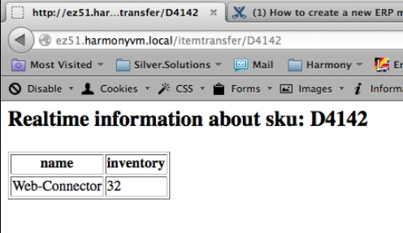

# Creatinge new ERP message [[% include 'snippets/experience_badge.md' %]]

If you want to create a new message, first think about whether you want to create a [standard message](create_standard_message.md) or a [specific message in a project](create_project_specific_message.md).

Standard messages have to meet stricter conventions like the UBL message standard.
Project-specific messages can be added in a more simple way with less effort.

## Use case: ERP message ItemTransfer

This example shows how to set up and use a new ERP message.
The example uses a message which requests product data from the ERP system that is often required in online shops.

The example is using the Web.Connector to fetch data about a given SKU in real time.
The name of the product and the inventory is displayed on a webpage.



You can find more existing ERP messages in [ERP messages component](../../../erp_communication/erp_components/erp_component_messages/erp_component_messages.md).

## Fetch products from ERP

The Web.Connector provides the web service operation `SV_ITEM_TRANSFER`.
This method fetches data for a given SKU and returns some data about this product.
The SKU value may also be a filter such as `1..` (this is a NAV notation that lists all products where the SKU starts with `1`).

The ERP expects the following XML as a request:

``` xml
<ITEMTRANSFER>
  <ITEM_NO>1..</ITEM_NO>
  <ITEM_MAXCOUNT>10</ITEM_MAXCOUNT>
</ITEMTRANSFER>
```

The ERP responds with the following XML. The `ITEM` tag can be repeated for each product returned by the ERP.

``` xml
<?xml version="1.0" encoding="UTF-8"?>
<ItemTransfer>
        <ITEM>
            <ITEM_NO>D4142</ITEM_NO>
            <DESCRIPTION>Web.Connector</DESCRIPTION>
            <DESCRIPTION_2/>
            <VENDOR_NO/><VENDOR_ITEM_NO/>
            <BLOCKED>0</BLOCKED>
            <INVENTORY>32</INVENTORY>
            <BASE_UNIT_OF_MEASURE_CODE>STÜCK</BASE_UNIT_OF_MEASURE_CODE>
            <UNIT_LIST_PRICE>349</UNIT_LIST_PRICE>
            <SEARCH_DESCRIPTION/>
            <ITEM_CATEGORY/>
            <PRODUCT_GROUP/>
        </ITEM>
 </ItemTransfer>
```

You need to send the request as expected by the ERP, but map the response if required.

### Create the request and response XML

[UBL 2.0](http://www.datypic.com/sc/ubl20/ss.html) is used as base for the XML structure and customized when necessary.

You create the request and response XML to generate message objects from as expected by the shop.

Make sure that the toot tags are not using the same name.
It is a good practice to name the tag of the response adding a suffix such as `Response`.

These two xml files have to be stored in the subdirectory `Resources/specifications/xml/` of your project:

- `request.itemtransfer.xml` contains the specification for the request.
- `response.itemtransfer.xml` contains the specification for the response.

`src/Demo/TestBundle/Resources/xml/request.itemtransfer.xml`:

``` xml
<?xml version="1.0" encoding="UTF-8"?>
<ItemTransfer>
  <ITEM_NO>1..</ITEM_NO>
  <ITEM_MAXCOUNT>10</ITEM_MAXCOUNT>
</ItemTransfer>
```

This is the expected response of the ERP answer. Since the tag `ITEM` is provided for each product,
the attribute `ses_unbounded="ITEM"` informs the shop that it should handle this element as an array. 

`src/Demo/TestBundle/Resources/xml/response.itemtransfer.xml`:

``` xml
<?xml version="1.0" encoding="UTF-8"?>
<ItemTransferResponse ses_unbounded="ITEM">
        <ITEM>
            <ITEM_NO>D4142</ITEM_NO>
            <DESCRIPTION>VPA-150</DESCRIPTION>
            <DESCRIPTION_2/>
            <VENDOR_NO/><VENDOR_ITEM_NO/>
            <BLOCKED>0</BLOCKED>
            <INVENTORY>20</INVENTORY>
            <BASE_UNIT_OF_MEASURE_CODE>STÜCK</BASE_UNIT_OF_MEASURE_CODE>
            <UNIT_LIST_PRICE>349</UNIT_LIST_PRICE>
            <SEARCH_DESCRIPTION/>
            <ITEM_CATEGORY/>
            <PRODUCT_GROUP/>
        </ITEM>
 </ItemTransferResponse>
```

!!! tip

    There are several XML attributes (`ses_unbounded`, `ses_type`), that can be used.
    See [XML format (necessary additional attributes)](../../erp_components/erp_component_messages/erp_message_class_generator.md) for more information.

### Create XSL mapping

To send and retrieve the XML in the proper format, create a mapping.
For more information see [ERP mapping component](../../erp_components/erp_component_mapping.md).

Two mappings have to be defined (note that the file ending is now `*.xsl`):

- `request.itemtransfer.xsl` maps the request as modeled before into the format the ERP expects.
- `response.itemtransfer.xsl` maps the response from the ERP as modeled before into the format the shop expects.

`src/Demo/TestBundle/Resources/xslbase/request.itemtransfer.xsl`:

``` xml
<?xml version="1.0" encoding="UTF-8"?>
<xsl:stylesheet version="1.0" xmlns:xsl="http://www.w3.org/1999/XSL/Transform">
    <xsl:template match="/*">
        <xsl:copy-of select="." />
    </xsl:template>
</xsl:stylesheet>
```

`src/Demo/TestBundle/Resources/xslbase/response.itemtransfer.xsl`:

``` xml
<?xml version="1.0" encoding="UTF-8"?>
<xsl:stylesheet version="1.0" xmlns:xsl="http://www.w3.org/1999/XSL/Transform">
    <xsl:template match="/ItemTransferResponse">
        <ItemTransfer>
            <xsl:copy-of select="*" />
        </ItemTransfer>
    </xsl:template>
</xsl:stylesheet>
```

### Generate request/response message classes

Now that you have the XML as expected from the shop and the mapping to/from the ERP system,
you are ready to generate the PHP objects.
For more information, see [ERP Message-Class-Generator](../../erp_components/erp_component_messages/erp_message_class_generator.md).

``` bash
php bin/console silversolutions:generatemessages --message itemtransfer --sourceDir src/Demo/TestBundle/Resources/xml --targetDir src/Demo/TestBundle --force
```

!!! caution

    If you recreate the PHP objects, you have to delete the old objects first.
    The "-force" parameter performs this task automatically.
    This includes all classes from the order: Entities/Messages/Document and the `ItemtransferMessage.php` from Entities/Messages
    as well as the .yml files from the config order: `itemtransferfactorylistener.service.yml` and `itemtransfermessage.message.yml`.

### Add configuration to parameters.yml

When all PHP objects are generated, you have to configure the messages so that they are accessible by the shop.

``` yaml
imports:
    - { resource: "@DemoTestBundle/Resources/config/itemtransferfactorylistener.service.yml" }

parameters:
    silver_erp.config.messages:
        itemtransfer:
            message_class: "Demo\\TestBundle\\Entities\\Messages\\ItemtransferMessage"
            response_document_class: "\\Demo\\TestBundle\\Entities\\Messages\\Document\\ItemTransferResponse"
            webservice_operation: "SV_ITEM_TRANSFER"
            mapping_identifier: "itemtransfer"
```

!!! note

    Define the web service method which is used in the ERP system or Web.Connector.
    In this example the operation `SV_ITEM_TRANSFER` is used. 

### Using request and response

When everything is set up, you can use the request and response objects in the shop. 

Implement a controller which gets the SKU using the URL (e.g. `/itemtransfer/1000`),
establishes the connection to the ERP and loads a template.

!!! caution

    Keep in mind that setting/getting content to/from elements always requires accessing the value attribute, for example:

    `$itemtransferRequest ->ITEM_MAXCOUNT->value =  '1';`

``` php
/**
* @Route("/itemtransfer/{sku}")
* 
*/
public function indexAction($sku)
{

    /** @var \Silversolutions\Bundle\EshopBundle\Services\MessageInquiryService $inquiryService */
    $inquiryService = $this->get('silver_erp.message_inquiry_service');

    /** @var \Demo\TestBundle\Entities\Messages\ItemtransferMessage $itemtransferMessage */
    $itemtransferMessage = $inquiryService->inquireMessage(\Demo\TestBundle\Services\Factory\ItemtransferFactoryListener::ITEMTRANSFER);

    /** @var \Demo\TestBundle\Entities\Messages\Document\ITEMTRANSFER $itemtransferRequest */
    $itemtransferRequest = $itemtransferMessage->getRequestDocument();
    $itemtransferRequest->ITEM_NO->value = $sku; // some item number
    $itemtransferRequest->ITEM_MAXCOUNT->value = '1'; 

    /** @var \Silversolutions\Bundle\EshopBundle\Services\Transport\CurlMessageTransport $erpTransport */
    $erpTransport = $this->get('silver_erp.message_transport');
    /** @var \Demo\TestBundle\Entities\Messages\Document\ITEMTRANSFER_RESPONSE $itemtransferResponse */
    $itemtransferResponse = $erpTransport->sendMessage($itemtransferMessage)->getResponseDocument();   //item.ITEM[0].DESCRIPTION.value

    return $this->render(
        'DemoTestBundle:Default:index.html.twig',
        array(
            'sku' => $sku, 
            'itemDescription' => $itemtransferResponse->ITEM[0]->DESCRIPTION->value, 
            'itemInventory' => $itemtransferResponse->ITEM[0]->INVENTORY->value,
        )
    );
}
```

Template (`index.html.twig`):

``` html+twig
<h2>Realtime information about sku: {{ sku }}</h2> 

<table border="1">
     <tr>
        <th>name</th>
        <th>inventory</th>
    </tr>
    <tr>
        <td>{{ itemDescription }}</td>
        <td>{{ itemInventory }}</td>
    </tr>
</table>
```
