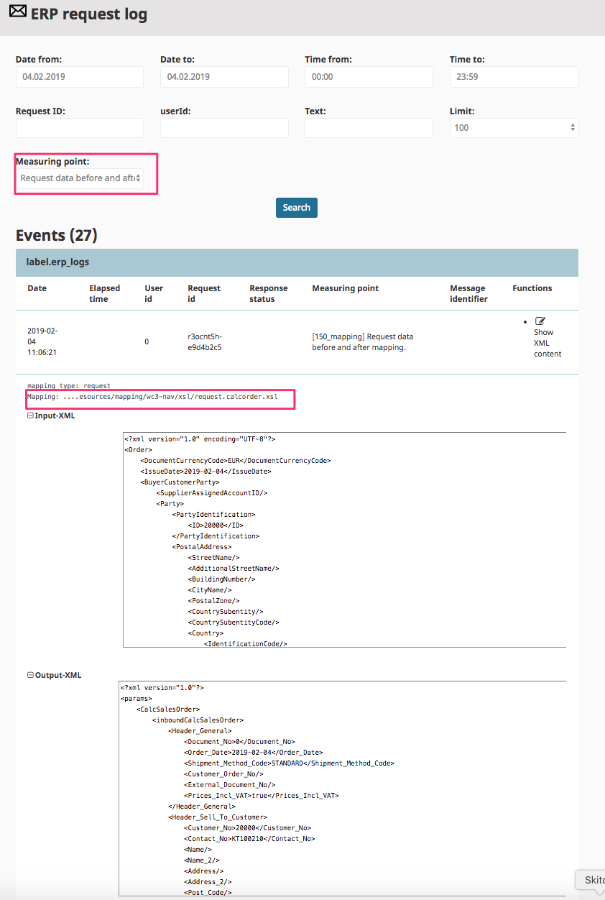

# ERP integration [[% include 'snippets/experience_badge.md' %]]

[[= product_name_exp =]] can communicate with ERP systems. It uses the data and logic already provided by ERP. 

This ensures that the shop is always up to date.
The complex logic and processes already implemented in the ERP can be reused.

The customer sees their individual prices and product availability from ERP.
Orders are also transferred to the ERP system.

### Configuring ERP integration

If you are using a prepared connector, see [Web.Connector configuration](erp_communication/erp_configuration/web_connector_configuration.md) for more information.

In you are using a REST-based ERP system, see [Curl Configuration](erp_communication/erp_configuration/curl_configuration.md).

If your ERP supports webservices directly, see [Configuration for webservice-based ERPs](erp_communication/erp_configuration/configuration_for_webservice_based_erps.md).

### Adapting the mapping

[[= product_name_exp =]] uses the UBL ([Universal Business Language](https://www.oasis-open.org/committees/tc_home.php?wg_abbrev=ubl)) standard to model business data.
ERP systems usually use vendor-specific structures and attribute names.
An XSLT-based mapping feature enables adapting the mapping between these formats.
See [Adapt the mappings for ERP functions](erp_communication/erp_configuration\adapt_the_mappings_for_erp_functions/adapt_the_mappings_for_erp_functions.md) for more details.

### Monitoring the ERP connection

The Back Office provides a monitoring service which enables checking all messages exchanged between ERP and [[= product_name_exp =]]. 

After selecting a date range and a measuring point (recommended: "Request data before and after mapping" and "Response data before and after mapping"),
you get more details about the request sent to the ERP system and the applied mapping.

**Mapping** refers to the XSLT file used for mapping.

**Input-XML** and **Output-XML** display the input data and the XML converted by the XSLT transformation.

## Supported ERP systems

[[= product_name_exp =]] offers out-of-the-box interfaces and connectors for:

- Microsoft Dynamics NAV
- Microsoft Dynamics AX
- SAP

Since [[= product_name_exp =]] offers an open interface using standards (REST, Webservices and a standard XML Format UBL),
you can adapt other ERP systems as well.

To be connected to [[= product_name_exp =]], an ERP system must be open (offer e.g. a REST or webservice interface)
and must offer the supported functions.

### Supported processes with ERP integration

[[= product_name_exp =]] and the ERP system exchange the following data.
The details of data exchange depend on the project-specific configuration,
because in complex configurations other systems might provide data as well (for example a PIM system).

|Data/Process|What is exchanged|When|
|--- |--- |--- |
|Customer data|Data about the customer such as: invoice and purchase address, list of delivery addresses, status, customer group, credit limit, contact data|The data for a customer is fetched from the ERP when the user logs in and has a customer number|
|Product data|Products and product groups|During the import. The import is initiated for example every night or more often. This data is usually provided using an export (XML, CSV, JSON)|
|Prices|List price and volume prices, individual prices|List prices are exchanged during the product import. Individual prices are fetched from the ERP when a customer is logged in and has a customer number. In that case the shop requests prices in real time from the ERP. You can define per project which cases request prices from the ERP (e.g. product detail page, basket and checkout)|
|Orders|Address data, Delivery address, products and customer number|When the customer makes an order, the order is sent immediately to the ERP system. If electronic payment is involved, the order is placed when the payment provider acknowledges the transaction.|
|Documents|Invoices, orders, delivery notes, credit memos|The order history feature requests such documents in real time from the ERP. This ensures that the customer sees all documents even if they placed the order by phone or fax.|
